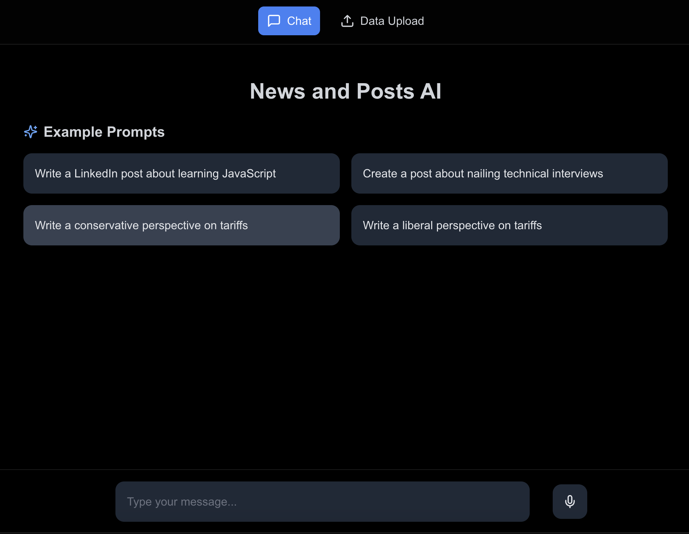

# AI-Powered Content Generation and Politically Charged News Whisperer

It might look like this ⬇️



A full-stack TypeScript application demonstrating modern AI techniques including RAG (Retrieval Augmented Generation), fine-tuning, agents, and LLM observability.

## Features

-   **Multi-Agent System**: 2 specialized agents for different content types:

    -   LinkedIn Agent: Uses a fine-tuned GPT-4 model for professional content
    -   News Agent: Leverages Pinecone vector database for RAG-based news analysis

-   **Training Pipeline**:

    -   Scripts for fine-tuning data preparation
    -   Cost estimation tools
    -   Training job management

-   **Observability**:
    -   Integration with Helicone for LLM monitoring
    -   Performance tracking
    -   Usage analytics

## Tech Stack

-   **Frontend**: Next.js, TypeScript, TailwindCSS
-   **Backend**: Next.js API Routes
-   **AI/ML**: OpenAI API, Pinecone Vector Database
-   **Monitoring**: Helicone
-   **Package Manager**: Yarn

## Learning Objectives

This repository serves as a practical guide for you to learn:

1. **RAG Implementation**

    - Vector database integration
    - Semantic search
    - Context-aware responses

2. **Fine-tuning**

    - Data preparation
    - Model training
    - Cost optimization

3. **Agent Architecture**

    - Specialized agent design
    - Response handling
    - Agent response format

4. **LLM Observability**
    - Performance monitoring
    - Usage tracking
    - Cost management

## Setup

1. **Clone the repository**

    ```bash
    git clone [repository-url]
    cd mini-rag
    ```

2. **Install dependencies**

    ```bash
    yarn install
    ```

3. **Environment Setup**
   Create a `.env` file in the root directory with the following variables:

    ```env
    OPENAI_API_KEY=your_openai_api_key
    PINECONE_API_KEY=your_pinecone_api_key
    HELICONE_API_KEY=your_helicone_api_key
    ```

4. **Create an Account on OpenAI**

    - You are going to need to add ~$10 USD to an OpenAI account - just do it!
    - You can swap out the OpenAI api with another (free-er) model if you so choose

5. **Database Setup in Pinecone**

    - Create a Pinecone index named 'articles'
    - Configure the index with dimension 1536 (for OpenAI embeddings)

6. **Training Data**
    - There is training data in `app/scripts/data/linkedin_training.jsonl` based on Brian Jenney's (that's me!) posts on LinkedIn
    - Use the provided scripts to estimate costs and upload training data

## Usage

1. **Start the development server**

    ```bash
    yarn dev
    ```

2. **Training the Model**

    ```bash
    # Estimate training costs
    yarn estimate-costs

    # Upload and start training
    yarn train
    ```

3. **Using the Application**
    - Navigate to `http://localhost:3000`
    - Choose from example prompts or enter your own
    - The system will route your query to the appropriate agent

## Scripts

-   `upload-training-data.ts`: Handles model fine-tuning
-   `estimate-training-cost.ts`: Calculates training expenses
-   `vectorize-articles.ts`: Processes news content for RAG

## Project Structure

```
mini-rag/
├── app/
│   ├── api/              # API routes
│   ├── libs/             # Shared utilities
│   ├── scripts/          # Training and data scripts
│   └── page.tsx          # Main application
```

## Resources

-   [OpenAI Documentation](https://platform.openai.com/docs)
-   [Pinecone Documentation](https://docs.pinecone.io)
-   [Helicone Documentation](https://docs.helicone.ai)
-   [Next.js Documentation](https://nextjs.org/docs)
