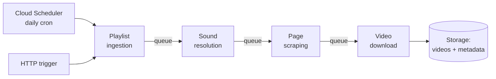

# Architecture — Queues or It Doesn't Count

**Time:** ~15 min · Read + Plan

> **This part:** the required stack, the four services you'll decompose into, and why they talk through queues instead of calling each other.

## The stack (non-negotiable)

The system must use:

| Piece | Requirement |
| --- | --- |
| Cloud | **Google Cloud Platform** |
| Services | **Cloud Run** |
| Scheduling | **Cloud Scheduler** for daily execution |
| Work distribution | **Cloud Tasks** (or similar queues) |
| Orchestration services | **TypeScript** |
| Crawling + downloading | **Python** |
| Web search & page crawling | **Crawl4AI** |
| Video download | **yt-dlp** |
| Video format | **MP4** |

For testing and demos, videos may land in local folders instead of cloud storage. Everything else stands.

## Four services, four responsibilities

Decompose the pipeline into independently scalable services:

1. **Playlist ingestion** — pull the songs out of Spotify
2. **Song → TikTok sound resolution** — find the right sound page for each song
3. **TikTok page scraping** — extract the sound's metadata
4. **Video downloading** — fetch the MP4s



**These services must communicate via queues — not direct synchronous calls.**

## Why queues are the whole point

If ingestion called resolution over HTTP, and resolution called scraping, and scraping called downloading — you'd have one long, fragile request chain wearing a microservices costume. One slow TikTok page and the entire run times out.

With queues between stages:

- A slow download doesn't block scraping the next song
- A crashed worker's task goes back on the queue and gets retried
- The download stage can scale to 20 workers while resolution runs on 2
- You can inspect the queue and *see* where work is piling up

Watch it happen — this is the pipeline you're building, songs flowing through queues, workers failing and retrying:

```visual
tiktok-pipeline | Run the pipeline. Then hit Chaos mode and watch the queues absorb the damage.
```

```match
{
  "title": "Match the GCP piece to its job",
  "note": "Tap a row, then tap its match.",
  "pairs": [
    { "left": "Cloud Run", "right": "Runs each service as a scalable container" },
    { "left": "Cloud Scheduler", "right": "Fires the daily cron run" },
    { "left": "Cloud Tasks", "right": "Carries work between stages, with retries" },
    { "left": "HTTP endpoint on a service", "right": "Lets a human trigger a run on demand" }
  ]
}
```

```scenario
{
  "who": "A fellow engineer reviewing your design doc",
  "setting": "Design review. Your diagram shows four Cloud Run services connected by Cloud Tasks queues.",
  "ask": "Why all the ceremony? One service could call the next over HTTP and this would be half the code.",
  "note": "More than one answer is defensible — pick the one YOU'D say.",
  "options": [
    {
      "text": "Because each stage fails differently. Queues isolate the failures: a TikTok rate-limit stalls the scrape queue, retries kick in, and everything upstream keeps flowing. Synchronous calls turn one slow page into a failed run.",
      "verdict": "best",
      "feedback": "This is the systems answer: it names the concrete failure mode (rate limits, slow pages) and what queues buy you (isolation, retries, independent scaling). It survives the follow-up question."
    },
    {
      "text": "The challenge spec requires queues, so that's what I built.",
      "verdict": "weak",
      "feedback": "True, and it'll end the conversation — but 'the spec said so' is what you say when you don't know why the spec said so. Interviewers and reviewers both push on this."
    },
    {
      "text": "Queues are more scalable in general — it's a best practice for microservices.",
      "verdict": "ok",
      "feedback": "Directionally right but hand-wavy. 'Best practice' without the failure story invites the exact follow-up you got. Name what breaks without them."
    }
  ],
  "debrief": "Queue-driven decomposition earns its complexity when stages have different speeds, different failure rates, and different scaling needs — which is exactly this pipeline: fast API pulls feeding slow scrapes feeding heavy downloads."
}
```

## Both triggers, one pipeline

Cloud Scheduler hits the ingestion service daily. A human (or a demo) hits the same service over HTTP. From that point on, the run is identical — everything downstream just consumes queues. If your manual path and your cron path diverge, you've built two pipelines and will debug both.

```quiz
[
  {
    "q": "Why must the download stage be independently scalable from search and scraping?",
    "options": ["Downloads are heavy and slow (video files) while other stages are light — they need different worker counts", "Python services can't run in the same container as TypeScript", "Cloud Run requires one service per language"],
    "answer": 0,
    "explain": "Moving MP4s is a different workload than parsing JSON. Queues let you throw 20 workers at downloads while 2 handle resolution — without touching each other."
  },
  {
    "q": "A scrape worker crashes mid-task. In a queue-driven design, what happens?",
    "options": ["The run fails and must be restarted from the top", "The task returns to the queue and is retried — the rest of the pipeline never notices", "The upstream service gets an HTTP 500 and must handle it"],
    "answer": 1,
    "explain": "That's the isolation you're paying for: the queue owns delivery and retry, so one worker's death is invisible to every other stage."
  }
]
```

## Key takeaways

- Four services — ingestion, resolution, scraping, downloading — on Cloud Run, in TypeScript (orchestration) and Python (crawling/downloading)
- Stages communicate **only through queues**; no synchronous service-to-service calls
- Queues buy you failure isolation, automatic retries, and per-stage scaling
- Cron (Cloud Scheduler) and manual (HTTP) triggers must feed the *same* pipeline

## Work with AI

```ai-prompt
title: Stress-test my service boundaries
---
I'm designing a queue-driven pipeline on GCP: Cloud Run services for (1) Spotify playlist ingestion, (2) song-to-TikTok-sound resolution via Crawl4AI web search, (3) TikTok sound-page scraping, (4) video downloading with yt-dlp. Cloud Tasks queues sit between every stage; Cloud Scheduler triggers daily runs and an HTTP endpoint triggers manual ones.

Walk through my design as a systems interviewer. For each of the four services, ask me: what's in its queue message? what does it do on retry — is it idempotent? what happens if it's rate-limited? ONE service at a time, waiting for my answers. Flag any place where I'm secretly making a synchronous call between services or storing state in a worker's memory. Finish with the single riskiest boundary in my design.
```
