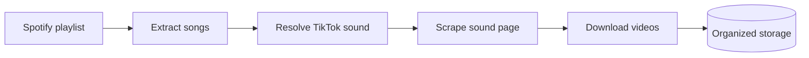

# The Mission — Spotify In, TikTok Videos Out

**Time:** ~10 min · Read

> **This part:** what you're building, the real playlist it runs against, and the six things the system must do end to end.

## The one-sentence version

Build a cloud-native data ingestion pipeline that takes a **real Spotify playlist**, finds the matching **TikTok sound** for each song, scrapes the sound page, downloads TikTok videos, and stores both metadata and media in a structured way.

Not a script. A **system** — distributed, queue-driven, able to run on a schedule *and* on demand.



## The input

Your system operates on this real playlist:

**https://open.spotify.com/playlist/37i9dQZF1DX0XUsuxWHRQd**

That's the primary test dataset. No mocks, no toy fixtures — if your pipeline chokes on a song in that list, that's a bug, not an edge case.

## What the system must do

For every song in the playlist:

1. **Extract** all songs from the playlist
2. **Find** the corresponding TikTok "sound" page for each song
3. **Scrape** metadata from that sound page
4. **Download** TikTok videos associated with the sound
5. **Store** the videos in organized folders on disk (or in cloud storage)
6. **Track** job state, retries, and failures so progress can be inspected

And the whole pipeline must support **two triggers**:

- Running automatically on a **cron schedule**
- Being fired manually via **HTTP APIs**

```order
title: Put the pipeline in order
---
Extract all songs from the Spotify playlist
Resolve each song to its TikTok sound page
Scrape metadata from the sound page
Download videos for the sound with yt-dlp
Store videos in organized folders
Inspect job state, retries, and failures
```

## Why this challenge looks like this

Every stage of this pipeline is a thing you'll do professionally: pull from a third-party API, search the open web and pick the right result programmatically, scrape a page that doesn't want to be scraped, move heavy binary files around, and keep a fleet of jobs honest with queues and retries.

Any one stage is a weekend project. Wiring them into a system that survives real-world failure — that's the actual test.

```quiz
[
  {
    "q": "What makes this a 'system' rather than a script?",
    "options": ["It's distributed and queue-driven, with independent services that survive individual failures", "It's written in more than one language", "It downloads real videos instead of test files"],
    "answer": 0,
    "explain": "Languages and real data are incidental. The requirement that stages communicate via queues, retry failures, and scale independently is what forces system design instead of a single long script."
  },
  {
    "q": "The pipeline must be triggerable how?",
    "options": ["Only by cron, so it stays fully automated", "Only by HTTP, so a human stays in control", "Both: on a cron schedule AND manually via HTTP APIs"],
    "answer": 2,
    "explain": "Real ingestion pipelines run on schedules but always need a manual 'run it now' lever for backfills, demos, and debugging."
  }
]
```

## Ready?

Next up: the architecture rules — which cloud services you must use, and why "the services talk through queues" is the requirement that shapes everything else.

## Work with AI

```ai-prompt
title: Interrogate the mission before you build
---
I'm starting a build challenge: a cloud-native pipeline that takes a real Spotify playlist, resolves each song to its TikTok sound page, scrapes the page, downloads TikTok videos with yt-dlp, and stores everything in organized folders. It must be queue-driven on Google Cloud (Cloud Run + Cloud Tasks + Cloud Scheduler), triggerable by cron and by HTTP.

Before I write any code, play the role of a skeptical staff engineer reviewing my kickoff. Ask me 5 questions, ONE AT A TIME, that expose whether I've actually thought this through — things like: where does state live? what happens when TikTok rate-limits me halfway through? how do I avoid re-downloading videos on the second run? Push back on vague answers. At the end, list the two decisions I should nail down before writing a line of code.
```
