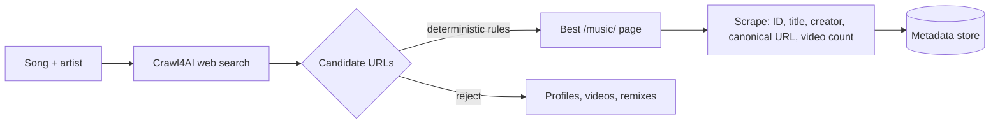

# Finding the Sound — Search, Judge, Scrape

**Time:** ~15 min · Read

> **This part:** the hardest stage — turning "song + artist" into the one correct TikTok sound page, then scraping it.

## The problem

There is no API that maps a Spotify track to a TikTok sound. You have a song name and an artist, and somewhere on tiktok.com there's a "music" page for that song — surrounded by profile pages, individual videos, remixes, and sped-up versions that all mention the same title.

Your resolver must, for each song:

1. Use **Crawl4AI** to perform a web search based on the song name and artist
2. Evaluate **multiple candidate URLs**
3. Choose the best TikTok "music" page using **deterministic rules**

Deterministic is the key word. No "the LLM picked this one." Rules you can read, test, and defend.

## What a valid sound page looks like

A real TikTok sound page typically:

- Lives on `tiktok.com/music/...`
- Ends with a **numeric ID**
- References the **song name** in the slug

Like this:

```
https://www.tiktok.com/music/espresso-sabrina-carpenter-74123456789
```

Your rules must distinguish these from unrelated TikTok profiles and individual video pages.

```quiz
[
  {
    "q": "Which URL should your resolver pick for 'Espresso' by Sabrina Carpenter?",
    "options": ["https://www.tiktok.com/@sabrinacarpenter", "https://www.tiktok.com/music/espresso-sabrina-carpenter-74123456789", "https://www.tiktok.com/@fan4life/video/7361234509876"],
    "answer": 1,
    "explain": "It's on /music/, ends with a numeric ID, and the slug references the song. The first is a profile; the third is one video that happens to use the sound."
  },
  {
    "q": "Why must URL selection use deterministic rules instead of vibes?",
    "options": ["So the same input always yields the same output — testable, debuggable, and explainable when it picks wrong", "Because LLM calls are too expensive at 100 songs", "Because Crawl4AI only returns one result"],
    "answer": 0,
    "explain": "When song #61 resolves to the wrong page, you need to point at the rule that failed and fix it — not rerun and hope. Determinism is what makes the pipeline debuggable at scale."
  }
]
```

```match
{
  "title": "Classify the candidate URL",
  "note": "Tap a URL, then tap what it actually is.",
  "pairs": [
    { "left": "tiktok.com/music/good-luck-babe-chappell-roan-7349871234512", "right": "Sound page — scrape it" },
    { "left": "tiktok.com/@chappellroan", "right": "Artist profile — reject" },
    { "left": "tiktok.com/@dancequeen/video/7355501234567", "right": "Single video using the sound — reject" },
    { "left": "tiktok.com/music/good-luck-babe-sped-up-7350009998887", "right": "Remix/sped-up variant — your rules must rank it below the original" }
  ]
}
```

## Scraping the sound page

Once resolved, the scraping service extracts from the sound page:

- **Sound ID**
- **Sound title**
- **Creator** (if present)
- **Canonical URL**
- **Number of videos** using the sound (if available)

Store all of it, associated with the song it came from. This metadata is what makes the run *inspectable* — when a download fails later, you want to know which song, which sound, which URL, without re-scraping anything.



## The parts nobody warns you about

- **Search results lie.** The top hit is often a compilation video or a fan page. Rank by your rules, not by search position.
- **Slugs get weird.** Featured artists, remasters, parenthetical "(feat. ...)" — your song-name matching needs to be forgiving on punctuation and strict on identity.
- **Pages change.** TikTok's markup is not a stable API. Extract defensively; when a field is missing, record that it's missing instead of crashing the worker.

## Key takeaways

- Resolution = Crawl4AI search → multiple candidates → **deterministic rules** pick the winner
- A valid target is a `tiktok.com/music/...` URL with a numeric ID that references the song
- Scrape sound ID, title, creator, canonical URL, and video count — store it linked to the song
- Extract defensively: missing fields are data, not exceptions

## Work with AI

```ai-prompt
title: Design my URL-scoring rules with me
---
I'm writing deterministic rules that pick the correct TikTok sound page for a song from a list of web-search candidate URLs. A valid page is on tiktok.com/music/, ends in a numeric ID, and references the song name in its slug. Candidates include artist profiles, individual videos, compilations, and sped-up/remix variants of the right song.

Help me design a scoring function. First ask me for my initial rule list. Then attack it: give me 5 realistic candidate-URL sets (song + 4-6 URLs each, including nasty cases — featured artists, '(sped up)' variants, punctuation differences) and make me trace my rules against each one by hand. Every time my rules pick wrong, help me patch the rule, not the example. End with the final rule list, ordered by precedence.
```
