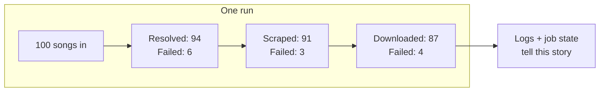

# Ship It — Observability, Scale, Proof

**Time:** ~10 min · Read

> **This part:** what the running system has to tell you, the scale bar it has to clear, and exactly what you submit.

## Observability — the run must explain itself

When a run finishes (or dies), the logs must answer, without you ssh-ing anywhere:

- How many songs were processed
- How many **succeeded or failed at each stage**
- Error details for the failures

If you can't answer "which stage is eating my songs?" from the logs alone, the observability requirement isn't met. Counters per stage, structured errors, and job state you can query beat a wall of print statements.



## The scale bar

A single run must be capable of processing **at least 100 songs** and downloading **dozens of TikTok videos**, subject to site limits.

That number is chosen to make shortcuts fail. Sequential processing takes too long. In-memory state loses everything on the first crash. No rate limiting gets you blocked at song 30. The architecture from part 2 isn't optional at this scale — it's the only thing that survives it.

```quiz
[
  {
    "q": "Your run processed 100 songs but downloaded 0 videos, and the logs just say 'done'. What requirement failed?",
    "options": ["The scale target — 100 songs weren't really processed", "Observability — the run can't explain where every song's videos went", "Nothing — 'subject to site limits' covers it"],
    "answer": 1,
    "explain": "Maybe TikTok blocked you — that happens. But the system must SAY so: per-stage success/failure counts and error details. A silent zero is an observability failure regardless of the cause."
  },
  {
    "q": "Why does the 100-song bar matter architecturally?",
    "options": ["It forces the distributed design: concurrency, durable state, rate limiting, and retries all become mandatory", "It proves the Spotify API works", "Big numbers look better in the demo"],
    "answer": 0,
    "explain": "At 5 songs, a bash script wins. At 100, every cut corner surfaces: the queue-driven, stateful, throttled design is what clears the bar."
  }
]
```

## What you submit

The final result must include:

- A **public GitHub repository**
- **Code for all services**
- **Instructions** for running the pipeline
- **Evidence** — logs, files, or screenshots proving real TikTok videos from the Spotify playlist were downloaded and stored

Treat the evidence as a first-class deliverable: a run log showing per-stage counts, a screenshot of the `./videos/<sound_id>/` tree, the metadata for a few sounds. Make the reviewer's job effortless.

## Before you call it done

- [ ] Cron trigger fires the full pipeline (Cloud Scheduler)
- [ ] HTTP trigger fires the same pipeline on demand
- [ ] All four services deployed on Cloud Run, talking only through queues
- [ ] A killed worker's task gets retried automatically
- [ ] Re-running skips everything that already succeeded
- [ ] Logs show per-stage counts and error details
- [ ] `./videos/<sound_id>/<video_id>.mp4` structure holds real MP4s
- [ ] README: setup, deploy, trigger, and where to find the evidence

## Key takeaways

- Logs must tell the run's story: songs in, success/fail per stage, errors with detail
- 100 songs is the bar because it breaks every non-distributed shortcut
- Submission = public repo + all service code + run instructions + hard evidence of real downloads
- Evidence is a deliverable, not an afterthought — make verification effortless

## Work with AI

```ai-prompt
title: Pre-mortem my submission
---
I'm about to submit a build challenge: a GCP pipeline (Cloud Run + Cloud Tasks + Cloud Scheduler, TypeScript orchestration, Python workers with Crawl4AI and yt-dlp) that turns a real Spotify playlist into scraped TikTok sound metadata and downloaded MP4s. Submission requires: public repo, all service code, run instructions, and evidence of real downloads. Scale bar: 100 songs in one run.

Run a pre-mortem as the reviewer who WANTS to reject me. Ask me, ONE AT A TIME, for the evidence behind each claim: show me the log line proving per-stage counts, the retry actually happening, the second run skipping completed work, both triggers firing the same code path. Where my evidence is weak, tell me the exact artifact to capture (log excerpt, screenshot, directory listing) before I submit. Finish with a submission checklist ordered by how likely each gap is to sink me.
```
