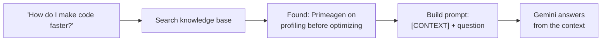

# Give It a Knowledge Base (RAG)

**Time:** ~30 min · Build

> **The goal:** search a custom knowledge base, inject what you find into the prompt, and get answers grounded in your content. That's RAG.

<!-- video embed goes here -->

## The limitation so far

Your advisor is helpful, but it only knows what was in its training data — with a cutoff date. It can't speak to your products, recent developments, or expert content you've created.

## How RAG works

Three moves:

1. **Retrieve** — search your knowledge base for content relevant to the question
2. **Augment** — add that content to the prompt as context
3. **Generate** — let the AI answer using both its training *and* your content



```order
title: Put the RAG flow in order
---
User asks a question
Search the knowledge base for relevant entries
Format the matches into a context block
Build the prompt: system prompt + context + question
Gemini generates an answer grounded in the context
```

## Meet your knowledge base

`data/knowledge-base.json` is your advisory board as flat JSON. Each entry:

```json
{
	"id": "primeagen-performance",
	"topic": "Performance & Optimization",
	"advisor": "Primeagen",
	"keywords": ["performance", "optimization", "speed", "profiling", "slow"],
	"content": "Stop guessing and start measuring. Profile first, optimize second..."
}
```

## Score and retrieve

The search is honest keyword scoring — no embeddings, no vector database:

```typescript
// lib/rag.ts
import knowledgeBase from '@/data/knowledge-base.json';

export function searchKnowledgeBase(query: string, maxResults = 3) {
	const q = query.toLowerCase();

	const scored = knowledgeBase.map((entry) => {
		let score = 0;
		if (q.includes(entry.topic.toLowerCase())) score += 10;
		for (const keyword of entry.keywords) {
			if (q.includes(keyword.toLowerCase())) score += 5;
		}
		return { entry, score };
	});

	return scored
		.filter((s) => s.score > 0)
		.sort((a, b) => b.score - a.score)
		.slice(0, maxResults)
		.map((s) => s.entry);
}
```

Simple, but effective for learning. Watch it run against the real board:

```visual
advisor-rag | Ask the board a question and watch retrieval pick your advisors.
```

```blanks
{
  "title": "Complete the scoring function",
  "note": "Same code you just read — can you rebuild it?",
  "code": "let score = 0;\nif (q.includes(entry.topic.toLowerCase())) score += ___1___;\nfor (const keyword of entry.keywords) {\n  if (q.includes(keyword.toLowerCase())) score += ___2___;\n}\n// ...later:\nreturn scored\n  .filter((s) => s.score > ___3___)\n  .sort((a, b) => b.score - a.score);",
  "blanks": [
    { "options": ["10", "5", "1"], "answer": "10", "explain": "A topic match is the strongest signal — worth double a keyword hit." },
    { "options": ["5", "10", "100"], "answer": "5", "explain": "Each keyword adds 5, so several keyword hits can outweigh one topic match." },
    { "options": ["0", "5", "10"], "answer": "0", "explain": "Drop zero-score entries entirely — injecting irrelevant context makes answers worse." }
  ]
}
```

## Inject the context

Format the winners into the prompt and generate:

```typescript
const relevant = searchKnowledgeBase(message);
const context = relevant.map((e) => `${e.advisor} on ${e.topic}:\n${e.content}`);

const prompt = `You are an expert AI advisor with access to a knowledge base.
Use the provided context when relevant and combine it with your own expertise.

[CONTEXT]
${context.join('\n\n')}
[/CONTEXT]

User question: ${message}`;

const result = await model.generateContent(prompt);
```

Try: "How do I make my code faster?" (Primeagen), "Should I use `any` in TypeScript?" (Theo), "How do I get better at debugging?" (Brian). The answers now carry specific opinions from your board.

```quiz
[
  {
    "q": "What do the three letters of RAG do?",
    "options": ["Retrieve relevant content, Augment the prompt with it, Generate from both", "Run, Analyze, Guess", "Read All Gigabytes into the model"],
    "answer": 0,
    "explain": "Retrieve → Augment → Generate. Search your content, put it in the prompt, let the model answer from it."
  },
  {
    "q": "A user asks 'How do I prompt better?' and retrieval finds nothing — even though a 'prompt engineering' entry exists. Why?",
    "options": ["Keyword matching can't understand meaning — 'prompt better' doesn't contain the stored keywords", "The knowledge base is too small", "Gemini refused the request"],
    "answer": 0,
    "explain": "THE limitation of keyword search: it matches words, not meaning. Embeddings fix exactly this — which is why production systems use them."
  }
]
```

## The takeaway

- RAG = **Retrieve** + **Augment** + **Generate**
- Your knowledge base can hold any text
- Keyword matching is simple but naive — it matches words, not meaning
- Irrelevant context *hurts*, so filter out zero-score entries

## Push it further

- **Add your own experts** — anyone whose opinions you care about
- **Improve matching** — fuzzy matches, synonyms (so "testing" also hits "TDD")
- **Show sources** — tell the user which entries were used

Next: static JSON is fine, but what did Theo say in his *latest* video? Time for real data.

## Work with AI

```ai-prompt
title: Design a knowledge base for MY advisory board
---
I built a simple RAG system: a JSON knowledge base of { id, topic, advisor, keywords, content }, keyword scoring (topic +10, keyword +5, top 3 win), and context injection into a Gemini prompt.

Help me build MY OWN board. Ask me for 3 people whose opinions I care about (any field) and what I'd ask them. Then for each advisor, help me draft 2-3 entries: pick topics, write realistic keyword lists (include the synonyms real questions use), and coach me on writing content in that person's voice. Finish with 5 test questions and predict which entries each should retrieve, so I can verify my scoring.
```
