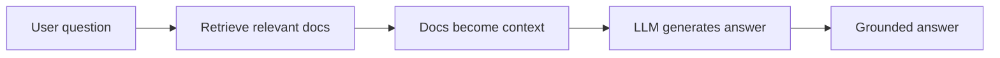

# Day 1 — How to Learn + What is RAG

**Time:** ~45 min · Read + Watch

> **Today:** how this course works (and why you'll be recording videos), then the core idea behind everything we build for the next six weeks: Retrieval-Augmented Generation.

## How you're going to learn this

This isn't a typical course where you passively watch videos and hope things stick. You're going to actively teach what you learn — because that's how real understanding happens.

### The Feynman Technique

Every week, you'll record a short video explaining a concept you learned. This isn't busywork. It's the **Feynman Technique**, named after the Nobel Prize-winning physicist:

> **If you can't explain something simply, you don't understand it well enough.**

The technique in 4 steps:

1. **Study the concept** — learn it like you normally would
2. **Teach it to a child** — explain it in simple terms, no jargon
3. **Identify gaps** — where did you struggle to explain? That's where your understanding is weak
4. **Review and simplify** — go back, fill the gaps, try again

Your weekly video is step 2. When you hit a wall trying to explain something, that's step 3 showing you exactly where to focus.

### You'll be the AI person

After this program, you might be the **only person** on your team who understands how AI applications actually work. Your manager will ask you to explain RAG to stakeholders. Product managers will need you to translate technical constraints into business decisions.

**You need to be able to articulate how things work to non-technical people.** These videos train that skill. Every single week.

### Office hours & getting help

- **Weekly office hours** — invite arrives via Slack. Bring AI-specific questions: architecture decisions, embeddings, RAG vs fine-tuning.
- **Async questions** — can't make it? [Submit a question](https://form.typeform.com/to/EwCKfAN6) anytime; it gets answered in the next session or directly.
- **Your mentor** — for technical concepts: debugging, code issues, implementation help.
- **Slack** — post your assignments and work-in-progress for feedback.

### Break things. Extend things. Rewrite things.

The codebase you're working with is **yours to experiment with**. Don't just follow along:

- **Break it** — remove a piece, watch it fail, understand why
- **Extend it** — add a feature, try a different embedding model
- **Rewrite it** — don't like how something is structured? Refactor it your way

---

## What is RAG?

By the end of this curriculum, you'll have built a full-stack RAG application using TypeScript, Next.js, Pinecone, and OpenAI. First, let's understand what we're building and why it matters.

<iframe src="https://share.descript.com/embed/kC3EtmZ5R5K" width="640" height="360" frameborder="0" allowfullscreen></iframe>

### The problem RAG solves

Imagine you're building a chatbot for your company's internal documentation. You could train a massive language model on all your docs, but that's expensive — and the model might "hallucinate": make up information that sounds plausible but is wrong.

What if instead, you could:

1. Store all your documents in a searchable format
2. When a user asks a question, find the most relevant documents
3. Feed those specific documents to a language model as context
4. Let the model answer based on that real, up-to-date information

That's exactly what RAG does.

### RAG in simple terms

RAG combines two powerful concepts:

- **Retrieval**: finding relevant information from a knowledge base
- **Generation**: using that information to generate accurate, contextual responses

Think of it like an **open-book exam for AI**. Instead of memorizing everything, the AI "looks up" relevant information and answers based on that specific context.



### Turning words into numbers

Before diving deeper, watch this explanation of how we turn words into numbers (embeddings) — the machinery that makes retrieval-by-meaning possible:

<iframe src="https://share.descript.com/embed/atonPgRS57j" width="640" height="360" frameborder="0" allowfullscreen></iframe>

```quiz
[
  {
    "q": "What problem does RAG primarily solve compared to using a plain LLM?",
    "options": ["The model answering from stale or missing knowledge, and hallucinating plausible-sounding wrong answers", "LLMs being too slow for chat applications", "The cost of hosting a frontend"],
    "answer": 0,
    "explain": "RAG grounds the model's answer in retrieved, up-to-date documents instead of relying on whatever the model memorized at training time."
  },
  {
    "q": "In the open-book exam analogy, what's the 'book'?",
    "options": ["The LLM's training data", "Your knowledge base of documents, searched at question time", "The system prompt"],
    "answer": 1,
    "explain": "Retrieval looks up relevant passages from your documents at question time — the model reads them, then answers."
  },
  {
    "q": "Why record a weekly video explaining a concept?",
    "options": ["To prove you did the work", "Explaining simply exposes exactly where your understanding is weak (Feynman Technique)", "Videos are easier to grade than code"],
    "answer": 1,
    "explain": "Teaching is the test: wherever your explanation stumbles is precisely where to go back and study."
  }
]
```

```order
title: Put the RAG flow in order
---
Store your documents in a searchable format
A user asks a question
Find the documents most relevant to the question
Feed those documents to the LLM as context
The LLM answers grounded in that real information
```

### Real-world RAG applications

- **Customer support**: answer questions based on your knowledge base
- **Internal tools**: query company documents, policies, and procedures
- **Educational platforms**: personalized tutoring based on course materials
- **Legal research**: find relevant case law and regulations
- **Medical assistance**: reference medical literature for diagnoses

### What we'll build together

Throughout this curriculum, we'll build a **Document Q&A System** that can:

- Ingest and process documents (web pages, text)
- Convert documents into searchable vector embeddings
- Store embeddings in Pinecone (a vector database)
- Accept user questions through a Next.js interface
- Retrieve relevant document chunks
- Generate accurate answers using OpenAI's models
- Handle follow-up questions with conversation context

All in **TypeScript**. You'll work in the [`student-todo-exercises`](https://github.com/projectshft/mini-rag/tree/student-todo-exercises) branch — starter code with TODOs you complete as the course progresses.

## ✅ Key takeaways

- RAG = **Retrieval** (find relevant docs) + **Generation** (answer using them as context) — an open-book exam for AI
- RAG beats retraining when knowledge changes often: update the documents, not the model
- Hallucination is the failure mode RAG attacks: ground answers in retrieved facts
- Explaining concepts simply (Feynman Technique) is how you'll actually learn this — the weekly videos are the workout

## 🤖 Work with AI

```ai-prompt
title: Quiz me on RAG fundamentals
---
You are my strict-but-friendly tutor. I just finished the first lesson of a RAG course, covering: what RAG is (retrieval + generation), the problem it solves (hallucination, stale knowledge), the open-book exam analogy, and real-world applications.

Quiz me with 5 questions, ONE AT A TIME, waiting for my answer before continuing. Start easy ("what does RAG stand for?") and get harder ("when would fine-tuning beat RAG?"). If I'm wrong, don't give me the answer — give me a hint and let me retry once. At the end, list the concepts I was shaky on and explain each in two sentences.
```

```ai-prompt
title: Practice the Feynman Technique right now
---
I'm practicing the Feynman Technique on today's topic: Retrieval-Augmented Generation.

I'm going to explain RAG to you as if you were a smart 12-year-old. Play that role: after my explanation, ask me the naive-but-sharp follow-up questions a curious kid would ask ("but where does the computer look things up?", "what if the book has the wrong answer?"). Point out any jargon I used without explaining it. Then rate my explanation 1–10 on simplicity and accuracy, and tell me the one gap I should study before recording my weekly video.
```
