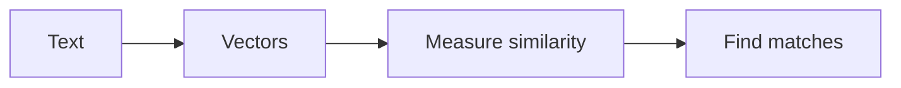

# Day 2 — Vectors and Embeddings

**Time:** ~45 min · Read + Watch

> **Today:** the math that makes RAG possible — how text becomes lists of numbers (embeddings), and how measuring the angle between those numbers tells you whether two pieces of text *mean* the same thing.

Understanding vectors is crucial for RAG systems. Don't worry — we'll keep it practical and visual.

## Video walkthrough

<iframe src="https://share.descript.com/embed/zz3e0kMLiO6" width="640" height="360" frameborder="0" allowfullscreen></iframe>

## Why vector math for RAG?

RAG systems need to find similar content. To do that:



The math makes similarity **measurable**. That's the whole trick.

## What is a vector?

A vector is just a list of numbers:

```typescript
// 2D vector (x, y coordinates)
const vector2D = [3, 4];

// 3D vector (x, y, z)
const vector3D = [1, 2, 3];

// Text embedding (512 dimensions!)
const embedding = [0.1, -0.3, 0.8, 0.2, ...];
```

**Think of it as:** a point in space, or a direction from the origin.

## From text to vectors

### How embeddings work

```
"artificial intelligence"
        ↓
Embedding Model
        ↓
[0.1, -0.3, 0.8, ..., 0.2]  (512 numbers)
```

**The magic:** similar concepts → similar vectors.

```typescript
"dog"   → [0.1, 0.5, -0.2, ...]
"puppy" → [0.2, 0.4, -0.1, ...]  // Close to "dog"!
"car"   → [-0.3, 0.1, 0.8, ...]  // Far from "dog"
```

### Using OpenAI's embedding API

```typescript
const response = await openai.embeddings.create({
	model: 'text-embedding-3-small',
	input: 'artificial intelligence',
});

const embedding = response.data[0].embedding;
// [0.1, -0.3, 0.8, ..., 0.2] (512 numbers)
```

## Measuring similarity

### The dot product

Multiply corresponding numbers, add them up:

```typescript
function dotProduct(a: number[], b: number[]): number {
	return a.reduce((sum, val, i) => sum + val * b[i], 0);
}

const v1 = [1, 2, 3];
const v2 = [4, 5, 6];
dotProduct(v1, v2); // (1×4) + (2×5) + (3×6) = 32
```

**Interpretation:**

- Higher value = more similar
- Zero = unrelated
- Negative = opposite

### Cosine similarity (the standard)

Normalize the dot product to get a score from -1 to 1:

```typescript
function magnitude(v: number[]): number {
	return Math.sqrt(v.reduce((sum, val) => sum + val * val, 0));
}

function cosineSimilarity(a: number[], b: number[]): number {
	const dot = dotProduct(a, b);
	return dot / (magnitude(a) * magnitude(b));
}
```

**Scale:**

- `1.0` = identical direction
- `0.0` = unrelated (perpendicular)
- `-1.0` = opposite direction

### Visual intuition

Cosine similarity measures the **angle** between vectors:

- Same direction → angle 0° → similarity = 1
- Perpendicular → angle 90° → similarity = 0
- Opposite → angle 180° → similarity = -1

Small angle = high similarity. Large angle = low similarity. Play with it here — drop a query into the space and watch which documents it lands near:

```visual
vector-search | Watch a query find its nearest neighbors
```

```quiz
[
  {
    "q": "What is a text embedding?",
    "options": ["A list of numbers that encodes the meaning of the text as a point in space", "A compressed copy of the text that saves storage", "A hash that uniquely identifies the text"],
    "answer": 0,
    "explain": "An embedding model maps text to a vector (e.g. 512 numbers) where similar meanings land close together — that's what makes similarity measurable."
  },
  {
    "q": "Two embeddings have a cosine similarity of 0. What does that tell you?",
    "options": ["The texts are opposites in meaning", "The vectors are perpendicular — the texts are unrelated", "One of the texts was empty"],
    "answer": 1,
    "explain": "Cosine measures the angle: 1 = same direction (very similar), 0 = perpendicular (unrelated), -1 = opposite direction."
  },
  {
    "q": "Which pair would have the HIGHEST cosine similarity?",
    "options": ["\"The weather is sunny\" vs \"Database optimization\"", "\"I love pizza\" vs \"Pizza is delicious\"", "\"Machine learning algorithms\" vs \"Dogs are loyal pets\""],
    "answer": 1,
    "explain": "Both sentences are about pizza with positive sentiment — same neighborhood in vector space. The other pairs are about completely different topics."
  },
  {
    "q": "Why does cosine similarity divide the dot product by the magnitudes?",
    "options": ["To make the computation faster", "To normalize the score so only direction matters, giving a comparable -1 to 1 range", "To prevent negative results"],
    "answer": 1,
    "explain": "Without normalizing, longer vectors would score higher just for being long. Dividing by magnitudes isolates the angle — pure direction, comparable across all pairs."
  }
]
```

Don't take the diagram's word for it — embed two real sentences with your class key and watch the geometry:

```try-it
{ "kind": "embedding-similarity", "title": "Feel the meaning-space", "description": "Embeds both texts with text-embedding-3-small and computes their cosine similarity. Try synonyms, paraphrases, opposites, and totally unrelated sentences — then try 'bank of the river' vs 'bank account'." }
```

## Why 512 dimensions?

Embeddings have many dimensions (512, 1536, 3072):

- **More dimensions = richer meaning**
- **Each dimension captures a concept** (roughly):
  - Dim 1: "How technical?"
  - Dim 2: "How positive?"
  - Dim 50: "Related to animals?"
  - ...

It's a balance:

- More = better quality
- Fewer = faster computation

## Finding similar documents

Here's the whole retrieval idea in one snippet — this is exactly what you'll implement yourself on [Day 3](/learn/day-03):

```typescript
// Documents
const docs = [
	'Python is a programming language',
	'JavaScript is for web development',
	'Machine learning uses algorithms',
	'Dogs are loyal pets',
];

// Get embeddings for all
const docEmbeddings = await Promise.all(docs.map((doc) => getEmbedding(doc)));

// Query
const query = 'What programming languages exist?';
const queryEmbedding = await getEmbedding(query);

// Calculate similarities
const similarities = docEmbeddings.map((docEmbed) =>
	cosineSimilarity(queryEmbedding, docEmbed)
);

// Results: [0.8, 0.7, 0.3, 0.1]
// "Python is a programming language" wins!
```

## Essential watching

For beautiful visual explanations:

**AI Accelerator Compendium (interactive guides):**

- [Vectors](https://projectshft.github.io/ai-accelerator-compendium/vectors/index.html) — interactive visualization of vectors and their properties
- [Dot Products](https://projectshft.github.io/ai-accelerator-compendium/dot-products/index.html) — visual explanation of dot products and similarity

**Bonus — dive deeper:**

- [LLMs](https://projectshft.github.io/ai-accelerator-compendium/mini-llm/index.html) — how large language models work
- [Transformers](https://projectshft.github.io/ai-accelerator-compendium/gpt/index.html) — the architecture behind modern AI
- [Attention](https://projectshft.github.io/ai-accelerator-compendium/attention/index.html) — understanding attention mechanisms

**3Blue1Brown's Linear Algebra series:**

1. [Vectors, what even are they?](https://www.youtube.com/watch?v=fNk_zzaMoSs)
2. [Dot products and duality](https://www.youtube.com/watch?v=LyGKycYT2v0)

These resources make the concepts crystal clear.

## ✅ Key takeaways

- A vector is just a list of numbers — a point (or direction) in space
- Embeddings convert text to vectors where **similar meaning = nearby vectors**
- The dot product measures alignment; cosine similarity normalizes it to -1…1 so only the *angle* matters
- More dimensions capture richer meaning, at the cost of speed and storage
- This is exactly how RAG finds relevant documents: embed the query, embed the docs, return the closest ones

## 🤖 Work with AI

```ai-prompt
title: Quiz me on vectors and embeddings
---
You are my strict-but-friendly tutor. I just learned about vectors and embeddings for RAG: what a vector is, how embedding models map text to ~512-dimensional vectors, the dot product, cosine similarity (and why we normalize by magnitude), and why similar text produces nearby vectors.

Quiz me with 5 questions, ONE AT A TIME, waiting for my answer before continuing. Start easy ("what does cosine similarity of 1.0 mean?") and get harder ("why prefer cosine similarity over raw dot product for text embeddings?", "give me two sentences you'd expect to score ~0.9 and two that score ~0.1"). If I'm wrong, don't give me the answer — give a hint and let me retry once. Finish by listing my weak spots with a two-sentence explanation of each.
```

```ai-prompt
title: Walk me through cosine similarity by hand
---
I want to build real intuition for cosine similarity before I implement it tomorrow. Give me two small vectors (3 dimensions, simple integers) and have me compute, step by step and by hand: (1) the dot product, (2) each magnitude, (3) the cosine similarity. Check each step before moving on. Then give me three more pairs designed to produce similarity ≈ 1, ≈ 0, and ≈ -1, and ask me to PREDICT the result before computing. If my prediction is off, help me see why geometrically (angle between the vectors), not just numerically.
```
