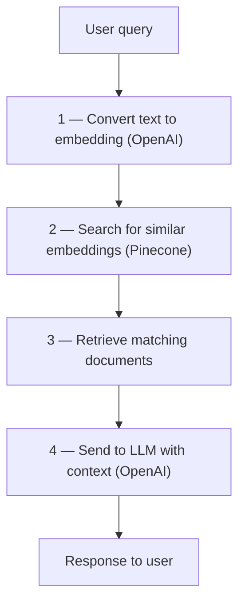

# Day 5 — Setting Up Pinecone

**Time:** ~60 min · Setup + Hands-on

> **Today:** wire up the two services that power the whole system — OpenAI (turns text into embeddings) and Pinecone (stores and searches them). By the end you'll have accounts, API keys, an index, and a working client you'll use every day from here on.

Now that you understand what vectors are and why similarity search matters, let's set up both OpenAI and Pinecone. These two services work together to power our RAG system.

## The big picture: how it all connects

Before writing any config, understand the complete flow:



Today sets up steps 1 and 2 — the OpenAI and Pinecone integrations.

## Video walkthrough

Watch the complete setup of OpenAI and Pinecone step-by-step:

<iframe src="https://share.descript.com/embed/eDhPxpnPLKa" width="640" height="360" frameborder="0" allowfullscreen></iframe>

## Part 1: Set up OpenAI

### Get your OpenAI API key

1. Go to [platform.openai.com](https://platform.openai.com)
2. Sign up or log in
3. Navigate to the "API Keys" section in your dashboard
4. Click "Create new secret key"
5. **Important:** copy the key immediately — you won't see it again!

### Add credits

The OpenAI API is pay-per-use:

1. Go to "Billing" in your OpenAI dashboard
2. Add a payment method
3. Add $5–10 in credits — this will last you a long time for learning

**Cost breakdown:**

- Embeddings (`text-embedding-3-small`): ~$0.0001 per 1K tokens (very cheap!)
- GPT-4o-mini: ~$0.15 per 1M input tokens
- For this course, $5 is more than enough

### The models we'll use

**Embedding models** (convert text to vectors):

- **text-embedding-3-small**: 512–1536 dimensions, fast and cheap ✅ (we'll use this)
- **text-embedding-3-large**: up to 3072 dimensions, more accurate but pricier

**Chat models** (generate responses):

- **gpt-4o**: most capable, best reasoning
- **gpt-4o-mini**: great balance of speed/cost/quality ✅ (we'll use this)

**Learn more:** [OpenAI Platform Documentation](https://platform.openai.com/docs/introduction) · [OpenAI Node.js SDK](https://github.com/openai/openai-node) (version `5.15.0` used in this project) · [Embeddings Guide](https://developers.openai.com/api/docs/guides/embeddings)

## Part 2: Set up Pinecone

### Create a free account and an index

1. Go to [https://www.pinecone.io/](https://www.pinecone.io/)
2. Click "Sign Up" and create a free account
3. Once logged in, create a new index:
   - **Name**: `rag-tutorial`
   - **Dimensions**: `512` (matches our OpenAI embedding dimensions)
   - **Metric**: `cosine`
4. Copy your API key from the console (API Keys section)

**⚠️ CRITICAL:** your Pinecone index dimensions MUST match your OpenAI embedding dimensions. We're using `512` dimensions for `text-embedding-3-small`.

**Learn more:** [Pinecone Documentation](https://docs.pinecone.io/guides/get-started/overview) · [Pinecone Node.js SDK](https://www.npmjs.com/package/@pinecone-database/pinecone) (version `6.1.0` used in this project)

## Part 3: Environment configuration

Add both API keys to your `.env` or `.env.local` file:

```bash
# OpenAI Configuration
OPENAI_API_KEY=sk-proj-xxxxxxxxxxxxxxxxxxxxxxxxxxxxxxxx

# Pinecone Configuration
PINECONE_API_KEY=xxxxxxxx-xxxx-xxxx-xxxx-xxxxxxxxxxxx
PINECONE_INDEX=rag-tutorial
```

**Where to get these:**

- **OPENAI_API_KEY**: OpenAI Platform → API Keys
- **PINECONE_API_KEY**: Pinecone console → API Keys
- **PINECONE_INDEX**: the name you chose when creating your index (`rag-tutorial`)

## Understanding the code

### OpenAI client

[`app/libs/openai/openai.ts`](https://github.com/projectshft/mini-rag/blob/student-todo-exercises/app/libs/openai/openai.ts) is already configured and exports the OpenAI client:

```typescript
import OpenAI from 'openai';

export const openaiClient = new OpenAI({
	apiKey: process.env.OPENAI_API_KEY as string,
});
```

### Pinecone client

Open [`app/libs/pinecone.ts`](https://github.com/projectshft/mini-rag/blob/student-todo-exercises/app/libs/pinecone.ts) to see the complete code.

**1. Client initialization:**

```typescript
import { Pinecone } from '@pinecone-database/pinecone';
import { openaiClient } from '../libs/openai/openai';

export const pineconeClient = new Pinecone({
	apiKey: process.env.PINECONE_API_KEY as string,
});
```

This creates ONE connection that your entire app shares — more efficient than creating new connections each time.

**2. The `searchDocuments` function:**

```typescript
export const searchDocuments = async (
	query: string,
	topK: number = 3
): Promise<ScoredPineconeRecord<RecordMetadata>[]> => {
	// Get reference to your index
	const index = pineconeClient.Index(process.env.PINECONE_INDEX!);

	// Convert query to embedding using OpenAI
	const queryEmbedding = await openaiClient.embeddings.create({
		model: 'text-embedding-3-small',
		dimensions: 512,
		input: query,
	});

	const embedding = queryEmbedding.data[0].embedding;

	// Search Pinecone for similar vectors
	const docs = await index.query({
		vector: embedding,
		topK,
		includeMetadata: true,
	});

	return docs.matches;
};
```

Look familiar? This is [Day 3's](/learn/day-03) `findTopSimilarDocuments` with Pinecone doing the score-filter-sort-slice work at scale.

## Key concepts

### Client vs. index

- **Client**: the connection to Pinecone (authenticate once, reuse everywhere)
- **Index**: a specific vector database (like a table in a traditional database)

Think of it like: client = database connection pool, index = the specific table you query.

### The search flow

1. Get embedding from OpenAI (convert text → vector)
2. Pass embedding to Pinecone (search for similar vectors)
3. Pinecone finds similar vectors using cosine similarity
4. Returns documents with similarity scores (0–1, higher = more similar)

### Query parameters

When you query Pinecone:

- **vector**: the embedding to search with (512 dimensions in our case)
- **topK**: how many results to return (default 3; try 5–10 for more)
- **includeMetadata**: whether to return the document text/metadata (we need this!)

The response contains:

- **id**: unique document identifier
- **score**: similarity score (0–1, where 1 = identical)
- **metadata**: the actual text content and any other data we stored

```quiz
[
  {
    "q": "Your Pinecone index is created with 1536 dimensions but your code embeds with dimensions: 512. What happens?",
    "options": ["Pinecone pads the vectors with zeros automatically", "Queries and upserts fail with a dimension mismatch — index dimensions and embedding dimensions must match exactly", "Search works but scores are less accurate"],
    "answer": 1,
    "explain": "Pinecone rejects vectors whose length doesn't match the index. Either recreate the index at 512 or change the dimensions parameter in the code — they must agree."
  },
  {
    "q": "What's the difference between the Pinecone client and an index?",
    "options": ["They're two names for the same object", "Client = the authenticated connection (create once, share everywhere); index = a specific vector database, like a table", "Client is for reads, index is for writes"],
    "answer": 1,
    "explain": "You authenticate one shared client for the whole app, then ask it for a reference to a specific index (rag-tutorial) when you need to query or upsert."
  },
  {
    "q": "Why does searchDocuments call OpenAI before it calls Pinecone?",
    "options": ["To check the user's query for policy violations", "Pinecone searches by vector, so the text query must first be converted to an embedding", "To warm up the OpenAI connection for the final answer"],
    "answer": 1,
    "explain": "Pinecone only understands vectors. Every search is: text → embedding (OpenAI) → nearest-neighbor query (Pinecone)."
  },
  {
    "q": "Why set includeMetadata: true on the query?",
    "options": ["It's required or the query errors", "Without it you get back IDs and scores but not the actual document text — useless as LLM context", "It makes the search more accurate"],
    "answer": 1,
    "explain": "The metadata carries the chunk's text. Matches without metadata can't be fed to the LLM as context, which is the whole point."
  }
]
```

## Test your setup

Make sure your `.env` file has all three values:

```bash
OPENAI_API_KEY=sk-proj-...
PINECONE_API_KEY=...
PINECONE_INDEX=rag-tutorial
```

Then verify the client imports and initializes without errors:

```typescript
import { pineconeClient, searchDocuments } from './app/libs/pinecone';

// This should not throw an error
console.log('Pinecone client initialized:', !!pineconeClient);
```

<details>
<summary>🔍 Expected output</summary>

```
Pinecone client initialized: true
```

No thrown errors, no missing-key warnings. (Searches will return zero matches for now — the index is empty until we upload documents next week. Initializing without an exception is today's win.)

</details>

**Common issues:**

- ❌ `OPENAI_API_KEY is missing` → check your `.env` file
- ❌ `PINECONE_API_KEY is missing` → check your `.env` file
- ❌ `Dimensions mismatch` → Pinecone index must be 512 dimensions
- ❌ `Index not found` → verify your index name in the Pinecone console

## Why 512 dimensions?

Notice we pass `dimensions: 512` when creating embeddings:

```typescript
const queryEmbedding = await openaiClient.embeddings.create({
	model: 'text-embedding-3-small',
	dimensions: 512,  // Must match Pinecone index!
	input: query,
});
```

- Smaller than the default 1536 = faster and cheaper
- Still highly accurate for most use cases
- Reduces storage costs in Pinecone
- Faster similarity search

**CRITICAL:** your Pinecone index dimensions must match this value. If you created your index with different dimensions, update the code to match.

## Challenge: the dimension trade-off

Embedding dimensions affect cost, performance, and accuracy — a decision you'll make on every real RAG system. Create a document (markdown, Google Doc, or notes) answering:

**1. Content type analysis** — for each, what dimensions would you choose and why?

- **LinkedIn posts** (short, casual, 1–3 paragraphs)
- **Legal documents** (long, technical, precise language)
- **Product reviews** (mixed sentiment, varied length)
- **Code documentation** (technical, structured)

**2. Image embeddings** — research how they differ from text embeddings:

- What models generate image embeddings? (Hint: CLIP, ResNet)
- What dimension ranges are typical for images?
- How do image embedding dimensions compare to text?

**3. The dimension trade-off matrix** — fill in the table:

| Dimensions | Accuracy | Speed | Storage cost | Use case |
|------------|----------|-------|--------------|----------|
| 256        | ?        | ?     | ?            | ?        |
| 512        | ?        | ?     | ?            | ?        |
| 1536       | ?        | ?     | ?            | ?        |
| 3072       | ?        | ?     | ?            | ?        |

**4. Real-world scenario** — you're building RAG for a legal tech company handling short case summaries (200–500 words), full legal opinions (5,000–20,000 words), and case law citations (very short, highly precise). What dimensions for each? Different Pinecone indexes or one? Why?

**5. Cost analysis** — you have 100,000 documents; each dimension is a 32-bit float (4 bytes). Compare total storage for 512 vs 1536 vs 3072 dimensions.

<details>
<summary>💡 Hint — the cost math</summary>

Storage = documents × dimensions × 4 bytes. For 100,000 docs at 512 dimensions that's 100,000 × 512 × 4 ≈ 205 MB. Now scale the dimension count — the storage (and query compute) scales linearly with it. That linear factor is the whole trade-off.

</details>

**Helpful resources:** [OpenAI Embeddings Guide](https://developers.openai.com/api/docs/guides/embeddings) · [Pinecone Performance Guide](https://docs.pinecone.io/guides/operations/performance-tuning) · [CLIP Model for Images](https://openai.com/index/clip/)

Save your analysis and keep it as a reference — these trade-offs come back in every production system. **Estimated time:** 30–45 minutes.

## Quick reference

**OpenAI SDK:** [Node.js SDK GitHub](https://github.com/openai/openai-node) · [Embeddings API Reference](https://platform.openai.com/docs/api-reference/embeddings) · [Chat Completions API Reference](https://platform.openai.com/docs/api-reference/chat)

**Pinecone SDK:** [Node.js SDK](https://docs.pinecone.io/reference/sdks/node/overview) · [Query API Reference](https://docs.pinecone.io/reference/api/data-plane/query) · [Best Practices](https://docs.pinecone.io/troubleshooting/best-practices)

## ✅ Key takeaways

- The RAG query path is: text → embedding (OpenAI) → similarity search (Pinecone) → matching docs → LLM answer (OpenAI)
- One shared client per service, authenticated via env vars — never hardcode or commit API keys
- **Index dimensions must exactly match embedding dimensions** (512 in this project) — the #1 setup bug
- `searchDocuments` is Day 3's similarity function running at database scale: Pinecone scores by cosine, returns topK with metadata
- Dimension count is a cost/accuracy/speed dial, and storage scales linearly with it

## 🤖 Work with AI

```ai-prompt
title: Debug my OpenAI + Pinecone setup with me
---
I just set up OpenAI and Pinecone for a RAG project. My stack: a Pinecone index named rag-tutorial (512 dimensions, cosine metric), text-embedding-3-small with dimensions: 512, env vars OPENAI_API_KEY / PINECONE_API_KEY / PINECONE_INDEX in .env, and two files: app/libs/openai/openai.ts (exports openaiClient) and app/libs/pinecone.ts (exports pineconeClient and a searchDocuments(query, topK) function).

Act as my rubber-duck debugger. Ask me one diagnostic question at a time to verify each link in the chain: env vars loading, client initialization, index name/dimensions match, and what searchDocuments should return on an EMPTY index. If I report an error message, explain the likely cause and the single next thing to check — don't dump a 10-item checklist on me.
```

```ai-prompt
title: Grill me on the dimension trade-off challenge
---
I just completed a challenge analyzing embedding dimensions (256 vs 512 vs 1536 vs 3072) for different content types — LinkedIn posts, legal documents, product reviews, code docs — including a storage cost calculation (100k docs × dimensions × 4 bytes) and a legal-tech scenario with mixed document lengths.

I'll paste my analysis below. Challenge it like a skeptical senior engineer in a design review: make me defend each dimension choice, check my storage math, ask when I'd split content across multiple Pinecone indexes vs one, and push on at least one recommendation you think is wrong or under-justified. End with the two strongest and two weakest parts of my analysis.

[paste your analysis here]
```
