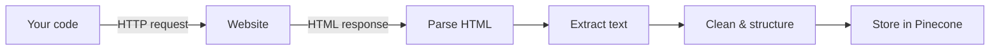

# Day 6 — Introduction to Scraping

**Time:** ~45 min · Read + Watch

> **Today:** your Pinecone index is empty, and a RAG system with no data answers nothing. We'll cover how to ethically scrape web content to fill it — what makes scraped content good or garbage, and why the size of what you scrape sets up next week's big topic: chunking.

Before we can build our RAG system, we need data. Lots of it.

## Video walkthrough

<iframe src="https://share.descript.com/embed/IKKjh70RIgn" width="640" height="360" frameborder="0" allowfullscreen></iframe>

## The problem: empty database

Right now, your Pinecone database (set up on [Day 5](/learn/day-05)) is empty. We need to feed it information!

```
Empty Pinecone Index
        ↓
      No Data
        ↓
   Can't Answer Questions
        ↓
   Useless RAG System 😢
```

**The solution?** Scrape publicly available documentation and content from the web.

## What is web scraping?

At a high level:



**The process:**

1. Send an HTTP request to a URL
2. Receive the HTML response
3. Parse the HTML (extract relevant content)
4. Clean and structure the data
5. Store in your database (Pinecone)

### Simple example

```typescript
// Pseudo-code for scraping
const html = await fetch('https://react.dev/docs');
const parsed = parseHTML(html);
const text = extractText(parsed);
const cleaned = cleanText(text);

// Now we can embed and store this text!
```

## Real-world use cases

Web scraping powers many AI and data applications:

**1. Knowledge base RAG systems** — scrape React/TypeScript/Next.js documentation, build a coding assistant trained on the latest docs, always up-to-date with official sources

**2. Legal tech** — scrape court cases and outcomes, build a legal precedent search tool, help lawyers research similar cases

**3. Competitive analysis** — track competitor pricing changes, monitor product features, analyze marketing strategies

**4. Content aggregation** — news articles for summarization, product reviews for sentiment analysis, social media for trend detection

**5. Research & training** — academic papers, historical documents, domain-specific knowledge bases

## The ethics of scraping

### The controversial reality

Web scraping is... complicated. Here's the truth:

**How OpenAI got its knowledge:**

- Scraped the entire internet
- Billions of web pages
- Books, articles, code, forums, everything
- Led to lawsuits and ethical debates

**The problem:** copyright concerns, Terms of Service violations, privacy issues, server load and costs.

### The ethical way to scrape

As developers, we should be ethical. Here's how:

**✅ DO:**

1. **Check `robots.txt`** — every site has one at `/robots.txt`

   ```
   Example: https://react.dev/robots.txt
   ```

2. **Respect the rules**

   ```
   User-agent: *
   Disallow: /admin/        # Don't scrape this
   Allow: /docs/            # OK to scrape this
   ```

3. **Rate limit your requests**

   ```typescript
   // Don't hammer the server
   await sleep(1000); // Wait 1 second between requests
   ```

4. **Use public APIs when available** — better than scraping, designed for programmatic access, usually more reliable

5. **Only scrape public content** — no login-protected pages, no personal information, no copyrighted content (without permission)

**❌ DON'T:**

- Ignore `robots.txt`
- Scrape at high frequency (DDoS-like behavior)
- Bypass authentication
- Scrape copyrighted content at scale
- Violate Terms of Service

### Why this course uses simple scraping

**We're scraping:** open source documentation (React, TypeScript, Next.js, Pinecone) — publicly available content that explicitly allows scraping, and small amounts of it (not the entire internet!).

**Why keep it simple?** Scraping is a MASSIVE topic (entire businesses are built on it), it's not the focus of this course, docs give us easy access to quality data, and it keeps us out of legal/ethical gray areas.

**The provided code** ([`app/libs/scrapers/webScraper.ts`](https://github.com/projectshft/mini-rag/blob/student-todo-exercises/app/libs/scrapers/webScraper.ts)) is a naive implementation — simple but works. It scrapes basic HTML content, respects `robots.txt`, and rate-limits requests. You're encouraged to extend it!

```quiz
[
  {
    "q": "Where do you check whether a site allows scraping a given path?",
    "options": ["The site's homepage footer", "The robots.txt file at the site root (e.g. react.dev/robots.txt)", "The HTML <meta> tags of each page"],
    "answer": 1,
    "explain": "robots.txt declares which paths crawlers may and may not access (Allow/Disallow per User-agent). Checking and respecting it is the baseline of ethical scraping."
  },
  {
    "q": "Your scraper hits a documentation site with 50 requests per second. What's the ethical problem, even if robots.txt allows the path?",
    "options": ["None — allowed paths can be fetched at any rate", "You're generating DDoS-like load on someone else's server; rate limiting (e.g. 1 request/second) is required", "It only matters if the site is behind a paywall"],
    "answer": 1,
    "explain": "robots.txt permission isn't permission to hammer the server. Rate limiting keeps your scraper from degrading the site for everyone else."
  },
  {
    "q": "Why can't we just embed a whole 50,000-word documentation page as one vector?",
    "options": ["Pinecone rejects documents over 10,000 words", "One embedding for that much text dilutes the meaning, may exceed token limits, and retrieval would return a huge blob that swamps the LLM's context", "OpenAI charges extra for long inputs"],
    "answer": 1,
    "explain": "A single vector averaging 50,000 words about everything is specific about nothing — and even if retrieved, the blob buries the relevant sentence. That's why we chunk."
  },
  {
    "q": "Which of these is GOOD content to keep from a scraped page?",
    "options": ["The navigation menu, so the model knows the site structure", "The article body — complete, structured, authoritative prose", "The footer and cookie banner, for completeness"],
    "answer": 1,
    "explain": "Navigation, footers, ads, and boilerplate are noise that pollutes retrieval. Keep the authoritative, complete, structured content; strip the rest."
  }
]
```

## Challenges with scraping

### 1. Complex HTML structure

Real websites are messy:

```html
<!-- What you want -->
<p>React Hooks were introduced in React 16.8.</p>

<!-- What you actually get -->
<div class="container">
	<div class="row">
		<div class="col-md-8">
			<article>
				<div class="content-wrapper">
					<p class="paragraph-style-1">
						React Hooks were introduced in React 16.8.
					</p>
				</div>
			</article>
		</div>
	</div>
</div>
<!-- Plus 500 more lines of navigation, ads, footers, etc. -->
```

**Solution:** use tools like Cheerio or Puppeteer to parse HTML and extract just the content you need.

### 2. Dynamic content

Modern websites use JavaScript to load content:

```
Initial HTML → Empty <div id="root"></div>
JavaScript runs → Content appears
Your scraper → Sees nothing!
```

**Solution:** use headless browsers (Puppeteer, Playwright) that execute JavaScript.

### 3. Anti-scraping measures

Websites don't always want to be scraped: CAPTCHA challenges, rate limiting, IP blocking, user-agent detection, dynamic page structure.

**Solution:** respect these measures. If a site doesn't want scraping, don't scrape it.

### 4. Data quality

Not all scraped content is useful:

```html
<!-- Useful -->
<article>React is a JavaScript library for building UIs.</article>

<!-- Not useful -->
<nav>Home | About | Contact | Login</nav>
<footer>© 2024 Example Corp</footer>
<div class="ad">Buy Our Product!</div>
```

**Solution:** be selective about what content you extract.

## The size problem: why chunking matters

Say you scraped a massive React documentation page:

```
Total content: 50,000 words
Your embedding limit: 512 dimensions
```

**What happens if you embed the entire document as one vector?**

- ❌ Too much information → diluted meaning
- ❌ May exceed token limits
- ❌ Won't fit in the LLM context window
- ❌ Loses specificity

**Example of the problem:**

```
User: "How do I use useState?"

Without chunking:
- Retrieves entire 50,000-word doc
- Contains useState... somewhere
- Plus useEffect, useContext, routing, styling, everything
- LLM gets confused by too much irrelevant context

With chunking:
- Retrieves 3 focused chunks about useState
- Each chunk: 500 characters
- Clear, focused context
- LLM generates perfect answer
```

This is why **chunking** is critical — it's the first thing we tackle next week, on [Day 8](/learn/day-08).

### Preview: the chunking problem

Consider this sentence:

> "After years of research, scientists finally discovered that the secret to eternal youth lies in consistent..."

**Bad chunking (cuts off mid-sentence):**

```
Chunk 1: "After years of research, scientists finally discovered
          that the secret to eternal youth lies in consistent"
```

**Missing context!** Consistent what? Exercise? Drug use? Diet? Sleep?

**Good chunking (respects sentence boundaries):**

```
Chunk 1: "After years of research, scientists finally discovered
          that the secret to eternal youth lies in consistent
          exercise and healthy eating habits."
```

**Complete context!** Now the meaning is preserved.

## What makes good scraped content?

For RAG systems, quality matters:

### ✅ Good content characteristics

1. **Authoritative** — official documentation, not random blog posts
2. **Complete** — full thoughts, not fragments
3. **Structured** — clear hierarchy (headings, paragraphs)
4. **Current** — up-to-date information
5. **Relevant** — matches your domain
6. **Clean** — no ads, navigation, footers

### ❌ Bad content to avoid

1. **Advertisements** — "Buy now! Limited time offer!"
2. **Navigation menus** — "Home | About | Contact"
3. **Boilerplate** — repeated headers/footers
4. **Comments sections** — often low quality
5. **Outdated content** — deprecated APIs
6. **Duplicate content** — same info multiple times

## What separates RAG novices from experts

According to experienced practitioners:

> "In my opinion, this is what separates the RAG noobs from people that have deeper understanding."

**Beginners think:** just scrape everything, dump it in the database, let the AI figure it out.

**Experts know:** scraping strategy matters, chunking strategy is critical, input quality determines output quality, and context preservation is everything.

**Your advantage:** we're all learning this together. RAG is so new that even senior developers are still figuring it out. Form your own opinions, experiment, and document what works!

## ✅ Key takeaways

- A RAG system is only as good as its data — an empty index answers nothing, and garbage in means garbage answers out
- Ethical scraping = check `robots.txt`, respect its rules, rate-limit requests, prefer public APIs, and only touch public content
- Real-world scraping is hard: messy HTML, JavaScript-rendered pages, and anti-scraping measures — we keep it simple with open docs
- Content quality is a curation job: keep authoritative, complete, structured text; strip navigation, ads, and boilerplate
- Big scraped pages can't become one embedding — chunking (Day 8) is how we turn raw pages into focused, retrievable pieces

## 🤖 Work with AI

```ai-prompt
title: Quiz me on ethical scraping and content quality
---
You are my strict-but-friendly tutor. I just finished a lesson on web scraping for RAG: the scrape pipeline (request → HTML → parse → extract → clean → store), robots.txt and rate limiting, scraping challenges (messy HTML, JS-rendered content, anti-scraping measures), good vs bad scraped content, and why huge pages must be chunked before embedding.

Quiz me with 5 questions, ONE AT A TIME. Start easy ("what is robots.txt?") and get harder — include at least one scenario question like "a client asks you to scrape a competitor's logged-in dashboard, what do you say?" and one on why a 50,000-word page can't be a single embedding. If I'm wrong, give me a hint and let me retry once. End with the concepts I was shaky on, each explained in two sentences.
```

```ai-prompt
title: Design a scraping plan for my own RAG idea
---
I want to practice thinking like a RAG engineer, not just a scraper. I'll describe a RAG app I'd like to build someday (domain, users, questions it should answer). Help me design the DATA side: (1) brainstorm 3-5 candidate sources and rank them on the good-content criteria — authoritative, complete, structured, current, relevant, clean; (2) for each, walk me through how we'd verify robots.txt and ToS allow it, and what rate limit is respectful; (3) flag which sources are JavaScript-rendered and would need a headless browser vs simple fetch + Cheerio; (4) predict what boilerplate we'd need to strip. Then play devil's advocate: tell me which source I overrated and why. Here's my idea:

[describe your RAG app idea]
```
