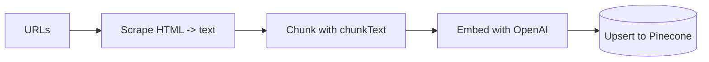

# Day 9 — Uploading Documents with a Script


> **Today:** time to get real content into your RAG system. You'll run a script that walks the entire ingestion pipeline — scrape, chunk, embed, upload — and watch your Pinecone index fill up with searchable knowledge.

## Video walkthrough

Watch how to upload vectors to Pinecone:

<iframe src="https://share.descript.com/embed/Ypt5j0zCq3x" width="640" height="360" frameborder="0" allowfullscreen></iframe>

## The upload script

Located at [`app/scripts/scrapeAndVectorizeContent.ts`](https://github.com/projectshft/mini-rag/blob/student-todo-exercises/app/scripts/scrapeAndVectorizeContent.ts), this script handles the entire pipeline:



Notice what's in the middle: the `chunkText()` function you completed on [Day 8](/learn/day-08). Today it goes to work on real web pages.

## Understanding the script

### Main function

```typescript
async function scrapeAndVectorize(urls: string[]) {
	// Step 1: Scrape and chunk
	const processor = new DataProcessor();
	const chunks = await processor.processUrls(urls);

	// Step 2: Generate embeddings and upload
	const index = pineconeClient.Index(process.env.PINECONE_INDEX);

	for (let i = 0; i < chunks.length; i += batchSize) {
		const batch = chunks.slice(i, i + batchSize);

		// Generate embeddings
		const embeddingResponse = await openaiClient.embeddings.create({
			model: 'text-embedding-3-small',
			input: batch.map((chunk) => chunk.content),
		});

		// Format vectors
		const vectors = batch.map((chunk, idx) => ({
			id: `${chunk.metadata.url}-${chunk.metadata.chunkIndex}`,
			values: embeddingResponse.data[idx].embedding,
			metadata: {
				text: chunk.content,
				url: chunk.metadata.url,
				title: chunk.metadata.title,
				chunkIndex: chunk.metadata.chunkIndex,
				totalChunks: chunk.metadata.totalChunks,
			},
		}));

		// Upload
		await index.upsert(vectors);
	}
}
```

### The flow, step by step

**Step 1: Scrape and chunk**

```typescript
const processor = new DataProcessor();
const chunks = await processor.processUrls(urls);
```

[`DataProcessor`](https://github.com/projectshft/mini-rag/blob/student-todo-exercises/app/libs/dataProcessor.ts) scrapes each URL, extracts the text content, chunks it with your `chunkText()` function, and returns an array of chunks with metadata.

**Step 2: Batch processing**

```typescript
for (let i = 0; i < chunks.length; i += batchSize) {
	const batch = chunks.slice(i, i + batchSize);
	// ...
}
```

Why batches of 100?

- The OpenAI embedding API has input limits
- Pinecone performs better with batched upserts
- It's easier to track progress

**Step 3: Generate embeddings**

```typescript
const embeddingResponse = await openaiClient.embeddings.create({
	model: 'text-embedding-3-small',
	input: batch.map((chunk) => chunk.content),
});
```

Send 100 text chunks, get back 100 embeddings (512-dimensional vectors) — one API call instead of a hundred.

**Step 4: Format vectors**

Pinecone's vector format has three parts:

- `id`: unique identifier — here, `url` + `chunkIndex` so re-running the script overwrites rather than duplicates
- `values`: the embedding (512 numbers)
- `metadata`: stored alongside the vector and returned at query time — crucially including the original `text`

**Step 5: Upload**

```typescript
await index.upsert(vectors);
```

*Upsert* = insert, or update if a vector with that ID already exists.

```quiz
[
  {
    "q": "Why does the script embed chunks in batches of 100 instead of one at a time?",
    "options": ["One API call per batch instead of per chunk — faster, cheaper on rate limits, and Pinecone prefers batched upserts", "OpenAI refuses single-input embedding requests", "Batches produce higher-quality embeddings"],
    "answer": 0,
    "explain": "Batching is purely operational: fewer round trips, friendlier to rate limits, better Pinecone upsert performance. The embeddings themselves are identical."
  },
  {
    "q": "Why is the vector ID built as `${url}-${chunkIndex}` instead of a random UUID?",
    "options": ["Pinecone requires IDs to contain a URL", "Deterministic IDs mean re-running the script upserts (overwrites) the same vectors instead of piling up duplicates", "Random IDs are slower to query"],
    "answer": 1,
    "explain": "Upsert = insert or update by ID. With deterministic IDs, re-scraping a page replaces its old chunks. With random IDs, every run would add a duplicate copy of everything."
  },
  {
    "q": "Why store the chunk's raw text in the vector's metadata?",
    "options": ["Pinecone needs it to compute similarity", "Pinecone only stores and searches vectors — metadata is how you get the actual text back at query time to hand to the LLM", "It reduces embedding costs"],
    "answer": 1,
    "explain": "Similarity search runs on the numbers. Without the text in metadata, a match would tell you WHICH chunk is relevant but not WHAT it says."
  }
]
```

## Running the script

### 1. Check environment variables

Ensure `.env.local` has:

```bash
OPENAI_API_KEY=sk-...
PINECONE_API_KEY=...
PINECONE_INDEX=your-index-name
```

### 2. Customize URLs

Edit the script:

```typescript
async function main() {
	const urls = [
		'https://react.dev/learn',
		'https://nextjs.org/docs',
		// Add your URLs here!
	];

	await scrapeAndVectorize(urls);
}
```

### 3. Run it

```bash
yarn scrape-content
```

Or directly:

```bash
npx ts-node app/scripts/scrapeAndVectorizeContent.ts
```

### 4. Watch the output

```bash
Scraping 8 URLs...
Processed https://react.dev/learn: 47 chunks
Processed https://nextjs.org/docs: 62 chunks
...

Created 245 chunks from content

Generating embeddings and uploading to Pinecone...
Processing batch 1/3...
Uploaded 100 vectors
Processing batch 2/3...
Uploaded 100 vectors
Processing batch 3/3...
Uploaded 45 vectors

SUMMARY
==================
Total chunks: 245
Successful: 245
Failed: 0
Completed at: 2025-01-15T10:30:45.123Z
```

## Verifying the upload

1. Go to https://app.pinecone.io
2. Select your index
3. Check the vector count matches the script output
4. Try a test query in the console

## Common issues

### "No content found to process"

URLs unreachable, scraper blocked by the website, or content parsing failed. Debug by inspecting what the processor returns:

```typescript
const chunks = await processor.processUrls(urls);
console.log('Chunks:', chunks.length);
chunks.forEach((c) => console.log(c.content.substring(0, 100)));
```

### "Failed to process batch"

Invalid OpenAI API key, rate limits, or network issues. Log the specific error:

```typescript
} catch (error) {
  console.error('Batch error:', error);
  // Look at the specific error
}
```

### "PINECONE_INDEX not set"

```bash
# In .env.local
PINECONE_INDEX=your-index-name
```

### Script hangs

Very large documents, network timeout, or Pinecone connection issues. Reduce the batch size:

```typescript
const batchSize = 50; // Instead of 100
```

## Challenge: how would you automate this?

Now that you can upload documents with a script, think about: **how would you collect way more data automatically?**

Ideas to consider:

1. **Sitemap crawling** — parse `sitemap.xml`, extract all URLs automatically, process hundreds of pages
2. **Recursive scraping** — start with one page, extract its links, follow them to scrape an entire site
3. **Scheduled updates** — run the script daily with cron; keep content fresh; handle changed content
4. **Multiple sources** — GitHub repos, blog RSS feeds, documentation sites, YouTube transcripts
5. **Deduplication** — check if a URL already exists; only update if content changed; avoid duplicate vectors

**Think about:**

- How would you track what's been processed?
- How would you handle rate limits?
- How would you update existing content?
- How would you scale to thousands of URLs?

We'll turn this pipeline into a proper API route on [Day 10](/learn/day-10).

## Key takeaways

- The ingestion pipeline is always the same four moves: scrape -> chunk -> embed -> upsert
- `DataProcessor` (`app/libs/dataProcessor.ts`) bundles scraping + your Day 8 `chunkText()` into one call
- Batching (100 chunks per API call) is how you respect rate limits and keep Pinecone upserts fast
- Deterministic vector IDs (`url-chunkIndex`) make re-runs idempotent — upsert overwrites instead of duplicating
- Metadata is the payload: Pinecone searches the vectors, but the `text` in metadata is what your LLM will actually read

## Work with AI

```ai-prompt
title: Explain the upload script back to me — then poke holes
---
I just studied app/scripts/scrapeAndVectorizeContent.ts, which scrapes URLs, chunks the text with chunkText(), embeds batches of 100 chunks with text-embedding-3-small, and upserts vectors (id = url-chunkIndex, values = 512-dim embedding, metadata = text/url/title/chunkIndex/totalChunks) to Pinecone.

I'll explain the whole pipeline to you from memory, step by step. Play a skeptical senior engineer: after my explanation, ask me pointed follow-ups like "what happens if you run the script twice on the same URLs?", "why is the text stored twice — once as a vector and once in metadata?", and "what breaks first at 10,000 URLs?". Flag anything I got wrong or skipped, then rate my explanation 1–10.
```

```ai-prompt
title: Help me build the sitemap crawler extension
---
I have a working script (app/scripts/scrapeAndVectorizeContent.ts) that takes a hardcoded array of URLs and scrapes -> chunks -> embeds -> upserts them to Pinecone. I want to extend it to crawl a sitemap.xml automatically instead of hardcoding URLs.

Don't write the code for me. Instead: (1) ask me clarifying questions about my design (how I'll parse the XML, filter URLs, dedupe against already-uploaded pages, respect rate limits), (2) point out edge cases I haven't considered (sitemap index files that link to other sitemaps, thousands of URLs, non-HTML entries), and (3) let me propose the implementation plan, then critique it. Only show code if I explicitly give up on a step.
```
