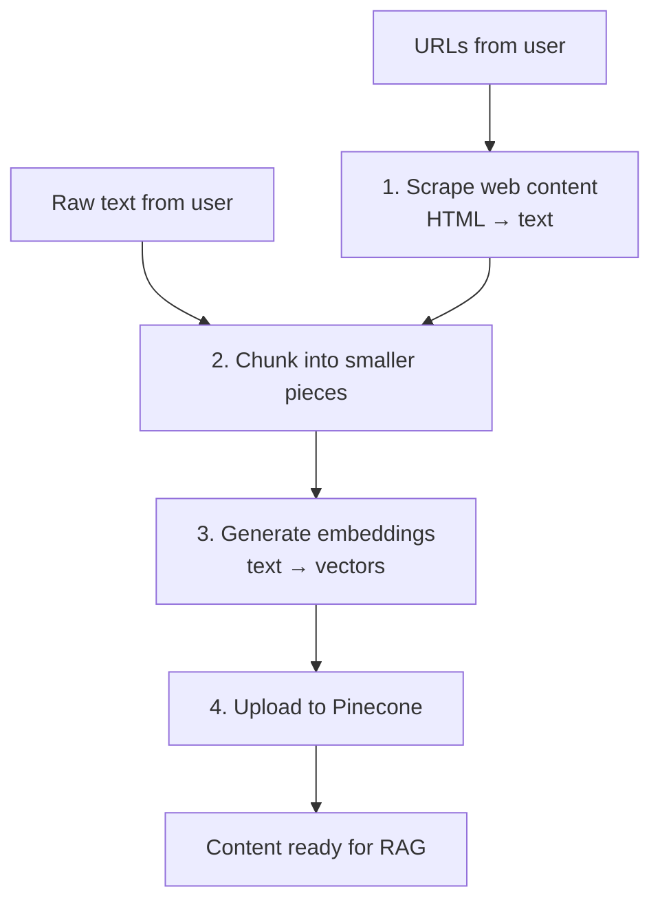

# Day 10 — Building the Upload API Route

**Time:** ~90 min · Build

> **Today:** yesterday's script proved the pipeline works. Now you'll build it properly — an API route your frontend (or anything else) can call to scrape, chunk, vectorize, and upload documents. This is the "write" side of your RAG system, and you're implementing it TODO by TODO.

## Video walkthrough

Watch this introduction to the upload interface:

<iframe src="https://share.descript.com/embed/vXKQ7RBncMc" width="640" height="360" frameborder="0" allowfullscreen></iframe>

## What you'll build

By the end of today, you'll have:

- An API route that accepts URLs ([`app/api/upload-document/route.ts`](https://github.com/projectshft/mini-rag/blob/student-todo-exercises/app/api/upload-document/route.ts))
- A pipeline that scrapes, chunks, and vectorizes content
- Documents uploaded to Pinecone and ready for retrieval

**Note:** the UI also supports an [`/api/upload-text`](https://github.com/projectshft/mini-rag/blob/student-todo-exercises/app/api/upload-text/route.ts) route for raw text — already implemented as a reference. Today focuses on the URL route, which is more complex because it requires web scraping.

## The big picture



The URL route (`/api/upload-document`) does all four steps; the text route (`/api/upload-text`) skips scraping and starts at chunking. The "read" side — retrieval — comes on [Day 11](/learn/day-11).

### Why this pipeline exists

**Why not just save the whole webpage?**
- Too much context for the LLM (token limits!)
- Harder to find relevant sections
- Less precise retrieval

**Why chunk the content?**
- Smaller chunks = more focused context
- Better retrieval (find exact relevant sections)
- Fits within LLM context windows

**Why batch upload?**
- API rate limits
- More efficient
- Better error handling

## Understanding the pieces

### 1. The DataProcessor

Located at [`app/libs/dataProcessor.ts`](https://github.com/projectshft/mini-rag/blob/student-todo-exercises/app/libs/dataProcessor.ts), this class handles:

- **Scraping**: fetching HTML and extracting clean text (via [`app/libs/scrapers/webScraper.ts`](https://github.com/projectshft/mini-rag/blob/student-todo-exercises/app/libs/scrapers/webScraper.ts))
- **Chunking**: breaking text into ~500-character pieces with overlap

```typescript
// How it works (simplified)
const processor = new DataProcessor();
const chunks = await processor.processUrls(['https://example.com']);

// Returns array of chunks:
[
  {
    id: "url-chunk-0",
    content: "First 500 chars of text...",
    metadata: {
      url: "https://example.com",
      title: "Page Title",
      chunkIndex: 0,
      totalChunks: 5
    }
  },
  // ... more chunks
]
```

Chunks overlap by ~50 characters to maintain context at boundaries — the strategy you implemented on [Day 8](/learn/day-08).

### 2. OpenAI embeddings

```typescript
// What happens under the hood
const response = await openaiClient.embeddings.create({
  model: 'text-embedding-3-small',
  input: ['Hello world', 'Machine learning basics']
});

// Returns one embedding per input string:
[
  { embedding: [0.1, -0.3, 0.8, ...] },
  { embedding: [0.2, 0.1, -0.5, ...] }
]
```

**Why `text-embedding-3-small`?** Fast and efficient (we use 512 dimensions instead of 1536), good quality for most use cases, lower cost than larger models.

### 3. Batching strategy

Pinecone recommends uploading in batches of 100:

```typescript
// Why batch?
const allChunks = 500; // chunks to upload
const batchSize = 100;

// Without batching: 500 API calls
// With batching: 5 API calls (much faster!)

for (let i = 0; i < chunks.length; i += batchSize) {
  const batch = chunks.slice(i, i + batchSize);
  // Process batch...
}
```

### 4. Vector metadata

Each vector you upload carries metadata:

```typescript
{
  id: "unique-identifier",
  values: [0.1, -0.3, ...], // The embedding
  metadata: {
    text: "The actual chunk content",
    url: "https://source-url.com",
    title: "Document Title",
    chunkIndex: 0,
    totalChunks: 10
  }
}
```

**Why metadata matters:**

- `text`: what you show to the LLM as context
- `url`: for attribution/sourcing
- `title`: for display to users
- `chunkIndex`: to reconstruct full documents if needed

Pinecone indexes the vector but returns the metadata when querying.

### Why an API route instead of just the script?

- Can be called from the frontend UI
- Can be triggered by scripts
- Keeps business logic separate from UI
- Easy to test independently

```quiz
[
  {
    "q": "The upload route validates the request body with a Zod schema before doing anything else. What does this buy you?",
    "options": ["It compresses the URLs for faster scraping", "Malformed input fails fast with a clear 400 error instead of blowing up mid-pipeline after you've already paid for scraping and embeddings", "Zod is required by Next.js API routes"],
    "answer": 1,
    "explain": "Validation at the boundary means bad input never reaches the expensive steps — and the caller gets an actionable error instead of a mysterious 500."
  },
  {
    "q": "You get 'Vector dimension (1536) doesn't match index (512)'. What happened?",
    "options": ["Pinecone shrunk your index overnight", "The embedding call didn't request 512 dimensions, so text-embedding-3-small returned its default 1536-dim vectors", "Your chunks are too long"],
    "answer": 1,
    "explain": "The index was created for 512-dim vectors. Every embedding call — upload AND query — must request the same model and dimensions, or Pinecone rejects the mismatch."
  },
  {
    "q": "Where does /api/upload-text differ from /api/upload-document?",
    "options": ["It uses a different vector database", "It skips the scraping step — text arrives directly, then chunking, embedding, and upserting are identical", "It doesn't need embeddings because text is already searchable"],
    "answer": 1,
    "explain": "Same pipeline minus scraping. Comparing the two routes is a great way to isolate exactly what DataProcessor contributes."
  }
]
```

## Your challenge

Open [`app/api/upload-document/route.ts`](https://github.com/projectshft/mini-rag/blob/student-todo-exercises/app/api/upload-document/route.ts) and you'll find **9 TODO steps**. Work through them in order — the roadmap:

1. **Validate the request** — parse the body, run it through the Zod schema, pull out `urls`
2. **Scrape and chunk** — hand the URLs to `DataProcessor`
3. **Check chunks exist** — bail early with a helpful response if scraping produced nothing
4. **Get the Pinecone index**
5. **Set up batch processing** — loop in slices of 100
6. **Generate embeddings** — one API call per batch
7. **Format vectors** — map chunks + embeddings into Pinecone's `{ id, values, metadata }` shape
8. **Upload each batch** — upsert, tracking the success count
9. **Return results** — success/failure summary as JSON

You've already seen every ingredient: the script from [Day 9](/learn/day-09) does the same pipeline, and the finished [`/api/upload-text`](https://github.com/projectshft/mini-rag/blob/student-todo-exercises/app/api/upload-text/route.ts) route shows the route-shaped version minus scraping. **Try it from memory first** — resist opening those references until you're stuck.

<details>
<summary>💡 Hint 1 — validation and scraping (steps 1–2)</summary>

Parse the JSON body with `await req.json()`, then run it through the schema: `uploadDocumentSchema.parse(body)` — Zod throws if the shape is wrong, and destructuring `{ urls }` from the parsed result gives you typed data. Scraping + chunking is two lines: instantiate `DataProcessor`, then `await processor.processUrls(urls)`.

</details>

<details>
<summary>💡 Hint 2 — embeddings and vector format (steps 6–7)</summary>

The embeddings API takes an **array of strings** and returns embeddings in the same order:

```typescript
const embeddingResponse = await openaiClient.embeddings.create({
	model: 'text-embedding-3-small',
	input: batch.map((chunk) => chunk.content),
});

// embeddingResponse.data[0].embedding — first embedding
// embeddingResponse.data[1].embedding — second embedding
```

So when you `batch.map((chunk, idx) => ...)`, the matching embedding is `embeddingResponse.data[idx].embedding`. For unique IDs, combine URL and chunk index:

```typescript
const id = `${chunk.metadata.url}-${chunk.metadata.chunkIndex}`;
```

</details>

<details>
<summary>💡 Hint 3 — the upload itself (step 8)</summary>

One line per batch:

```typescript
await index.upsert(vectors);
```

Add the batch's length to your running success count after the upsert resolves — that's what your final response reports.

</details>

## Testing your implementation

### Using the frontend

Run `yarn dev` and open `http://localhost:3000`. The UI has two upload modes:

**URL mode:** select the "URLs" tab, enter URLs (one per line), click "Upload", check the response for a success message.

**Text mode:** select the "Raw Text" tab, paste any text content, click "Upload".

### Using curl

**Test URL upload:**

```bash
curl -X POST http://localhost:3000/api/upload-document \
  -H "Content-Type: application/json" \
  -d '{
    "urls": [
      "https://react.dev/learn",
      "https://nextjs.org/docs"
    ]
  }'
```

**Test text upload:**

```bash
curl -X POST http://localhost:3000/api/upload-text \
  -H "Content-Type: application/json" \
  -d '{
    "text": "This is sample text about React hooks. useState and useEffect are commonly used hooks."
  }'
```

### Verifying in the Pinecone console

1. Go to your Pinecone index
2. Check the "Vectors" tab — you should see new entries
3. Try the "Query" feature — search for your test content

## Common issues & solutions

### "Dimension mismatch"

```
❌ Vector dimension (1536) doesn't match index (512)
```

**Fix:** ensure you're using `text-embedding-3-small` with `dimensions: 512`.

### "Rate limit exceeded"

**Fix:** add a delay between batches or reduce the batch size.

### "No content scraped" (`chunks.length === 0`)

**Fix:** check the URL is accessible; look at `dataProcessor.ts` — you may need to adjust selectors; some sites block scraping.

### "Metadata too large"

**Fix:** the chunk text is too long for Pinecone's metadata size limit. Reduce chunk size or trim the metadata `text` field.

## Understanding what you built

- **Request → validation:** `uploadDocumentSchema.parse(body)` — only well-formed URL arrays get through
- **Scraping → chunking:** `processor.processUrls(urls)` — HTML becomes structured chunks with metadata
- **Text → vectors:** `openaiClient.embeddings.create()` — meaning becomes numbers in 512-dimensional space
- **Vectors → database:** `index.upsert(vectors)` — your knowledge is now searchable by semantic similarity

## Think beyond the exercise

Real-world questions worth sitting with (no assignment — just think):

**1. Scale:** 100,000 documents to upload. How do you handle rate limits? Synchronous processing or a job queue? How do you track progress and handle partial failures?

**2. Updates:** a document changes. Do you re-upload the whole thing? How do you delete old chunks when content is removed? Version history?

**3. Quality:** not all content is worth indexing. How do you filter out 404 pages, login walls, and ads? What if a scrape returns gibberish? Should you validate content *before* spending money on embeddings?

**4. Cost:** at $0.02 per 1M tokens, what does your knowledge base cost to embed? When does a smaller model make sense? How do you avoid re-embedding unchanged content?

## Solution walkthrough

Once your route works (or you've genuinely exhausted the hints), watch the implementation walkthrough:

<iframe src="https://share.descript.com/embed/tb6EgaRGjay" width="640" height="360" frameborder="0" allowfullscreen></iframe>

## ✅ Key takeaways

- The upload route is the write side of RAG: validate → scrape → chunk → embed → upsert, exposed as `POST /api/upload-document`
- Zod validation at the boundary fails fast on bad input, before you pay for scraping or embeddings
- Embedding model **and** dimensions must match your index (512 for `text-embedding-3-small` here) — mismatches fail at upsert time
- Batches of 100 keep you inside rate limits and make Pinecone upserts efficient
- The already-built `/api/upload-text` route is the same pipeline minus scraping — a useful reference for isolating what each piece does

## 🤖 Work with AI

```ai-prompt
title: Debug my upload route with me
---
I just implemented the 9 TODOs in app/api/upload-document/route.ts (Next.js API route): Zod validation of a urls array, DataProcessor.processUrls() for scraping+chunking, batched OpenAI embeddings (text-embedding-3-small, 512 dims, batches of 100), mapping to Pinecone vectors (id = url-chunkIndex, metadata = text/url/title/chunkIndex/totalChunks), and index.upsert().

Act as my debugging partner. ONE AT A TIME, present me a realistic failure symptom (e.g. a 500 with a dimension-mismatch message, an empty success response with 0 chunks, duplicate-looking search results after re-uploading) and ask me to diagnose the cause and the fix before revealing your answer. Do 5 rounds, escalating in subtlety. Score my diagnostic reasoning at the end.
```

```ai-prompt
title: Design review — take my route to production
---
Here's my situation: I have a working /api/upload-document route (scrape → chunk → embed → upsert to Pinecone, batches of 100). Interview me like a staff engineer doing a design review for taking it to production at 100k documents.

Ask me one question at a time about: idempotency and re-uploads, partial batch failures mid-request, request timeouts on long scrapes (should this be a job queue?), filtering junk content before paying for embeddings, and cost controls. Push back on hand-wavy answers. At the end, summarize my design's three biggest weaknesses.
```
