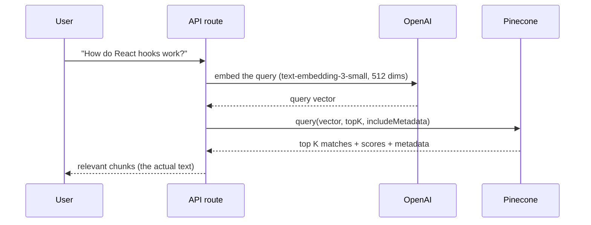

# Day 11 — Querying Documents


> **Today:** your Pinecone index is full of vectors. Time for the payoff — the "read" side of RAG. You'll learn how similarity search actually retrieves documents, then harden a query API route with proper validation and error handling.

## Video walkthrough

Watch this explanation of querying documents:

<iframe src="https://share.descript.com/embed/bcBSmqqgDJ8" width="640" height="360" frameborder="0" allowfullscreen></iframe>

## The retrieval flow



**Key insight:** we never search by text directly. We search by *semantic similarity* using vector math — the same cosine similarity you implemented on [Day 3](/learn/day-03), now running at database scale.

## Understanding vector similarity search

When you query Pinecone:

1. **Your query becomes a vector**

    ```
    "How do React hooks work?"
    -> [0.23, -0.15, 0.89, ..., 0.42]  // 512 numbers
    ```

2. **Pinecone compares it to all stored vectors**

    ```
    Stored doc 1: [0.25, -0.14, 0.87, ..., 0.40]  // Similar!
    Stored doc 2: [0.10, 0.92, -0.31, ..., -0.15]  // Not similar
    Stored doc 3: [0.24, -0.16, 0.91, ..., 0.43]  // Very similar!
    ```

3. **It returns the top K most similar**

    ```
    1. Doc 3 (score: 0.95) - "React hooks introduction..."
    2. Doc 1 (score: 0.92) - "Understanding useState..."
    3. Doc 7 (score: 0.87) - "useEffect guide..."
    ```

### Similarity scores

Scores range from 0.0 to 1.0:

- **1.0** = identical vectors (perfect match)
- **0.8–0.95** = highly similar (great results)
- **0.6–0.8** = moderately similar (decent results)
- **< 0.6** = low similarity (may not be relevant)

## Using the `searchDocuments` function

There's a helper already built in [`app/libs/pinecone.ts`](https://github.com/projectshft/mini-rag/blob/student-todo-exercises/app/libs/pinecone.ts):

```typescript
export const searchDocuments = async (
	query: string,
	topK: number = 3,
): Promise<ScoredPineconeRecord<RecordMetadata>[]> => {
	// 1. Get reference to your index
	const index = pineconeClient.Index(process.env.PINECONE_INDEX!);

	// 2. Convert query to embedding using OpenAI
	const queryEmbedding = await openaiClient.embeddings.create({
		model: 'text-embedding-3-small',
		dimensions: 512,
		input: query,
	});

	const embedding = queryEmbedding.data[0].embedding;

	// 3. Query Pinecone with the embedding
	const docs = await index.query({
		vector: embedding,
		topK,
		includeMetadata: true, // IMPORTANT: Get the actual text!
	});

	return docs.matches;
};
```

### Breaking it down

**Step 1: get the index** — connect to the same index you uploaded to.

**Step 2: create the query embedding.**

**Critical:** model and dimensions **must match** what you used during upload. Vectors from different models (or different dimension counts) live in different spaces — comparing them is meaningless.

**Step 3: query Pinecone** — `vector` is your query embedding, `topK` is how many results you want, and `includeMetadata: true` is what gets you the actual text back (without it, you'd receive IDs and scores but no content).

**Step 4: return matches.** Each match contains:

- `id` — unique document ID
- `score` — similarity score (0–1)
- `metadata` — your stored data (text, URL, etc.)

### What the response looks like

```typescript
[
	{
		id: 'react-docs-chunk-42',
		score: 0.94,
		metadata: {
			source: 'https://react.dev/learn/hooks',
			content:
				'React Hooks let you use state and other React features...',
			chunkIndex: 42,
			totalChunks: 150,
		},
	},
	{
		id: 'react-docs-chunk-15',
		score: 0.89,
		metadata: {
			source: 'https://react.dev/reference/react/useState',
			content: 'useState is a React Hook that lets you add state...',
			chunkIndex: 15,
			totalChunks: 150,
		},
	},
	{
		id: 'typescript-docs-chunk-8',
		score: 0.76,
		metadata: {
			source: 'https://typescriptlang.org/docs',
			content: 'TypeScript provides static typing...',
			chunkIndex: 8,
			totalChunks: 200,
		},
	},
];
```

**Notice:** sorted by score (highest first), metadata contains the actual text, and each result is a different chunk.

```quiz
[
  {
    "q": "Your upload used text-embedding-3-small at 512 dimensions. Your query code accidentally uses 1536 dimensions. What happens?",
    "options": ["Pinecone silently returns worse results", "The query fails — a 1536-dim vector can't be compared against a 512-dim index", "Pinecone truncates the vector automatically"],
    "answer": 1,
    "explain": "Query vectors must live in the same space as stored vectors: same model, same dimensions. A dimension mismatch is a hard error, not a quality degradation."
  },
  {
    "q": "What does includeMetadata: true actually get you?",
    "options": ["Higher similarity scores", "The stored text and source info back with each match — without it you'd only get IDs and scores", "Faster queries"],
    "answer": 1,
    "explain": "Pinecone searches vectors, but vectors are just numbers. The metadata is where the human-readable chunk text lives — it's what you'll feed the LLM."
  },
  {
    "q": "Queries for 'React state management' and 'how to manage state in React' return nearly identical results. Why?",
    "options": ["Pinecone caches similar-looking queries", "Both phrasings embed to nearby vectors because embeddings capture meaning, not keywords", "Both contain the word 'state', and Pinecone matches on shared words"],
    "answer": 1,
    "explain": "This is the whole point of semantic search: paraphrases land close together in embedding space, so retrieval works even when the exact words differ."
  },
  {
    "q": "For a RAG system, why not just set topK = 50 to be safe?",
    "options": ["Pinecone charges per result returned", "Lower-ranked results are increasingly irrelevant noise that eats LLM context tokens and can dilute the answer", "topK above 10 is not supported"],
    "answer": 1,
    "explain": "More isn't better. Past the first handful, matches drift off-topic — you pay tokens for them and risk the LLM anchoring on weak context. Start at 3–5."
  }
]
```

## Your challenge: harden the test route

There's a skeleton at [`app/api/rag-test/route.ts`](https://github.com/projectshft/mini-rag/blob/student-todo-exercises/app/api/rag-test/route.ts) — a bare-bones route for testing retrieval:

```typescript
import { searchDocuments } from '@/app/libs/pinecone';
import { NextRequest, NextResponse } from 'next/server';

export async function POST(request: NextRequest) {
	const body = await request.json();
	const { query, topK } = body;

	const results = await searchDocuments(query, topK);

	const formattedResults = results.map((doc) => ({
		id: doc.id,
		score: doc.score,
		content: doc.metadata?.text || '',
		source: doc.metadata?.source || 'unknown',
		chunkIndex: doc.metadata?.chunkIndex,
		totalChunks: doc.metadata?.totalChunks,
	}));

	return NextResponse.json({
		query,
		resultsCount: formattedResults.length,
		results: formattedResults,
	});
}
```

It works — until someone sends it garbage. **Extend it with production-quality patterns:**

1. **Add Zod schema validation**
    - Validate `query` as a required string
    - Make `topK` optional with a default (e.g. 5)
    - Parse the request body through your schema — this mirrors what you did in [`upload-document/route.ts`](https://github.com/projectshft/mini-rag/blob/student-todo-exercises/app/api/upload-document/route.ts) on [Day 10](/learn/day-10)

2. **Add try/catch error handling**
    - Wrap the function body in try/catch
    - Check for `ZodError` and return 400 for validation failures
    - Return 500 for unexpected errors
    - Log errors with `console.error` for debugging

3. **Return appropriate status codes**
    - 200 for successful queries
    - 400 for invalid input (missing query, wrong types)
    - 500 for server errors (Pinecone down, etc.)

Write it yourself before opening the hints.

<details>
<summary>Hint 1 — the Zod schema</summary>

Zod schemas can attach defaults, so parsing handles the "optional with default" case for you:

```typescript
const ragTestSchema = z.object({
	query: z.string().min(1),
	topK: z.number().int().positive().optional().default(5),
});
```

After `ragTestSchema.parse(body)`, `topK` is always a number — no `??` fallbacks needed downstream.

</details>

<details>
<summary>Hint 2 — telling a 400 from a 500</summary>

In the catch block, the error's *type* decides the status: `if (error instanceof ZodError)` -> the caller's fault -> 400 with the validation issues; anything else -> your system's fault -> log it and return a generic 500. Never leak internal error details in the 500 response.

</details>

<details>
<summary>Solution — don't open until you've tried</summary>

```typescript
import { searchDocuments } from '@/app/libs/pinecone';
import { NextRequest, NextResponse } from 'next/server';
import { z, ZodError } from 'zod';

const ragTestSchema = z.object({
	query: z.string().min(1, 'query is required'),
	topK: z.number().int().positive().max(20).optional().default(5),
});

export async function POST(request: NextRequest) {
	try {
		const body = await request.json();
		const { query, topK } = ragTestSchema.parse(body);

		const results = await searchDocuments(query, topK);

		const formattedResults = results.map((doc) => ({
			id: doc.id,
			score: doc.score,
			content: doc.metadata?.text || '',
			source: doc.metadata?.source || 'unknown',
			chunkIndex: doc.metadata?.chunkIndex,
			totalChunks: doc.metadata?.totalChunks,
		}));

		return NextResponse.json({
			query,
			resultsCount: formattedResults.length,
			results: formattedResults,
		});
	} catch (error) {
		if (error instanceof ZodError) {
			return NextResponse.json(
				{ error: 'Invalid request', details: error.issues },
				{ status: 400 },
			);
		}

		console.error('rag-test error:', error);
		return NextResponse.json(
			{ error: 'Internal server error' },
			{ status: 500 },
		);
	}
}
```

</details>

### Test your route

```bash
curl -X POST http://localhost:3000/api/rag-test \
  -H "Content-Type: application/json" \
  -d '{"query": "How do React hooks work?", "topK": 3}'
```

**Expected response:**

```json
{
	"results": [
		{
			"id": "react-docs-chunk-42",
			"score": 0.94,
			"content": "React Hooks let you use state...",
			"source": "https://react.dev/learn/hooks"
		},
		{
			"id": "react-docs-chunk-15",
			"score": 0.89,
			"content": "useState is a React Hook...",
			"source": "https://react.dev/reference/react/useState"
		}
	]
}
```

Also test the failure paths: send `{}` (should get a 400 with Zod details) and `{"query": 123}` (also 400).

## Testing different queries

Try these to feel how semantic search behaves:

```bash
# Query about React hooks
curl -X POST http://localhost:3000/api/rag-test \
  -H "Content-Type: application/json" \
  -d '{"query": "How do I use useState in React?"}'

# Query about TypeScript
curl -X POST http://localhost:3000/api/rag-test \
  -H "Content-Type: application/json" \
  -d '{"query": "What are TypeScript generics?"}'
```

These three should return very similar results:

```bash
curl -X POST http://localhost:3000/api/rag-test \
  -d '{"query": "React state management"}'

curl -X POST http://localhost:3000/api/rag-test \
  -d '{"query": "How to manage state in React"}'

curl -X POST http://localhost:3000/api/rag-test \
  -d '{"query": "useState hook tutorial"}'
```

**Why?** Embeddings capture *meaning*, not just keywords — "state management" and "manage state" are semantically near-identical, so vector similarity finds the same conceptually related content.

## Understanding the topK parameter

```typescript
await searchDocuments(query, 3);   // top 3 — most relevant
await searchDocuments(query, 10);  // top 10 — broader context
await searchDocuments(query);      // default is 3
```

**Guidelines:**

- **topK = 3–5:** focused, high-quality results
- **topK = 5–10:** more context, some noise
- **topK > 10:** lots of context, potentially less relevant

**For RAG systems:** start with 3–5 chunks and experiment. More isn't always better — every chunk you retrieve costs LLM context tokens.

## Common issues and solutions

### Empty results (`{ "results": [] }`)

**Causes:** no documents uploaded yet, query embedding model mismatch, or wrong index.
**Fix:** check the Pinecone console for vectors, verify the embedding model matches upload, check `PINECONE_INDEX`.

### Low similarity scores (e.g. 0.42)

**Causes:** the query doesn't match uploaded content, different domain/topic.
**Fix:** upload relevant documents, rephrase the query more specifically, check document quality.

### Wrong content returned

**Causes:** chunking strategy issues, documents from the wrong domain, query too vague.
**Fix:** improve chunking (better overlap), filter by metadata, increase topK to inspect more results.

## Advanced: filtering by metadata

Pinecone supports metadata filtering at query time:

```typescript
const docs = await index.query({
	vector: embedding,
	topK: 5,
	includeMetadata: true,
	filter: {
		source: { $eq: 'https://react.dev' }, // Only React docs
	},
});
```

**Use cases:** filter by source URL, upload date, content type, or tags.

Getting retrieval working is one thing — keeping it truthful as documents change is another. Practice the conversation:

```scenario
{
  "who": "Your team lead",
  "setting": "Standup. Marketing shipped new pricing last month — the website got updated, but nobody touched the Pinecone index.",
  "ask": "The bot is still quoting the old prices. How do we handle docs going stale?",
  "note": "Several of these genuinely work — pick the one you'd reach for first.",
  "options": [
    {
      "text": "Re-ingest by source: delete every vector whose metadata source is the pricing page, then chunk and upsert the new version. With deterministic IDs like source-chunkIndex, the upsert overwrites matching chunks in place — the delete step is what catches the tail when the new doc has fewer chunks than the old one. Either way, it's an ingestion fix, not a prompt fix.",
      "verdict": "best",
      "feedback": "The workhorse answer: simple, correct, and scoped to the one doc that changed. Mentioning the tail case is what marks real experience — plain upsert-in-place with the same IDs silently strands orphan chunks whenever the new version is shorter, and those orphans are exactly the stale prices."
    },
    {
      "text": "Version everything: stamp each chunk's metadata with an ingestedAt or version field, and filter to the latest at query time — Pinecone supports metadata filters. Old pricing stays queryable if anyone ever needs the history.",
      "verdict": "ok",
      "feedback": "The right reach when history is a requirement — compliance, audits, 'what did we charge in March?' If nobody needs old pricing, though, you're carrying storage and query-time complexity to preserve vectors whose only remaining job is being wrong."
    },
    {
      "text": "Set up a nightly job that wipes the index and re-ingests everything from the source of truth. Nothing can ever be more than a day stale, and we never have to track what changed.",
      "verdict": "ok",
      "feedback": "Defensible and genuinely stale-proof — plenty of small systems run exactly this. The costs show up at scale: you re-embed thousands of unchanged chunks to fix one page, and today's wrong prices stay wrong until tonight's run. Good backstop, wasteful as the primary mechanism."
    },
    {
      "text": "Just upload the new pricing doc alongside the old one — the newer content should score higher, and the model can tell which version is current.",
      "verdict": "weak",
      "feedback": "It can't. Old and new pricing chunks are semantically near-identical, so both get retrieved, and nothing in a vector or its text says 'I'm outdated' — the model may even blend the two into one confident wrong answer. Retrieval has no sense of time unless you build one."
    }
  ],
  "debrief": "Stale data is an INGESTION problem, not a prompt problem — no system prompt can make the model ignore a wrong chunk you handed it. Make ingestion idempotent (deterministic IDs, delete-by-source, re-upsert) so 'this doc changed' is a routine operation instead of an incident. The other patterns — freshness metadata, scheduled rebuilds — are tools for when history or simplicity matter more than efficiency."
}
```

## Experiments

**1. Different topK values** — run the same query at topK 3, 5, and 10. Compare the lowest score in each set, the relevance of the bottom results, and how many tokens you'd be sending to an LLM.

**2. Query variations** — try `'React hooks'`, `'How to use React hooks'`, `'React hooks tutorial for beginners'`, `'useState and useEffect in React'`. Do they return the same documents? Which phrasing retrieves best?

**3. Score thresholds** — retrieve 10 results, then `results.filter((doc) => doc.score > 0.8)`. How many pass? What threshold separates genuinely useful chunks from noise in *your* data?

That third experiment matters: **Assignment 1** is due on [Day 13](/learn/day-13), and it asks you to reason about exactly these retrieval-quality tradeoffs.

## Key takeaways

- Retrieval = embed the query, then vector-similarity search — never text matching; paraphrases retrieve the same chunks
- Query embedding model and dimensions must match upload exactly, or the search is broken (hard error) — this is the #1 gotcha
- `includeMetadata: true` is what turns matches (IDs + scores) into usable context (the actual chunk text)
- Scores above ~0.8 are strong matches; below ~0.6, treat results with suspicion — thresholds are how you say "I don't know"
- Production routes validate input (Zod -> 400) and separate caller errors from server errors (500) — the pattern you'll reuse in every route from here on

## Work with AI

```ai-prompt
title: Predict-the-score retrieval game
---
I just built /api/rag-test, which embeds a query (text-embedding-3-small, 512 dims) and searches my Pinecone index of scraped React and Next.js documentation chunks. Similarity scores run 0–1, where 0.8+ is a strong match and below 0.6 is dubious.

Play a prediction game with me, ONE ROUND AT A TIME: name a hypothetical query against that index (e.g. "how does useEffect cleanup work", "best pizza in Chicago", "component lifecycle methods"), and have me predict (a) roughly what the top score would be and (b) which doc source would win. Then tell me what you'd actually expect and why, correcting my mental model of embedding space. After 6 rounds, summarize what I've learned about when semantic similarity is high vs low.
```

```ai-prompt
title: Extend my route with a score threshold
---
My app/api/rag-test/route.ts validates {query, topK} with Zod, calls searchDocuments(), and returns formatted matches. I want to add a minScore parameter so callers can filter out weak matches — and return a helpful "no confident matches" response when everything falls below the threshold.

Coach me through it Socratically: ask me where the filter belongs (route vs searchDocuments), what the Zod schema change looks like, what a good default threshold is given that my scores cluster around 0.75–0.95 for on-topic queries, and what the empty-result response shape should be. Critique my proposed code, but don't write it for me unless I ask.
```
