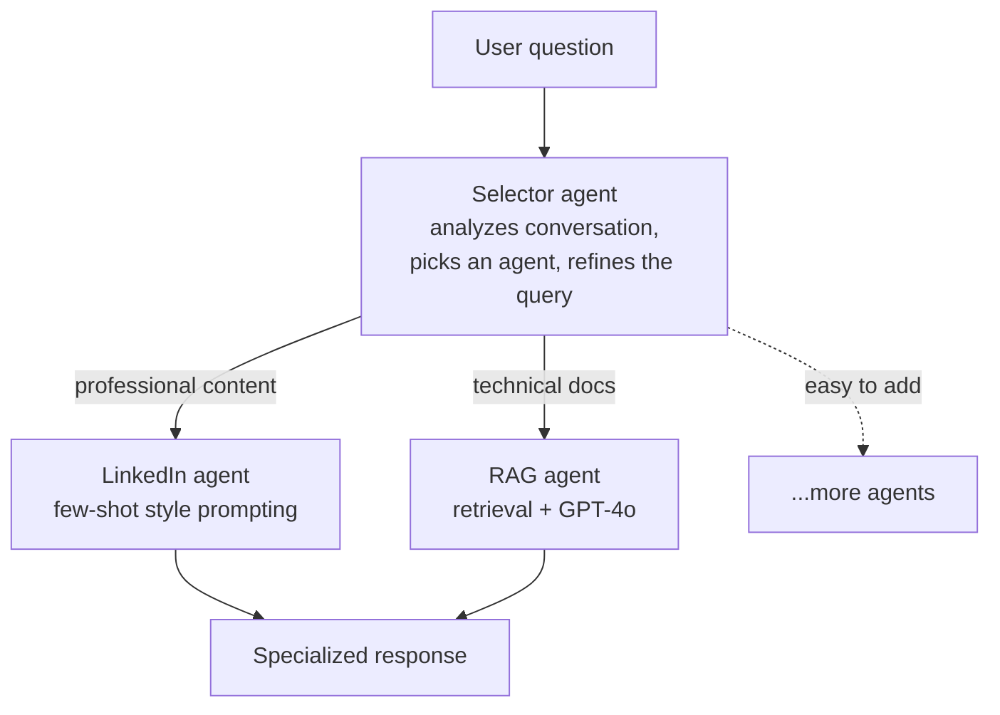

# Day 15 — Understanding Agent Systems

**Time:** ~45 min · Read + Watch

> **Today:** you've built the data pipeline — now you make the system intelligent. Agents are specialized AI workers, and this week you'll build the architecture that routes every user message to the right one.

## Video walkthrough

Watch this introduction to agent architecture:

<iframe src="https://share.descript.com/embed/NU3Y2poBr00" width="640" height="360" frameborder="0" allowfullscreen></iframe>

## What you'll build this week

By the end of this week's module, you'll understand:

- What agents are and why we need them
- How to route requests to the right agent
- The agent architecture pattern
- How to build an agent selector

## The problem: one model can't do everything well

Imagine you have a chatbot that needs to:

- Answer questions about your LinkedIn content (needs your writing style)
- Answer questions about React documentation (needs up-to-date info)
- Handle casual conversation (needs general knowledge)

**One approach: use one model for everything**

```typescript
// ❌ The naive approach
const response = await openai.chat.completions.create({
	model: 'gpt-4o',
	messages: [
		{ role: 'system', content: 'Answer any question' },
		{ role: 'user', content: userMessage },
	],
});
```

**Problems:**

- Can't fine-tune for specific tasks
- No specialized knowledge retrieval
- Same prompt for all scenarios
- Expensive (always uses the big model)

## The solution: agent architecture

Instead, use specialized agents behind a router:



**Benefits:**

- Right tool for the job
- Better quality answers
- More cost effective
- Easy to add new capabilities

### Real-world analogy: a hospital

**Bad approach — one doctor:** a single generalist sees every patient. Slower, less specialized care; nobody can be expert in everything.

**Good approach — specialists:** a triage nurse routes patients. The cardiologist handles heart issues, the orthopedist handles broken bones. Each is an expert in their domain.

Your AI system works the same way. The selector is the triage nurse.

## Understanding the components

### 1. Agent types ([`app/agents/types.ts`](https://github.com/projectshft/mini-rag/blob/student-todo-exercises/app/agents/types.ts))

```typescript
export type AgentType = 'linkedin' | 'rag';

export interface AgentRequest {
	type: AgentType; // Which agent is handling this
	query: string; // Refined/summarized query
	originalQuery: string; // What user actually said
	messages: Message[]; // Full conversation history
}

export type AgentResponse = StreamTextResult; // Streamed response
```

**Key insight: `AgentRequest` is your contract.** Every agent receives the same structure but handles it differently:

- `type`: so the agent knows what it's supposed to do
- `query`: refined query (the selector removed the fluff)
- `originalQuery`: maintains the user's exact words
- `messages`: for context-aware responses

### 2. Agent config ([`app/agents/config.ts`](https://github.com/projectshft/mini-rag/blob/student-todo-exercises/app/agents/config.ts))

```typescript
export const agentConfigs: Record<AgentType, AgentConfig> = {
	linkedin: {
		name: 'LinkedIn Agent',
		description: 'For questions about LinkedIn, professional networking...',
	},
	rag: {
		name: 'RAG Agent',
		description: 'For questions about documentation, technical content...',
	},
};
```

**Why a separate config?**

- Single source of truth
- The selector uses the descriptions to route
- Easy to add new agents (just add to config)
- Documentation stays in sync with code

### 3. Agent registry ([`app/agents/registry.ts`](https://github.com/projectshft/mini-rag/blob/student-todo-exercises/app/agents/registry.ts))

```typescript
type AgentExecutor = (request: AgentRequest) => Promise<AgentResponse>;

export const agentRegistry: Record<AgentType, AgentExecutor> = {
	linkedin: linkedInAgent,
	rag: ragAgent,
};
```

**The registry pattern** is a classic:

1. Map string keys to functions
2. Type-safe lookup
3. Runtime routing
4. Easy to extend

Think of it like a phone directory — given an agent name, quickly find the function to call.

## The agent selector: the brain

Located at [`app/api/select-agent/route.ts`](https://github.com/projectshft/mini-rag/blob/student-todo-exercises/app/api/select-agent/route.ts). This is the "triage nurse" of your system — you'll implement it on [Day 17](/learn/day-17).

**Input:** conversation history (last 5 messages)

**Process:**

1. Analyzes the conversation context
2. Determines user intent
3. Refines the query (removes conversational fluff)
4. Chooses the best agent

**Output:** `{ agent: 'rag', query: 'How do I use React hooks?' }`

### Why last 5 messages?

```typescript
const recentMessages = messages.slice(-5);
```

- Maintains conversation context
- Understands follow-up questions
- Not too much context (cost + latency)
- Captures recent intent shifts

Example:

```
User: "Tell me about yourself"
Bot: "I'm a RAG assistant..."
User: "What about hooks?" ← Without context, unclear!
```

With context, the selector knows "hooks" refers to React (from earlier messages).

### The selector prompt

```typescript
const systemPrompt = `You are an agent router.
Based on the conversation history, determine which agent should handle
the request and create a focused query.

Available agents:
- "linkedin": For professional networking questions
- "rag": For technical documentation questions

Respond with: { "agent": "rag", "query": "clear focused query" }`;
```

**Why this works:** clear instructions, explicit agent descriptions, structured output (JSON), and query refinement built in.

```quiz
[
  {
    "q": "Why route requests through a selector agent instead of sending everything to one big model?",
    "options": ["Specialized agents give better answers per task, cost less, and are easy to extend", "OpenAI requires a router for multi-turn chat", "It reduces the number of API calls per message"],
    "answer": 0,
    "explain": "One generalist prompt can't be fine-tuned, retrieve specialized knowledge, or adapt per task. Routing adds a call, but each downstream agent is the right tool for its job."
  },
  {
    "q": "Why does AgentRequest carry BOTH `query` and `originalQuery`?",
    "options": ["The refined query captures core intent (better retrieval); the original preserves the user's exact words and tone", "One is a backup in case the other is empty", "TypeScript requires two string fields to disambiguate"],
    "answer": 0,
    "explain": "Refinement strips fluff for embedding matching; the original keeps the user's voice — together they give the agent complete context."
  },
  {
    "q": "What does the agent registry pattern buy you?",
    "options": ["Type-safe runtime lookup from an agent name to its executor function — adding an agent is just adding an entry", "Automatic load balancing across agents", "It caches agent responses between requests"],
    "answer": 0,
    "explain": "The registry maps string keys to functions. The chat route looks up the executor by name and calls it — no if/else chains, no rebuilds to extend."
  },
  {
    "q": "Why does the selector only look at the last 5 messages?",
    "options": ["Enough context for follow-ups and intent shifts, without paying for tokens the routing decision doesn't need", "OpenAI limits requests to 5 messages", "Older messages are stored in Pinecone instead"],
    "answer": 0,
    "explain": "Routing is a cheap classification call that runs on every message — you want recent context, not the whole transcript."
  }
]
```

## Query refinement: why it matters

**User says:** "yo can you tell me like what's the deal with that state management thing you mentioned earlier?"

**Selector refines to:** "What is React state management?"

**Benefits:**

- Better embedding matching (if using RAG)
- Clearer intent for the agent
- Removes noise ("yo", "like", "you mentioned")
- More precise retrieval

## The chat route: tying it together

Located at [`app/api/chat/route.ts`](https://github.com/projectshft/mini-rag/blob/student-todo-exercises/app/api/chat/route.ts). It receives:

```typescript
{
  messages: [...conversation],
  agent: 'rag',
  query: 'refined query'
}
```

Then:

1. Gets the agent executor from the registry
2. Builds the `AgentRequest`
3. Executes the agent
4. Returns the stream

**Beautiful simplicity:** the route doesn't care HOW agents work, just that they follow the contract. Each agent is a black box that takes a request and returns a stream.

## Why this architecture?

### Separation of concerns

```
┌─────────────────┐
│ Select Agent    │ ← Routing logic
├─────────────────┤
│ Execute Agent   │ ← Execution logic
├─────────────────┤
│ LinkedIn Agent  │ ← Domain logic (professional)
├─────────────────┤
│ RAG Agent       │ ← Domain logic (documentation)
└─────────────────┘
```

Each layer has ONE job. Easy to test individually, modify without breaking others, add new agents, and debug.

### Type safety

```typescript
// TypeScript prevents:
getAgent('invalid-agent'); // ❌ Type error!
getAgent('rag'); // ✅ Works!
```

And it ensures every agent receives an `AgentRequest` and returns an `AgentResponse`.

### Extensibility

Want to add a "coding" agent? Four steps:

1. Add to types: `'linkedin' | 'rag' | 'coding'`
2. Add to config (name + description)
3. Add to registry (map to function)
4. Implement the agent function

Done. The selector automatically knows about it because it reads from the config.

## Common patterns & best practices

1. **Always include both queries** — original captures tone/exact words, refined captures core intent.
2. **Fail fast** — if configuration is missing (like API keys), throw during initialization, not later when handling requests.
3. **Stream everything** — all agents return streams, not complete responses. Better UX, lower perceived latency, cancellable, and the industry standard for chat apps.

## Additional reading

**[Building Effective Agents (Anthropic)](https://www.anthropic.com/engineering/building-effective-agents)** — deep dive into agentic workflows vs simple prompts, routing patterns (exactly what we're building!), tool-calling patterns, and real production examples. Read it for: when to use agents vs workflows, orchestration patterns, and common pitfalls.

## ✅ Key takeaways

- One model with one prompt can't excel at every task — specialized agents behind a router beat a generalist
- The selector agent is triage: it reads recent conversation context, picks an agent, and refines the query
- `AgentRequest` is the contract — every agent takes the same shape (type, query, originalQuery, messages) and returns a stream
- Config + registry + types make adding a new agent a four-step change with no routing rewrites
- Query refinement ("yo what's that state thing" → "React state management") directly improves retrieval quality downstream

## 🤖 Work with AI

```ai-prompt
title: Quiz me on agent architecture
---
You are my strict-but-friendly tutor. I just studied the agent architecture in a RAG codebase: a selector agent (app/api/select-agent/route.ts) that routes messages to a LinkedIn agent or a RAG agent, with an AgentRequest contract (type, query, originalQuery, messages), an agentConfigs object, and an agentRegistry mapping names to executor functions.

Quiz me with 5 questions, ONE AT A TIME, waiting for my answer. Start easy ("what does the selector output?") and get harder ("why keep config separate from the registry?", "what breaks if agents received only the refined query?"). If I'm wrong, give a hint and let me retry once. End with a list of my weak spots explained in two sentences each.
```

```ai-prompt
title: Design a new agent with me
---
I'm learning the agent architecture pattern: types (AgentType union), config (name + description used by the selector), registry (name → executor function), and a selector that routes based on config descriptions.

Help me design a hypothetical third agent — a "coding" agent that reviews code snippets. Walk me through the four extension steps one at a time, asking ME to propose each change (the type union edit, the config description the selector would route on, the registry entry, and the agent function signature) before you critique it. Push back hard on my config description: give me three example user messages and ask which agent should get each one, to test whether my description would route them correctly.
```
