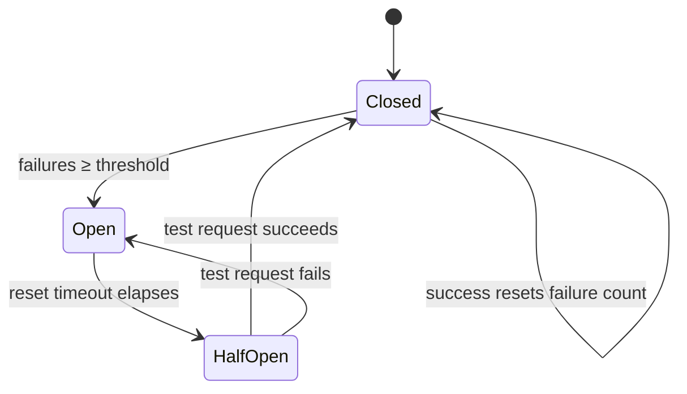

# Day 19 — Graceful Degradation

**Time:** ~45 min · Read + Think

> **Today:** what happens when OpenAI goes down? Or your primary model is overloaded? Production systems need fallback strategies — today you learn the patterns that keep your app standing when its dependencies fall over.

## Why this matters

**Real incidents:**

- OpenAI has experienced multiple outages (some lasting hours)
- Rate limits can spike during high-traffic periods
- Model deprecations happen with limited notice
- Regional issues can affect specific deployments

**The question:** does your entire application crash, or does it degrade gracefully?

You've already shipped a small piece of this: your [Day 17](/learn/day-17) selector falls back to `'rag'` when parsing fails. Today generalizes that instinct into a toolkit.

## Degradation strategies

### Strategy 1: model fallback chain

Try your preferred model first, fall back to alternatives:

```typescript
const MODEL_CHAIN = [
	{ provider: 'openai', model: 'gpt-4o' },
	{ provider: 'openai', model: 'gpt-4o-mini' },
	{ provider: 'anthropic', model: 'claude-3-haiku-20240307' },
];

async function generateWithFallback(prompt: string): Promise<string> {
	for (const { provider, model } of MODEL_CHAIN) {
		try {
			return await callModel(provider, model, prompt);
		} catch (error) {
			console.warn(`${provider}/${model} failed, trying next...`);
			continue;
		}
	}
	throw new Error('All models failed');
}
```

**Tradeoffs:** the primary model gives the best quality; fallbacks may be cheaper but lower quality; users might notice the difference.

### Strategy 2: provider redundancy

Same capability across multiple providers:

```typescript
const EMBEDDING_PROVIDERS = {
	primary: {
		provider: 'openai',
		model: 'text-embedding-3-small',
		dimensions: 512,
	},
	fallback: {
		provider: 'cohere',
		model: 'embed-english-v3.0',
		dimensions: 512, // Must match!
	},
};
```

**Critical:** embedding dimensions must match across providers if they share a vector index. A 512-dim query against 1536-dim vectors isn't "degraded" — it's broken.

### Strategy 3: cached responses

For common queries, cache successful responses:

```typescript
async function queryWithCache(query: string): Promise<string> {
	// Check cache first
	const cached = await cache.get(hashQuery(query));
	if (cached) return cached;

	try {
		const response = await generateResponse(query);
		await cache.set(hashQuery(query), response, { ttl: 3600 });
		return response;
	} catch (error) {
		// On failure, try semantic cache match
		const similar = await cache.findSimilar(query, threshold: 0.95);
		if (similar) return similar;
		throw error;
	}
}
```

Stale-but-relevant beats an error page.

### Strategy 4: graceful feature reduction

Disable non-critical features when degraded:

```typescript
async function processQuery(query: string) {
	const results = await searchDocuments(query); // Core feature - must work

	let reranked = results;
	try {
		reranked = await rerankResults(results); // Nice-to-have
	} catch (error) {
		console.warn('Reranking unavailable, using raw results');
	}

	let summary;
	try {
		summary = await generateSummary(reranked); // Nice-to-have
	} catch (error) {
		summary = 'Summary unavailable. See results below.';
	}

	return { results: reranked, summary };
}
```

Notice the shape: the core path throws if it fails; every enhancement fails *soft* with a sensible default. (You'll build reranking on [Day 23](/learn/day-23) — keep this pattern in mind when you do.)

## Implementation pattern: circuit breaker

Prevent cascading failures by stopping requests to failing services:



```typescript
class CircuitBreaker {
	private failures = 0;
	private lastFailure: Date | null = null;
	private state: 'closed' | 'open' | 'half-open' = 'closed';

	constructor(
		private threshold: number = 5,
		private resetTimeout: number = 30000
	) {}

	async call<T>(fn: () => Promise<T>): Promise<T> {
		if (this.state === 'open') {
			if (Date.now() - this.lastFailure!.getTime() > this.resetTimeout) {
				this.state = 'half-open';
			} else {
				throw new Error('Circuit breaker is open');
			}
		}

		try {
			const result = await fn();
			this.onSuccess();
			return result;
		} catch (error) {
			this.onFailure();
			throw error;
		}
	}

	private onSuccess() {
		this.failures = 0;
		this.state = 'closed';
	}

	private onFailure() {
		this.failures++;
		this.lastFailure = new Date();
		if (this.failures >= this.threshold) {
			this.state = 'open';
		}
	}
}

// Usage
const openaiBreaker = new CircuitBreaker(5, 30000);

async function callOpenAI(prompt: string) {
	return openaiBreaker.call(() => openai.chat.completions.create({
		model: 'gpt-4o',
		messages: [{ role: 'user', content: prompt }],
	}));
}
```

**How it works:**

1. **Closed** (normal): requests pass through
2. **Open** (failing): requests immediately fail — don't pile on a struggling service
3. **Half-open** (testing): allow one request through to test recovery

```quiz
[
  {
    "q": "OpenAI starts erroring on every request. Why does a circuit breaker 'open' and fail requests IMMEDIATELY instead of letting them try?",
    "options": ["Hammering a failing service delays its recovery and ties up your own resources on doomed requests", "Open circuits are cheaper because OpenAI refunds failed calls", "It forces users to refresh the page, which clears the error"],
    "answer": 0,
    "explain": "Failing fast protects both sides: the struggling service gets breathing room, and your app returns fallbacks in milliseconds instead of stacking up 30-second timeouts."
  },
  {
    "q": "Which error should you NOT retry with exponential backoff?",
    "options": ["AuthenticationError — your API key is wrong; it will be wrong on every retry", "RateLimitError — the service is temporarily saturated", "APIConnectionError — the network hiccuped"],
    "answer": 0,
    "explain": "Retry transient failures (rate limits, connection drops, 5xx). Permanent failures like bad auth or malformed requests will never succeed — fail fast and fix the cause."
  },
  {
    "q": "In graceful feature reduction, what separates a 'core' step from a 'nice-to-have' step in code?",
    "options": ["Core steps propagate their errors; nice-to-haves are wrapped in try/catch with a sensible default", "Core steps use bigger models", "Nice-to-haves run in a separate microservice"],
    "answer": 0,
    "explain": "searchDocuments() throwing kills the request — that's correct, there's nothing to show. Reranking or summarization failing just downgrades the response quality."
  },
  {
    "q": "Your fallback embedding provider must produce vectors with the same dimensions as the primary. Why?",
    "options": ["They share one vector index — a 512-dim query can't be compared against vectors of a different dimension", "Providers legally require dimension parity", "Different dimensions cost more per query"],
    "answer": 0,
    "explain": "Similarity math requires vectors in the same space. Mismatched dimensions don't degrade results — they make queries fail or return nonsense."
  }
]
```

## Error handling best practices

### Distinguish error types

```typescript
function isRetryable(error: unknown): boolean {
	if (error instanceof OpenAI.RateLimitError) return true;
	if (error instanceof OpenAI.APIConnectionError) return true;
	if (error instanceof OpenAI.InternalServerError) return true;

	// Don't retry auth errors or bad requests
	if (error instanceof OpenAI.AuthenticationError) return false;
	if (error instanceof OpenAI.BadRequestError) return false;

	return false;
}
```

### Exponential backoff

```typescript
async function withRetry<T>(
	fn: () => Promise<T>,
	maxRetries: number = 3
): Promise<T> {
	for (let attempt = 0; attempt < maxRetries; attempt++) {
		try {
			return await fn();
		} catch (error) {
			if (!isRetryable(error) || attempt === maxRetries - 1) {
				throw error;
			}
			const delay = Math.pow(2, attempt) * 1000; // 1s, 2s, 4s
			await new Promise(resolve => setTimeout(resolve, delay));
		}
	}
	throw new Error('Max retries exceeded');
}
```

## User communication

**Don't just fail silently.** Tell users what's happening:

```typescript
function getUserMessage(error: unknown): string {
	if (error instanceof OpenAI.RateLimitError) {
		return "We're experiencing high demand. Please try again in a moment.";
	}
	if (error instanceof OpenAI.APIConnectionError) {
		return "We're having trouble connecting. Please check back shortly.";
	}
	return "Something went wrong. We're looking into it.";
}
```

Users prefer "limited service" to cryptic errors.

## Think about it

Actually write down answers — these come back when you plan your capstone in Week 6.

1. **Your capstone project:** what's the minimum viable response if your LLM fails? Can you return raw search results without summarization? Show a cached response? What message do you show users?
2. **Cost vs reliability tradeoff:** running multiple providers costs more. When is it worth it?
3. **Testing failures:** how would you test your fallback logic without waiting for a real outage? (Hint: what if `callModel` could be forced to throw for a specific provider?)

## Quick reference: degradation checklist

- [ ] **Fallback models defined** — what's your backup when the primary fails?
- [ ] **Timeouts configured** — don't wait forever for a response
- [ ] **Retries with backoff** — don't hammer failing services
- [ ] **Circuit breaker** — stop cascading failures
- [ ] **Error classification** — retry transient, fail fast on permanent
- [ ] **User messaging** — communicate status clearly
- [ ] **Monitoring/alerts** — know when degradation is happening
- [ ] **Cached responses** — serve stale data when fresh is unavailable

## ✅ Key takeaways

- Plan for failure — every external service you depend on will eventually fail
- Degrade gracefully: partial functionality (raw results, cached answers, a smaller model) beats total failure
- Classify errors before retrying — back off on rate limits and connection errors, fail fast on auth and bad requests
- Circuit breakers stop cascading failures: closed → open at the failure threshold → half-open to probe recovery
- Untested fallback code often doesn't work — inject failures deliberately and communicate degradation to users clearly

## 🤖 Work with AI

```ai-prompt
title: Design a degradation plan for my RAG app
---
I'm building a RAG chat app: a selector agent (gpt-4o-mini) routes messages to a LinkedIn agent or a RAG agent (Pinecone retrieval + gpt-4o synthesis, streaming responses). I just studied graceful degradation: model fallback chains, provider redundancy, cached responses, feature reduction, circuit breakers, retry-with-backoff, and error classification.

Walk me through a failure-mode analysis, ONE component at a time (selector, retrieval, synthesis, streaming). For each: ask ME first what the failure looks like to the user and what my minimum viable response is, then critique my answer and propose the right strategy from the toolkit. Finish by helping me write a prioritized 5-item degradation checklist for this specific app — not a generic one.
```

```ai-prompt
title: Test my fallbacks without an outage
---
I have TypeScript patterns from today's lesson: generateWithFallback() looping over a MODEL_CHAIN, a CircuitBreaker class (threshold 5, reset 30s, closed/open/half-open), withRetry() with exponential backoff, and an isRetryable() classifier for OpenAI error types.

Help me write tests that prove the fallback logic works WITHOUT a real outage. Start by asking me how I'd fake a failing provider (nudge me toward injecting a mock callModel / fake fn into breaker.call). Then have me write, one at a time, tests for: (1) fallback chain skips a throwing model, (2) breaker opens after exactly 5 failures and rejects instantly, (3) breaker goes half-open after the reset timeout and closes on success, (4) withRetry does NOT retry an AuthenticationError. Review each test I write before moving on.
```
