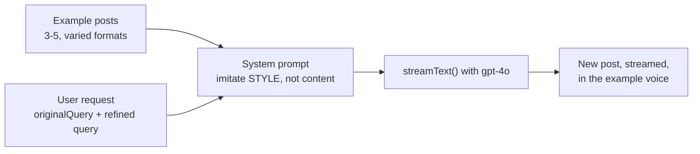

# Day 20 — Implementing the LinkedIn Agent

**Time:** ~90 min · Build

> **Today:** your first specialized agent. You'll use few-shot prompting to lock in a specific LinkedIn writing voice and stream the response — the selector you built this week will route to it automatically.

> **Note on fine-tuning:** this agent was originally built on a fine-tuned model. OpenAI deprecated fine-tuning (May 2026), so we now use **few-shot prompting** instead: show the model a handful of real example posts in the prompt and ask it to imitate their style. This is how style transfer is done with modern models anyway — "context is all you really need." The fine-tuning module ([Day 12](/learn/day-12)) covers the old approach conceptually.

## Video walkthrough

Watch this guide to implementing the LinkedIn agent:

<iframe src="https://share.descript.com/embed/oSYwAxsn4AO" width="640" height="360" frameborder="0" allowfullscreen></iframe>

> The video shows the original fine-tuned model version. The agent structure (system prompt + `streamText()`) is the same — only the model and the style examples have changed.

## What you'll build

An agent that:

- Uses **few-shot prompting** to lock in a writing style — no custom model needed
- Streams responses for a better user experience
- Writes LinkedIn posts in a voice you choose

## How few-shot prompting works

Instead of training a model on hundreds of examples (fine-tuning), you paste a few examples directly into the prompt and tell the model to imitate them:

- **Clear instructions** — what the post should achieve and what to imitate (tone, structure, formatting)
- **A few example posts** — 3–5 is plenty; the model infers the voice from them
- **The user's request** — the topic for the new post

This is faster to iterate on than fine-tuning: change an example, re-run, done.



## Implementation steps

The agent implementation is in [`app/agents/linkedin.ts`](https://github.com/projectshft/mini-rag/blob/student-todo-exercises/app/agents/linkedin.ts). Remember the contract from [Day 15](/learn/day-15): it receives an `AgentRequest` (with `query`, `originalQuery`, and `messages`) and must return a stream.

### 1. Pick your example posts

The repo includes `data/brian_posts.csv` — 850+ real LinkedIn posts from Brian with engagement stats (impressions, reactions, comments).

Three of those posts are already wired up as defaults in `app/agents/example-posts.ts`. You can:

- **Keep the defaults** — they're high-engagement posts with three different formats (story, list, short take)
- **Pick your own from the CSV** — sort by `numImpressions` to find what performed best
- **Use a creator you like** — paste in posts from anyone whose style you want to copy

Whatever you choose, pick examples with **different formats** so the model learns the voice, not a single template.

### 2. Implement the agent

Your agent needs to:

1. **Build an examples block** from the posts in `app/agents/example-posts.ts`
2. **Build a system prompt** that tells the model to imitate the style (not the content) of the examples
3. **Include the user's request** — the original query and refined query from the selector agent
4. **Use `streamText()`** from the Vercel AI SDK to stream the response

The TODOs in `app/agents/linkedin.ts` guide you through each step. Try it yourself before opening the hints below.

<details>
<summary>💡 Hint 1 — where do the examples go?</summary>

In the **system prompt**, not the message history. If you put example posts in `messages`, the model treats them as conversation turns; in the system prompt, they're style reference material.

Build one string: map over `EXAMPLE_POSTS`, label each one (`--- Example Post 1 ---`), and join with blank lines. Then interpolate that block into the system prompt.

</details>

<details>
<summary>💡 Hint 2 — the system prompt's three jobs</summary>

Your system prompt needs to do three things, in roughly this order:

1. Define the role: a LinkedIn copywriter who writes high-engagement posts
2. Present the examples and say explicitly: **match the voice, tone, structure, and formatting — do NOT copy the content**
3. Include both `request.originalQuery` and `request.query` so the model knows the topic and the user's exact phrasing

Without the "style, not content" instruction, the model will recycle topics from the examples instead of writing about the user's topic.

</details>

<details>
<summary>💡 Hint 3 — the streamText call</summary>

```typescript
return streamText({
	model: openai('gpt-4o'),
	system: systemPrompt,
	messages: request.messages,
});
```

Return the `streamText()` result directly — no `await`, no extra method calls. The chat route handles the stream (that's the `AgentResponse` contract).

</details>

<details>
<summary>✅ Solution — don't open until you've tried</summary>

```typescript
import { EXAMPLE_POSTS } from './example-posts';

const examples = EXAMPLE_POSTS.map(
	(post, i) => `--- Example Post ${i + 1} ---\n${post}`,
).join('\n\n');

const systemPrompt = `You are a professional LinkedIn copywriter who creates high-engagement posts.

Study the example posts below and match their voice, tone, structure, and formatting (short punchy lines, line breaks between thoughts, occasional lists and emphasis). Do NOT copy their content — only their style.

${examples}

Original user request: "${request.originalQuery}"
Refined query: "${request.query}"

Use the refined query to understand the user's intent and write a new LinkedIn post on that topic in the style of the examples.`;

return streamText({
	model: openai('gpt-4o'),
	system: systemPrompt,
	messages: request.messages,
});
```

Key points:

- Return the `streamText()` result directly (no need to call additional methods or await)
- The **examples go in the system prompt** — the model treats them as style reference, not conversation history
- "Imitate the style, not the content" matters — without it, the model will recycle topics from the examples
- A standard model (`gpt-4o`) replaces the fine-tuned model — the examples do the work the training data used to do

</details>

```quiz
[
  {
    "q": "Why do the example posts go in the SYSTEM prompt instead of the messages array?",
    "options": ["In the system prompt they act as style reference; in messages the model would treat them as conversation turns to respond to", "The messages array has a 3-item limit", "System prompts are free of token costs"],
    "answer": 0,
    "explain": "Role matters: system content defines how the model should behave (here: 'write like this'), while messages are the dialogue it's participating in."
  },
  {
    "q": "You skip the 'imitate the style, NOT the content' instruction. What's the likely failure?",
    "options": ["The model recycles topics from the example posts instead of writing about the user's topic", "The model refuses to generate anything", "Streaming breaks because the prompt is too long"],
    "answer": 0,
    "explain": "Few-shot examples pull the model toward everything in them — voice AND subject matter. You have to explicitly scope the imitation to style."
  },
  {
    "q": "Why pick example posts with DIFFERENT formats (story, list, short take)?",
    "options": ["Varied formats teach the model the underlying voice; identical formats teach it a single template it will always repeat", "OpenAI requires format diversity in prompts", "Different formats compress better, saving tokens"],
    "answer": 0,
    "explain": "If all three examples are stories, every output will be a story. Variation forces the model to generalize to the voice rather than memorize one shape."
  },
  {
    "q": "When would fine-tuning still beat few-shot prompting for style transfer?",
    "options": ["Extremely niche domains a few examples can't capture, or very high volume where prompt tokens cost more than training", "Whenever you have more than 10 example posts", "Never — few-shot is strictly better in all cases"],
    "answer": 0,
    "explain": "For a personal LinkedIn agent, few-shot wins on speed, cost, and iteration. Fine-tuning's remaining niches are domain depth and amortizing token costs at massive scale."
  }
]
```

## Tuning the output

If the output doesn't sound right:

- **Add more examples** — 1–2 more posts can sharpen the voice
- **Vary your examples** — if all your examples are stories, the model will always tell stories
- **Tighten the instructions** — e.g. "keep it under 150 words", "end with a question"

## When would fine-tuning still make sense?

An extremely niche domain few examples can't capture, very high-volume generation where prompt tokens cost more than training, or a style that drifts with few-shot. For a personal LinkedIn agent, few-shot prompting wins on every axis that matters: speed, cost, and iteration time.

Expect this question in code review — practice the answer:

```scenario
{
  "who": "A teammate",
  "setting": "Code review on your LinkedIn agent. They've noticed data/brian_posts.csv has 850+ posts and you're only using three.",
  "ask": "Why not embed all 850 posts into Pinecone and RAG over them? Retrieval could pull the most relevant old posts for each new topic — we're wasting the data.",
  "note": "Pick the reply you'd leave on the review.",
  "options": [
    {
      "text": "Retrieval fetches facts — it doesn't shape how the model writes. RAG would hand the model Brian's old post about a topic as context, which is what you'd want for quoting or referencing it, not for imitating him. Style lives in examples (or, historically, in fine-tuned weights); knowledge lives in the index. Three varied examples already carry the voice — 850 retrieved chunks wouldn't carry it better, they'd just tempt the model to recycle old content.",
      "verdict": "best",
      "feedback": "This is the distinction that settles it: retrieval changes what the model KNOWS for one answer; examples change how it WRITES. The 'wasting the data' framing assumes more input is always better — pointing out that the 850 posts are style-reference-shaped, not knowledge-shaped, reframes the whole question."
    },
    {
      "text": "There's a decent hybrid in that direction, actually: retrieve the 3 stylistically closest posts per topic and inject them as dynamic few-shot examples instead of the hard-coded ones. Still few-shot doing the style work — retrieval just picks which examples.",
      "verdict": "ok",
      "feedback": "A real production pattern (retrieval-selected few-shot), and it shows you understand that examples, not context, carry the voice. But it's an optimization to earn: it adds a retrieval hop and per-request prompt churn before the static version has even failed — and topically-similar examples pull the model toward recycling content, the exact failure the 'style, not content' instruction guards against."
    },
    {
      "text": "Mostly cost — indexing 850 posts means embedding and Pinecone storage, and the agent already works fine.",
      "verdict": "weak",
      "feedback": "Cost is a real consideration but it's not the reason, and it's a weak hill to defend — 850 short posts cost pennies to embed and store. Argue economics and the suggestion returns the moment someone notices the price tag is trivial; the durable answer is architectural: retrieval doesn't transfer style."
    },
    {
      "text": "Sure, more data can't hurt — let's index them and give the agent a search tool over its own posts.",
      "verdict": "weak",
      "feedback": "'Use all the data' sounds rigorous, which is what makes this tempting — but it mistakes what the model is missing. It doesn't lack knowledge about the topics; it needs a voice to write in. You'd ship a slower, more complex agent whose posts read like remixes of the retrieved ones."
    }
  ],
  "debrief": "This is Day 12's question, inverted: there the goal was knowledge (docs that change weekly, citations required), so retrieval won. Here the goal is voice, so examples win. The sorting question for any 'should we RAG this?' debate: does the model need to KNOW something, or SOUND like someone? Knowledge belongs in the index; voice belongs in examples in the prompt — or, before the May 2026 deprecation, in fine-tuned weights."
}
```

## Testing

Once implemented, the selector agent you built on [Day 17](/learn/day-17)–[18](/learn/day-18) will route LinkedIn-post requests to this agent automatically — try "Write a LinkedIn post about learning RAG" in the app and watch it stream.

Then try the same topic with different example posts swapped into `app/agents/example-posts.ts` — the change in voice should be obvious. That's the whole point: the examples ARE the model's training, and you can hot-swap them.

## Resources

- [Vercel AI SDK — streamText](https://sdk.vercel.ai/docs/ai-core/stream-text)
- [OpenAI Prompt Engineering Guide](https://platform.openai.com/docs/guides/prompt-engineering)

## ✅ Key takeaways

- Few-shot prompting does what fine-tuning used to: 3–5 example posts in the system prompt lock in a voice, with instant iteration
- Examples belong in the system prompt as style reference — and you must explicitly say "imitate the style, not the content"
- Format variety in your examples teaches the voice; identical formats teach a template
- The agent honors the Day 15 contract: it takes an `AgentRequest` (both queries + messages) and returns `streamText()` directly
- Tuning is an edit-and-re-run loop: swap examples, tighten instructions, add constraints — no training jobs

## 🤖 Work with AI

```ai-prompt
title: A/B test my few-shot voice
---
I built a LinkedIn agent (app/agents/linkedin.ts) that uses few-shot prompting: 3 example posts in the system prompt, an "imitate the style, not the content" instruction, and streamText() with gpt-4o. I want to verify the examples actually drive the voice.

Act as my test harness. First, ask me to paste my 3 example posts and one generated post from my agent. Analyze which stylistic features of the examples the output picked up (line length, hooks, lists, emoji, endings) and which it ignored. Then propose an A/B experiment: suggest 3 replacement example posts with a deliberately DIFFERENT style (e.g. long-form, formal, no line breaks) and predict, feature by feature, how the output should change. I'll run it and paste the result — score your predictions and tell me what that reveals about which prompt elements carry the most weight.
```

```ai-prompt
title: Quiz me on few-shot vs fine-tuning
---
You are my strict-but-friendly tutor. I just implemented a LinkedIn writing agent using few-shot prompting (example posts + style instructions in a system prompt, streamed via the Vercel AI SDK) after studying why it replaced the fine-tuned-model approach.

Quiz me with 5 questions, ONE AT A TIME. Cover: why examples go in the system prompt, what "style not content" prevents, why format variety matters, the cost/iteration tradeoffs vs fine-tuning, and why the agent returns streamText() directly instead of awaiting a full completion. If I'm wrong, hint and let me retry once. End by rating whether I'm ready to explain few-shot style transfer in my weekly Feynman video, and name the weakest link in my understanding.
```
