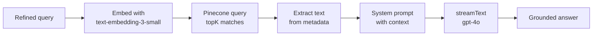

# Day 22 — Implementing the RAG Agent

**Time:** ~90 min · Build

> **Today:** the payoff for everything you've built so far. You'll implement the RAG agent — the piece that takes the selector's refined query, embeds it, searches Pinecone, and streams back an answer grounded in *your* documents.

## Video walkthrough

Watch this guide to implementing the RAG agent:

<iframe src="https://share.descript.com/embed/9skzqf8Bpwv" width="640" height="360" frameborder="0" allowfullscreen></iframe>

## What you'll build

A working RAG agent that:

- Generates embeddings for user queries
- Retrieves relevant context from Pinecone
- Builds context-aware prompts
- Streams responses with document-grounded answers

Every piece is something you've already touched: embeddings (Week 1), Pinecone queries ([Day 11](/learn/day-11)), and the agent architecture (Week 3). Today you connect them into one function.

## The RAG pipeline

The agent lives at [`app/agents/rag.ts`](https://github.com/projectshft/mini-rag/blob/student-todo-exercises/app/agents/rag.ts) and follows five steps:

```typescript
export async function ragAgent(request: AgentRequest): Promise<AgentResponse> {
  // Step 1: Turn question into embedding
  // Step 2: Search Pinecone for similar content
  // Step 3: Extract text from results
  // Step 4: Build prompt with context
  // Step 5: Stream LLM response
}
```



Note what the agent receives: `request.query` is the *refined* query your selector produced ([Day 18](/learn/day-18)), and `request.originalQuery` is what the user literally typed. You'll use both.

```quiz
[
  {
    "q": "Why must the query be embedded with the same model used for the documents?",
    "options": ["Different embedding models produce vectors in different spaces — similarity scores between them are meaningless", "Pinecone rejects vectors from other models", "text-embedding-3-small is the only model that supports queries"],
    "answer": 0,
    "explain": "Cosine similarity only means something when both vectors live in the same embedding space. Mixing models gives you numbers that look like scores but carry no signal."
  },
  {
    "q": "Why does the Pinecone query need includeMetadata: true?",
    "options": ["It makes the search more accurate", "The actual chunk text lives in metadata — without it you get back IDs and scores but nothing to feed the LLM", "It's required for topK to work"],
    "answer": 1,
    "explain": "Pinecone stores vectors; the human-readable text you stored alongside them is metadata. No metadata, no context."
  },
  {
    "q": "The system prompt says 'if the context doesn't contain enough information, say so clearly.' What failure mode does this line defend against?",
    "options": ["Slow responses", "The LLM hallucinating a plausible answer when retrieval came back with weak or irrelevant chunks", "Pinecone returning too many matches"],
    "answer": 1,
    "explain": "Without an explicit instruction, the model happily improvises when the context is thin. This line turns bad retrieval into an honest 'I don't know' instead of a confident lie."
  }
]
```

## Your challenge

Open [`app/agents/rag.ts`](https://github.com/projectshft/mini-rag/blob/student-todo-exercises/app/agents/rag.ts) and implement the five TODO steps. Try each step yourself before opening its hint — you've written versions of most of this code already.

### Step 1: Generate an embedding for the query

Convert `request.query` into a vector using the **same model you embedded documents with**.

<details>
<summary>💡 Hint 1 — you did this in the upload script</summary>

Look at how [`app/scripts/scrapeAndVectorizeContent.ts`](https://github.com/projectshft/mini-rag/blob/student-todo-exercises/app/scripts/scrapeAndVectorizeContent.ts) embeds chunks. Same client, same model (`text-embedding-3-small`), same call — the only difference is the input is now the query string.

</details>

<details>
<summary>💡 Hint 2 — the exact call</summary>

```typescript
const embeddingResponse = await openaiClient.embeddings.create({
  model: 'text-embedding-3-small',
  input: request.query,
});

const embedding = embeddingResponse.data[0].embedding;
```

</details>

### Step 2: Query Pinecone for similar documents

Search the index for the most relevant chunks. You want the metadata back, not just IDs.

<details>
<summary>💡 Hint — same query you wrote on Day 11</summary>

```typescript
const index = pineconeClient.Index(process.env.PINECONE_INDEX as string);

const queryResponse = await index.query({
  vector: embedding,
  topK: 5,
  includeMetadata: true,
});
```

`topK: 5` is a starting point, not a law. Tomorrow you'll learn why you might fetch more and keep fewer.

</details>

### Step 3: Extract text content from the results

Turn the array of matches into one context string. Watch out for matches with missing metadata.

<details>
<summary>💡 Hint — map, filter, join</summary>

```typescript
const retrievedContext = queryResponse.matches
  .map((match) => match.metadata?.text)
  .filter(Boolean)
  .join('\n\n');
```

`.filter(Boolean)` drops any match whose metadata lacks a `text` field — otherwise you'd inject `undefined` into your prompt.

</details>

### Step 4: Build the system prompt with context

Ground the LLM: give it the original request, the refined query, the retrieved context, and an explicit instruction for what to do when the context isn't enough.

<details>
<summary>💡 Hint — the prompt shape</summary>

```typescript
const systemPrompt = `You are a helpful assistant that answers questions based on the provided context.

Original User Request: "${request.originalQuery}"

Refined Query: "${request.query}"

Context from documentation:
${retrievedContext}

Use the context above to answer the user's question. If the context doesn't contain enough information, say so clearly.`;
```

Including *both* queries matters: the refined query drove retrieval, but the original phrasing tells the model what tone and detail level the user actually wants.

</details>

### Step 5: Stream the response

Return a streaming response so the frontend can render tokens as they arrive.

<details>
<summary>💡 Hint — streamText, like the LinkedIn agent</summary>

You built this pattern in the LinkedIn agent on [Day 20](/learn/day-20):

```typescript
return streamText({
  model: openai('gpt-4o'),
  system: systemPrompt,
  prompt: `Context: ${retrievedContext}\n\nUser Query: ${request.query}`,
});
```

</details>

<details>
<summary>✅ Solution — don't open until you've tried all five steps</summary>

```typescript
export async function ragAgent(request: AgentRequest): Promise<AgentResponse> {
  // Step 1: Generate embedding
  const embeddingResponse = await openaiClient.embeddings.create({
    model: 'text-embedding-3-small',
    input: request.query,
  });
  const embedding = embeddingResponse.data[0].embedding;

  // Step 2: Query Pinecone
  const index = pineconeClient.Index(process.env.PINECONE_INDEX as string);
  const queryResponse = await index.query({
    vector: embedding,
    topK: 5,
    includeMetadata: true,
  });

  // Step 3: Extract context
  const retrievedContext = queryResponse.matches
    .map((match) => match.metadata?.text)
    .filter(Boolean)
    .join('\n\n');

  // Step 4: Build prompt
  const systemPrompt = `You are a helpful assistant answering based on context.

Original: "${request.originalQuery}"
Refined: "${request.query}"

Context: ${retrievedContext}

Answer using the context. If insufficient, say so.`;

  // Step 5: Stream response
  return streamText({
    model: openai('gpt-4o'),
    system: systemPrompt,
    prompt: `Context: ${retrievedContext}\n\nQuery: ${request.query}`,
  });
}
```

</details>

## Testing your RAG agent

### Through the API

```bash
curl -X POST http://localhost:3000/api/chat \
  -H "Content-Type: application/json" \
  -d '{
    "messages": [
      {"role": "user", "content": "How do I use useState?"}
    ],
    "agent": "rag",
    "query": "How to use useState hook in React"
  }'
```

### Check what was retrieved

Don't trust the final answer alone — inspect the middle of the pipeline:

```typescript
console.log('Retrieved context:', retrievedContext);
console.log('Number of matches:', queryResponse.matches.length);
```

If the answer is bad, this tells you instantly whether the problem is retrieval (wrong chunks came back) or generation (right chunks, bad prompt). That distinction is the single most useful debugging skill in RAG.

## Heads up: this is Assignment 2

The RAG agent you built today is the core of **Assignment 2 (due Day 27)** — you'll extend it with query preprocessing and record a video on evaluating retrieval quality. Full spec, checklist, and submission links on [Day 27](/learn/day-27). As you test today, start noticing: when retrieval misses, *why* does it miss?

## ✅ Key takeaways

- The RAG agent is a five-step pipeline: **embed → search → extract → prompt → stream** — every step is code you'd already written elsewhere
- Query and documents must share one embedding model, or similarity scores are noise
- The chunk text lives in Pinecone **metadata** — `includeMetadata: true` or you retrieve nothing usable
- An explicit "say so if the context is insufficient" instruction converts retrieval failures into honest answers instead of hallucinations
- Debug RAG by logging the retrieved context: it splits every bad answer into a retrieval problem or a generation problem

## 🤖 Work with AI

```ai-prompt
title: Debug my RAG agent with me
---
I just implemented ragAgent in app/agents/rag.ts for a RAG course. The pipeline is: embed the query with text-embedding-3-small, query Pinecone (topK 5, includeMetadata), join match.metadata.text into a context string, build a system prompt containing the original query + refined query + context, and return streamText with gpt-4o.

I'm going to paste my implementation and one example of a bad answer it gave. Walk me through diagnosing it: first ask me what the logged retrievedContext contained for that query, then help me decide whether it's a retrieval problem (wrong chunks) or a generation problem (right chunks, weak prompt). Don't rewrite my code until we've localized the fault.
```

```ai-prompt
title: Poke holes in my pipeline explanation
---
I'm learning RAG and just built a five-step RAG agent: embed query → Pinecone search → extract metadata text → build grounded system prompt → stream response. I'll explain each step to you in my own words, including WHY it exists.

Play a skeptical senior engineer: after each step, ask one pointed question that tests whether I really understand it (e.g. "what breaks if you embed the query with a different model?", "why topK 5 and not 50?", "what happens when metadata.text is missing?"). If my answer is hand-wavy, push back once before moving on. End with a list of the steps I explained weakest.
```
