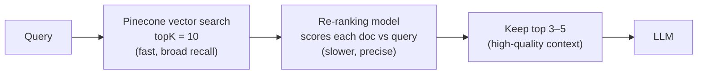

# Day 23 — Implementing Reranking

**Time:** ~60 min · Hands-on

> **Today:** your RAG agent works, but its context is only as good as cosine similarity's top 5 — and cosine's top 5 is often polluted. You'll fix that with the two-stage pattern every production RAG system uses: over-fetch, then re-rank.

## Video walkthrough

Watch this explanation of reranking:

<iframe src="https://share.descript.com/embed/uxl9z4JgiQc" width="640" height="360" frameborder="0" allowfullscreen></iframe>

## The problem

Vector search (Pinecone) is fast and good at finding *generally related* content, but not always precise:

**Query:** "How to use React hooks with TypeScript"

**Pinecone returns (top 5 by cosine similarity):**

1. "React hooks introduction" — 0.89 ✅ Relevant
2. "TypeScript basics" — 0.87 ⚠️ Not specific enough
3. "Using hooks in React" — 0.86 ✅ Relevant
4. "TypeScript with React" — 0.85 ⚠️ Not about hooks specifically
5. "React hooks patterns" — 0.84 ✅ Relevant

**The issue:** results 2 and 4 pollute the context with semi-relevant content. The LLM now has to answer around noise — and noise in, noise out.

```visual
reranking | Why cosine's top hit isn't always the best answer
```

## The solution: over-fetch and re-rank

**Strategy:**

1. **Over-fetch** — get more results than you need (e.g. 10 instead of 5)
2. **Re-rank** — use a specialized model to score relevance more accurately
3. **Keep top N** — take only the best after re-ranking (e.g. top 3–5)



**Why this works:**

- **Pinecone** compares two pre-computed vectors — fast semantic search with good recall (casts a wide net)
- **Re-ranker** is a cross-encoder: it reads the query and each document *together*, using cross-attention, so it catches distinctions like "about TypeScript" vs "about hooks *in* TypeScript"
- **Together:** fast retrieval + accurate ranking = the best of both, without running the expensive model over your whole corpus

```quiz
[
  {
    "q": "Why over-fetch (topK 10) before re-ranking instead of just asking Pinecone for the best 5?",
    "options": ["Pinecone's ranking is approximate — the truly best documents may sit at positions 6–10, and the re-ranker can only promote what's in the candidate pool", "Pinecone charges less for larger topK values", "Re-rankers require a minimum of 10 documents"],
    "answer": 0,
    "explain": "Re-ranking can reorder candidates but can't invent them. Over-fetching widens the pool so the cross-encoder has the good stuff available to promote."
  },
  {
    "q": "Why is a cross-encoder re-ranker more accurate than cosine similarity between embeddings?",
    "options": ["It uses bigger vectors", "It reads the query and document together with cross-attention, instead of comparing two independently pre-computed vectors", "It's trained on more recent data"],
    "answer": 1,
    "explain": "A bi-encoder embeds query and document separately, then compares. A cross-encoder sees both at once, so it can weigh exactly how this document relates to this query — at the cost of being too slow to run over the whole corpus."
  },
  {
    "q": "When is re-ranking probably NOT worth it?",
    "options": ["When queries are nuanced and precision is critical", "When your corpus has many near-duplicate documents", "When latency is critical and your corpus is tiny (< 100 docs)"],
    "answer": 2,
    "explain": "Re-ranking adds ~100–200ms and per-query cost. With a tiny corpus or hard latency budgets, basic retrieval is usually good enough."
  }
]
```

## Documentation resources

Before implementing, skim these docs:

**Pinecone Inference API (re-ranking):**

- [Re-ranking Guide](https://docs.pinecone.io/guides/inference/rerank) — complete guide
- [API Reference](https://docs.pinecone.io/reference/api/2025-04/inference/rerank) — re-rank endpoint

**Cohere re-ranking:**

- [Cohere Rerank Documentation](https://docs.cohere.com/docs/reranking-with-cohere) — how re-rank models work
- [Rerank Best Practices](https://docs.cohere.com/docs/reranking-best-practices) — optimization tips

## Your challenge

Modify your RAG agent ([`app/agents/rag.ts`](https://github.com/projectshft/mini-rag/blob/student-todo-exercises/app/agents/rag.ts)) to use re-ranking. Three changes: over-fetch, re-rank, use the re-ranked context. Try it with the docs above before opening the hints.

### Step 1: Over-fetch

Change your Pinecone query to pull more candidates than you'll keep.

<details>
<summary>💡 Hint — one number changes</summary>

```typescript
const queryResponse = await index.query({
	vector: embedding,
	topK: 10, // Changed from 5 to 10
	includeMetadata: true,
});
```

</details>

### Step 2: Re-rank

After the Pinecone query, pass the candidate texts plus the query to a re-ranking model. Pinecone's inference API hosts one, so you don't need a new vendor account.

<details>
<summary>💡 Hint 1 — what the re-ranker needs</summary>

The re-ranker takes: a model name, the query string, and an array of *plain document texts* (not vectors, not matches). So first pull the text out of your matches, filtering out empties.

</details>

<details>
<summary>💡 Hint 2 — the call</summary>

```typescript
// Re-rank the results using Pinecone's inference API
const documents = queryResponse.matches
	.map((match) => match.metadata?.text ?? match.metadata?.content)
	.filter(Boolean);

// topN: Number of top results to return after reranking
// - Lower values (3-5) = more focused, highest relevance only
// - Higher values (10+) = more context, but may include less relevant docs
// returnDocuments: true means we get the actual text back, not just scores
const reranked = await pineconeClient.inference.rerank(
	'bge-reranker-v2-m3',
	request.query,
	documents,
	{ topN: 5, returnDocuments: true },
);
```

</details>

### Step 3: Use the re-ranked context

Your context string should now come from the re-ranker's output, not the raw Pinecone matches.

<details>
<summary>💡 Hint — reranked.data replaces queryResponse.matches</summary>

```typescript
// Changed from queryResponse.matches to reranked.data
const retrievedContext = reranked.data
	.map((result) => result.document?.text)
	.filter(Boolean)
	.join('\n\n');
```

Everything downstream (system prompt, `streamText`) stays the same.

</details>

<details>
<summary>✅ Solution — the full re-ranking implementation</summary>

```typescript
export async function ragAgent(request: AgentRequest): Promise<AgentResponse> {
	// Step 1: Generate embedding for the refined query
	const embeddingResponse = await openaiClient.embeddings.create({
		model: 'text-embedding-3-small',
		input: request.query,
	});

	const embedding = embeddingResponse.data[0].embedding;

	// Step 2: Query Pinecone for similar documents (over-fetch)
	const index = pineconeClient.Index(process.env.PINECONE_INDEX as string);

	const queryResponse = await index.query({
		vector: embedding,
		topK: 10, // Over-fetch more results
		includeMetadata: true,
	});

	// Step 2.5: Re-rank with Pinecone inference API
	const documents = queryResponse.matches
		.map((match) => match.metadata?.text ?? match.metadata?.content)
		.filter(Boolean);

	// topN: Number of top results to return after reranking
	// - Lower values (3-5) = more focused, highest relevance only
	// - Higher values (10+) = more context, but may include less relevant docs
	// returnDocuments: true means we get the actual text back, not just scores
	const reranked = await pineconeClient.inference.rerank(
		'bge-reranker-v2-m3',
		request.query,
		documents,
		{ topN: 5, returnDocuments: true },
	);

	// Step 3: Extract the text content from re-ranked results
	const retrievedContext = reranked.data
		.map((result) => result.document?.text)
		.filter(Boolean)
		.join('\n\n');

	// Step 4: Build the system prompt with context
	const systemPrompt = `You are a helpful assistant that answers questions based on the provided context.

Original User Request: "${request.originalQuery}"

Refined Query: "${request.query}"

Context from documentation:
${retrievedContext}

Use the context above to answer the user's question. If the context doesn't contain enough information, say so clearly.`;

	// Step 5: Stream the response
	return streamText({
		model: openai('gpt-4o'),
		system: systemPrompt,
		prompt: `Context: ${retrievedContext}\n\nUser Query: ${request.query}`,
	});
}
```

</details>

## Understanding the results

### Without re-ranking (vector search only)

```
Query: "React hooks with TypeScript"

Top 5 from Pinecone:
1. React hooks intro - 0.89
2. TypeScript basics - 0.87       ← Not specific enough
3. Using hooks - 0.86
4. TypeScript with React - 0.85   ← Not about hooks
5. React hooks patterns - 0.84
```

### With re-ranking (over-fetch + re-rank)

```
Query: "React hooks with TypeScript"

Step 1 - Pinecone: Get top 10 similar docs

Step 2 - Re-rank:
1. React hooks with TypeScript guide - 0.95  ✅ Perfect
2. TypeScript types for hooks - 0.89         ✅ Highly relevant
3. useState with TypeScript - 0.84           ✅ Specific example
```

**Result:** higher quality, more focused context for the LLM. Notice the score *spread* too — re-ranked scores separate relevant from irrelevant much more sharply than cosine's crowded 0.84–0.89 band.

## When to use re-ranking

### ✅ Use re-ranking when:

- Queries are specific and nuanced
- Your corpus has many similar documents
- Precision matters more than speed
- Production applications where quality is critical

### ❌ Skip re-ranking when:

- Queries are broad and simple
- Small corpus (< 100 documents)
- Latency is critical (re-ranking adds ~100–200ms)
- Budget is very limited

## Cost & performance trade-offs

**Performance:**

| Approach | Pinecone | Re-ranking | Total |
| --------------------- | -------- | ---------- | ------ |
| Basic (topK=5) | ~50ms | — | ~50ms |
| Re-ranked (topK=10→3) | ~60ms | ~150ms | ~210ms |

**Cost (per 1,000 queries):**

| Service | Basic | With re-ranking | Delta |
| -------------- | ----- | --------------- | ------ |
| Pinecone | $0.01 | $0.02 | +$0.01 |
| Re-rank model | $0 | $2.00 | +$2.00 |
| **Total** | $0.01 | $2.02 | +$2.01 |

That 200× cost multiplier is why "should we re-rank?" is a real engineering decision, not a default.

## Testing your implementation

Add logging to compare the two stages:

```typescript
console.log(
	'Pinecone scores:',
	queryResponse.matches.map((m) => m.score),
);
console.log(
	'Re-ranked scores:',
	reranked.data.map((r) => r.score),
);
console.log('Context length:', retrievedContext.length);
```

You should see bigger gaps between relevant and irrelevant content in the re-ranked scores.

## Looking ahead

Re-ranking is the core of **Assignment 3 (due Day 34)**, where you'll extend today's work with score thresholding — filtering out low-confidence results and answering "I don't have enough information" when nothing passes. Full spec and submission links on [Day 34](/learn/day-34). Keep your logging in place; you'll want that score data.

## Additional reading

### Re-Ranking Semantic Search (Qdrant) ⭐ highly recommended

**Link:** https://qdrant.tech/documentation/search-precision/reranking-semantic-search/

Deep technical explanation of re-ranking algorithms: two-stage retrieval, cross-encoder vs bi-encoder models, latency vs accuracy trade-offs, and benchmarks. It uses Qdrant examples, but the concepts apply directly to Pinecone — re-ranking principles are universal across vector databases.

## ✅ Key takeaways

- Cosine similarity has good **recall** but mediocre **precision** — semi-relevant docs cluster right below the truly relevant ones
- The production pattern is two-stage: **over-fetch** a wide candidate pool fast, then **re-rank** it with a cross-encoder that reads query + document together
- The re-ranker can only promote what's in the pool — over-fetching is what gives it room to work
- Re-ranking costs real latency (~150ms) and real money (~$2/1k queries) — it's a trade-off you justify, not a default you assume
- Compare score distributions before/after: re-ranked scores separate signal from noise far more sharply

## 🤖 Work with AI

```ai-prompt
title: Grill me on the two-stage retrieval trade-offs
---
I just implemented over-fetch + re-rank in my RAG agent (Pinecone topK 10 → bge-reranker-v2-m3 → keep top 5, in app/agents/rag.ts). Play a pragmatic engineering manager deciding whether to ship this to production.

Ask me, one at a time: (1) what latency and per-query cost does re-ranking add and where do those numbers come from, (2) for OUR corpus, what evidence would show re-ranking is actually improving answers, (3) when would you rip it out. Push back on vague answers — demand numbers or concrete experiments. Then give me your ship/don't-ship verdict and one thing to measure first.
```

```ai-prompt
title: Help me design a re-ranking A/B test
---
I have a RAG agent in app/agents/rag.ts with re-ranking behind a code path I can toggle (basic topK=5 vs topK=10 → rerank → top 5). Help me design a small evaluation: 10 test queries against my own document corpus, half broad ("what is chunking?") and half nuanced ("difference between topK and topN in reranking?").

For each query I'll paste both retrieved-context lists. Help me score them (relevant / semi-relevant / irrelevant per chunk), tally the results, and decide whether re-ranking earns its 150ms for my corpus. Start by helping me pick the 10 queries.
```
