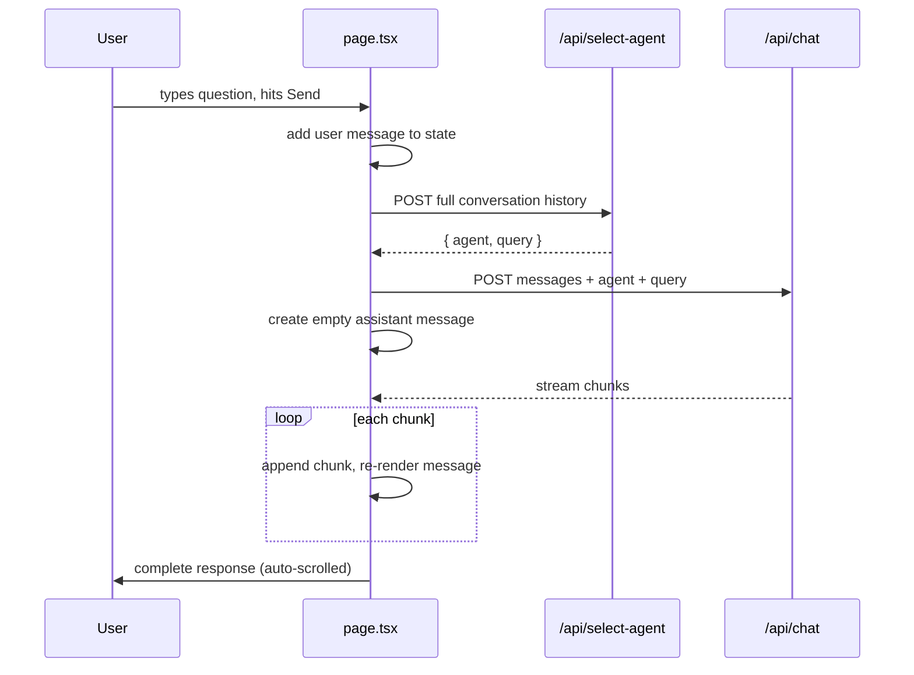

# Day 25 — Understanding the Chat Interface


> **Today:** you've built the backend — agents, routing, retrieval. Now walk through the frontend to see how it all comes together: a hand-rolled streaming chat UI in one React component. It's intentionally bare-bones, and your challenge is to make it better by surfacing RAG sources.

## Video walkthrough

<iframe src="https://share.descript.com/embed/eGQzTq8Dl4l" width="640" height="360" frameborder="0" allowfullscreen></iframe>

## What you'll learn

By the end of today, you'll understand:

- How the custom streaming implementation works (fetch + `ReadableStream`, no libraries)
- The two-step flow: agent selection -> chat response
- How messages are managed with React state
- Where the code can be improved (lots of opportunities!)

Everything today lives in one file: [`app/page.tsx`](https://github.com/projectshft/mini-rag/blob/student-todo-exercises/app/page.tsx).

## The complete flow



Two round trips per message: first the selector ([Day 17](/learn/day-17)–[19](/learn/day-19)) picks the agent and refines the query, then the chat route runs that agent and streams the answer.

## Documentation resources

**Fetch API & Streams:**

- [Fetch API — MDN](https://developer.mozilla.org/en-US/docs/Web/API/Fetch_API) — basic fetch usage
- [Streams API — MDN](https://developer.mozilla.org/en-US/docs/Web/API/Streams_API) — understanding ReadableStream
- [Using Readable Streams](https://developer.mozilla.org/en-US/docs/Web/API/Streams_API/Using_readable_streams) — reading stream data

**React Hooks:**

- [useState](https://react.dev/reference/react/useState) — state management
- [useEffect](https://react.dev/reference/react/useEffect) — side effects (auto-scroll)
- [useRef](https://react.dev/reference/react/useRef) — DOM references

**Alternative approaches:**

- [Vercel AI SDK — useChat](https://sdk.vercel.ai/docs/api-reference/use-chat) — higher-level chat hook
- [Server-Sent Events](https://developer.mozilla.org/en-US/docs/Web/API/Server-sent_events) — SSE alternative to raw streams

## State management

Located at `app/page.tsx` (lines 7–21):

```typescript
// Chat state
const [input, setInput] = useState('');
const [messages, setMessages] = useState<
	Array<{
		id: string;
		role: 'user' | 'assistant';
		content: string;
	}>
>([]);
const [isStreaming, setIsStreaming] = useState(false);
const messagesEndRef = useRef<HTMLDivElement>(null);

// Upload state
const [uploadContent, setUploadContent] = useState('');
const [uploadType, setUploadType] = useState<'urls' | 'text'>('urls');
const [isUploading, setIsUploading] = useState(false);
const [uploadStatus, setUploadStatus] = useState('');
```

**The messages array** is deliberately minimal — an `id` (for React keys), a `role`, and `content`. No complex message parts, no metadata. Just the essentials.

**The streaming flag** (`isStreaming`) prevents multiple simultaneous requests and drives the loading state.

## The chat submit handler

Located at `app/page.tsx` (lines 84–175). Six steps.

### Step 1: Prevent default & validate

```typescript
const handleChatSubmit = async (e: React.FormEvent<HTMLFormElement>) => {
  e.preventDefault();
  if (!input.trim() || isStreaming) return;
```

- `e.preventDefault()` — stop the form from refreshing the page
- `!input.trim()` — reject empty or whitespace-only input
- `isStreaming` — don't send while already processing

### Step 2: Add the user message to the UI

```typescript
const userInput = input;
setInput(''); // Clear input immediately for better UX

const userMessage = {
	id: uuidv4(),
	role: 'user' as const,
	content: userInput,
};

setMessages((prev) => [...prev, userMessage]);
```

Clearing the input *first* makes the UI feel responsive — the user knows the message was received and can start typing the next one. And `role: 'user' as const` tells TypeScript this is the literal type `'user'`, not just `string`.

### Step 3: Select the agent

```typescript
const currentMessages = [
	...messages,
	{ role: 'user' as const, content: userInput },
];

setIsStreaming(true);

const agentResponse = await fetch('/api/select-agent', {
	method: 'POST',
	headers: { 'Content-Type': 'application/json' },
	body: JSON.stringify({ messages: currentMessages }),
});

const { agent, query } = await agentResponse.json();
```

**Key insight:** we build `currentMessages` by hand instead of reading `messages` from state, because React state updates are async — `messages` doesn't include the message we *just* added yet. The selector needs the full conversation, including the new input, to route properly and refine follow-up questions.

### Step 4: Call the chat route

```typescript
const response = await fetch('/api/chat', {
	method: 'POST',
	headers: { 'Content-Type': 'application/json' },
	body: JSON.stringify({
		messages: currentMessages,
		agent,
		query,
	}),
});

if (!response.ok) {
	console.error('Error from chat API:', await response.text());
	return;
}
```

We pass `currentMessages` again because the chat route needs conversation history to maintain context in the response.

### Step 5: Create an empty assistant message

```typescript
const assistantMessageId = uuidv4();
setMessages((prev) => [
	...prev,
	{
		id: assistantMessageId,
		role: 'assistant',
		content: '', // Start empty!
	},
]);
```

Why empty? We'll fill it as chunks arrive. The message bubble appears immediately, and updating it in place creates the smooth streaming effect.

### Step 6: Read the stream

```typescript
const reader = response.body?.getReader();
const decoder = new TextDecoder();
let assistantResponse = '';

if (reader) {
	while (true) {
		const { done, value } = await reader.read();
		if (done) break;

		const chunk = decoder.decode(value);
		assistantResponse += chunk;

		// Update the message with accumulated response
		setMessages((prev) =>
			prev.map((msg) =>
				msg.id === assistantMessageId
					? { ...msg, content: assistantResponse }
					: msg,
			),
		);
	}
}
```

Breaking it down:

- **`getReader()`** gives us manual control over the stream — we pull it chunk by chunk
- **`TextDecoder`** converts each `Uint8Array` chunk into a string
- **`assistantResponse += chunk`** accumulates the full response so far
- **The `setMessages` map** finds the assistant message by ID and replaces its content; React re-renders and the user sees the new text

Because each chunk updates the *same* message (found by `assistantMessageId`), text appears progressively with no flashing or jumping.

```quiz
[
  {
    "q": "Why does the handler build currentMessages manually instead of just using the messages state after setMessages?",
    "options": ["It's a performance optimization", "React state updates are asynchronous — messages won't include the just-added user message yet", "The API requires a different array format"],
    "answer": 1,
    "explain": "setMessages schedules an update; reading `messages` right after still gives the old array. Building the array by hand guarantees the selector sees the newest message."
  },
  {
    "q": "Why create an EMPTY assistant message before reading the stream?",
    "options": ["The API requires an assistant message to exist first", "So each incoming chunk can update one stable message (by ID), producing a smooth in-place streaming effect", "To reserve an ID in the database"],
    "answer": 1,
    "explain": "The empty bubble appears instantly, and every chunk maps over messages to update that one ID. Appending a new message per chunk would spam the list instead."
  },
  {
    "q": "What roles do getReader() and TextDecoder play in the streaming loop?",
    "options": ["getReader pulls raw Uint8Array chunks from the response body; TextDecoder turns each into a string", "getReader parses JSON; TextDecoder handles emoji", "They're only needed for Server-Sent Events"],
    "answer": 0,
    "explain": "response.body is a ReadableStream of bytes. The reader pulls chunks; the decoder converts bytes to text you can append to the message."
  },
  {
    "q": "Why is the send button disabled while isStreaming is true?",
    "options": ["To save tokens", "Streaming locks the input field at the browser level", "To prevent overlapping requests that would interleave chunks into the wrong message"],
    "answer": 2,
    "explain": "Two simultaneous streams would both be appending to state at once. The flag serializes requests and doubles as the loading indicator."
  }
]
```

## Auto-scroll to bottom

Located at `app/page.tsx` (lines 80–82):

```typescript
useEffect(() => {
	messagesEndRef.current?.scrollIntoView({ behavior: 'smooth' });
}, [messages]);
```

An empty `<div ref={messagesEndRef} />` sits after the last message. Whenever `messages` changes — including on every streamed chunk — the effect scrolls that div into view. Result: the chat always shows the latest text, smoothly.

## Rendering messages

Located at `app/page.tsx` (lines 236–264):

```typescript
{
	messages.map((message) => (
		<div
			key={message.id}
			className={`p-3 rounded ${
				message.role === 'user'
					? 'bg-blue-100 ml-8'
					: 'bg-gray-100 mr-8'
			}`}
		>
			<p className='font-semibold mb-1'>
				{message.role === 'user' ? 'You' : 'AI Assistant'}
			</p>
			<div className='whitespace-pre-wrap'>{message.content}</div>
		</div>
	));
}
```

User messages get a blue background pushed right (`ml-8`); assistant messages gray, pushed left (`mr-8`). `whitespace-pre-wrap` preserves line breaks while still wrapping long lines.

### Loading indicator

```typescript
{
	isStreaming && !messages[messages.length - 1]?.content && (
		<div className='p-3 rounded bg-gray-100 mr-8'>
			<p className='text-gray-500'>Thinking...</p>
		</div>
	);
}
```

"Thinking..." shows only in the gap between creating the empty assistant message and the first chunk arriving — the moment content stops being empty, it disappears.

## The input form

Located at `app/page.tsx` (lines 273–288):

```typescript
<form onSubmit={handleChatSubmit} className='flex gap-2'>
	<input
		value={input}
		onChange={(e) => setInput(e.target.value)}
		placeholder='Ask a question about your documents...'
		className='flex-1 p-2 border rounded'
		disabled={isStreaming}
	/>
	<button
		type='submit'
		disabled={isStreaming || !input.trim()}
		className='px-6 py-2 bg-green-600 text-black rounded disabled:bg-gray-400'
	>
		{isStreaming ? 'Sending...' : 'Send'}
	</button>
</form>
```

A controlled input (React owns the value, which is what lets us clear it programmatically), disabled during streaming, with dynamic button text for clear feedback.

## What's missing (improvement opportunities)

This is a **bare-bones** interface. Obvious upgrades you could make:

1. **Error handling** — currently errors just hit `console.error`; show the user an apologetic assistant message instead
2. **Conversation persistence** — messages vanish on refresh; add localStorage, a database, or URL-based conversation IDs
3. **Message timestamps** — render `toLocaleTimeString()` under each bubble
4. **Copy button** — `navigator.clipboard.writeText(message.content)`
5. **Markdown rendering** — AI responses contain code blocks; render with `react-markdown` instead of raw text
6. **Agent indicator** — show whether RAG or LinkedIn handled each response
7. **Source references** — your challenge, below

## Your challenge: add source references

When the RAG agent responds, it retrieves documents from Pinecone — but the user has no idea which ones. Your task: display source references under RAG responses.

**Time estimate:** 1–2 hours. This one's genuinely open-ended — there's no single right answer.

### What you need to do

**1. Modify the RAG agent to return sources**

Update [`app/agents/rag.ts`](https://github.com/projectshft/mini-rag/blob/student-todo-exercises/app/agents/rag.ts) to collect source info:

```typescript
// After querying Pinecone:
const sources = queryResponse.matches.map((match) => ({
	title: match.metadata?.title || 'Untitled',
	url: match.metadata?.url || '',
	score: match.score || 0,
}));
```

**2. Pass sources through the chat route**

Here's the tricky part: `streamText()` returns a *text* stream. How do you smuggle structured metadata alongside it? Think about it before opening the hints — there are at least three workable designs.

<details>
<summary>Hint 1 — approach A: custom headers</summary>

Headers are sent before the body, so you can attach sources there:

```typescript
// In chat route:
const headers = new Headers();
headers.set('X-Sources', JSON.stringify(sources));
return new Response(stream, { headers });

// In frontend:
const sourcesHeader = response.headers.get('X-Sources');
const sources = sourcesHeader ? JSON.parse(sourcesHeader) : [];
```

Simple, but header size is limited and non-ASCII text needs encoding.

</details>

<details>
<summary>Hint 2 — approach B: append a marker to the stream</summary>

Emit the metadata as a sentinel-delimited suffix after the text finishes:

```typescript
// After streaming completes, append metadata:
yield `\n\n__SOURCES__${JSON.stringify(sources)}`;

// In frontend, parse it out:
if (chunk.includes('__SOURCES__')) {
	const [content, sourcesJson] = chunk.split('__SOURCES__');
	// Parse and store sources separately
}
```

Watch out: a sentinel can be split across chunk boundaries — check the *accumulated* response, not just the current chunk.

</details>

<details>
<summary>Hint 3 — approach C: separate API call</summary>

Store sources server-side keyed by message ID, then have the frontend fetch `/api/sources/:messageId` after the stream ends. Simpler parsing, one extra request.

</details>

**3. Display sources in the UI**

Add a section below RAG responses:

```typescript
{
	message.role === 'assistant' && message.sources && (
		<div className='mt-3 pt-3 border-t'>
			<p className='text-xs font-semibold mb-2'>Sources:</p>
			{message.sources.map((source, idx) => (
				<a
					key={idx}
					href={source.url}
					className='text-xs text-blue-600 block hover:underline'
					target='_blank'
					rel='noopener noreferrer'
				>
					{source.title} (Score: {source.score.toFixed(2)})
				</a>
			))}
		</div>
	);
}
```

(You'll need to extend the message type in state to carry an optional `sources` array.)

### Success criteria

When done, users should see:

1. The regular streaming response, as before
2. Below the response, a "Sources" section
3. Clickable links to the documents used
4. Relevance scores for each source
5. Sources only on RAG responses (not LinkedIn)

## Testing your interface

**Test 1 — basic chat flow:** upload a document, ask a question, watch for: message appears immediately -> "Thinking..." -> response streams in word by word -> auto-scroll keeps up.

**Test 2 — agent routing:** "Explain React hooks" should hit the RAG agent; "Help me write a LinkedIn post" should hit LinkedIn. Check the console logs.

**Test 3 — conversation context:**

```
You: "What are React hooks?"
AI: [explains hooks]
You: "Give me an example"  <- Should understand context
AI: [provides hook example]
```

**Test 4 — edge cases:** empty message (blocked), rapid submit clicks during streaming (blocked), very long responses (scrolling holds up), error responses (check console).

**Test 5 — source references (after the challenge):** ask a RAG question, verify sources render with sensible scores and links open in a new tab.

## Key takeaways

- The UI does **two round trips** per message: `/api/select-agent` picks the agent and refines the query, then `/api/chat` streams the answer
- Streaming is just `response.body.getReader()` + `TextDecoder` + accumulating chunks into one message updated in place by ID — no library required
- Build the outgoing messages array by hand: React state updates are async, so `messages` won't yet contain the message you just added
- The empty-assistant-message trick is what makes streaming render smoothly — one stable message, updated per chunk
- `streamText()` gives you a text-only stream, so attaching metadata (like RAG sources) forces a real design decision: headers, in-stream markers, or a second request

## Work with AI

```ai-prompt
title: Design review my source-references implementation
---
I'm doing the "add source references" challenge from my RAG course. The stack: app/agents/rag.ts retrieves from Pinecone and returns streamText() (a plain text stream), app/api/chat/route.ts serves it, and app/page.tsx reads it with getReader()/TextDecoder into a messages array of {id, role, content}.

I chose one of three approaches to pass sources alongside the stream: custom X-Sources header, an in-stream __SOURCES__ sentinel, or a separate /api/sources/:messageId call. I'll tell you which one and paste my code. Review it like a frontend-savvy staff engineer: probe the failure modes specific to my choice (header size limits and encoding? sentinel split across chunk boundaries? race between stream end and the second fetch?), check that sources only render for RAG responses, and suggest the smallest fix for each real issue you find.
```

```ai-prompt
title: Quiz me on the streaming chat flow
---
I just studied a hand-rolled streaming chat UI in app/page.tsx: two-step flow (POST /api/select-agent for {agent, query}, then POST /api/chat), manual currentMessages construction, an empty assistant message filled chunk-by-chunk via getReader() + TextDecoder, auto-scroll via useRef + useEffect on [messages], and an isStreaming flag gating the form.

Quiz me with 5 questions, ONE AT A TIME, hardest last. Focus on the WHYs: why build currentMessages manually, why the empty message, why update by ID instead of appending, what breaks without isStreaming, and one "what would you change in production" question. If I'm wrong, hint once and let me retry before revealing.
```
