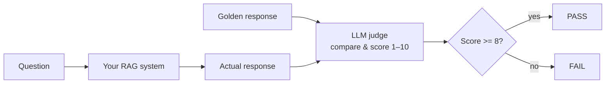

# Day 30 — LLM as Judge


> **Today:** yesterday's tests verified the *right agent* was selected. Today you'll test whether the answer was any *good* — by building an LLM judge that scores your RAG responses against golden references and fails the build when quality regresses.

## The problem: testing response quality

Routing tests tell us the right agent was selected, but they don't tell us if the response is actually good:

```typescript
// This passes, but is the response helpful?
expect(result.agent).toBe('rag');
expect(result.query).toBeTruthy();

// We have no idea if the actual answer was:
// "React hooks let you use state in functional components..."
// "I don't know anything about hooks"
// "Here's some random unrelated text..."
```

**LLM-as-judge** solves this by using another LLM call to evaluate response quality. It's the standard technique for catching regressions when models update, prompts change, or retrieval drifts.

## How it works

1. **Define a golden response** — a high-quality reference answer for a specific question
2. **Get the actual response** — run your system and capture the output
3. **Ask an LLM to score it** — compare actual vs golden on a 1–10 scale
4. **Pass/fail based on threshold** — if score < 8, the test fails



## When to use LLM-as-judge

**Good use cases:**

- Catching quality regressions after model updates
- Validating prompt changes don't degrade responses
- Ensuring RAG retrieval changes don't hurt answer quality
- Smoke testing critical user journeys

**Not ideal for:**

- Testing exact output (use string matching)
- Testing routing logic (use yesterday's selector tests — [/learn/day-29](/learn/day-29))
- High-frequency CI runs (expensive and slow)

## Creating golden responses

The key to good LLM-as-judge tests is high-quality reference responses.

**Where to get them:**

1. **Copy from the chat interface** — use your best real responses
2. **Write them manually** — craft ideal responses for key questions
3. **Curate from production** — save highly-rated user interactions

**What makes a good golden response:**

```typescript
// Too vague - hard to score against
const badGolden = 'React hooks are useful for state management.';

// Specific and comprehensive
const goodGolden = `React hooks let you use state and lifecycle features
in functional components. The most common hooks are:

1. useState - for managing local state
2. useEffect - for side effects like API calls
3. useContext - for accessing context values
4. useRef - for mutable references that persist across renders

Hooks must be called at the top level of your component, not inside
loops or conditions.`;
```

## The scoring prompt

The LLM judge needs clear instructions on how to evaluate:

```typescript
const JUDGE_SYSTEM_PROMPT = `You are an expert evaluator assessing AI response quality.

Compare the ACTUAL response against the REFERENCE response and score from 1-10:

SCORING CRITERIA:
- 10: Perfect - covers all key points, equally or more helpful
- 8-9: Excellent - covers most key points, minor omissions
- 6-7: Good - covers main idea but missing important details
- 4-5: Fair - partially correct but significant gaps
- 2-3: Poor - mostly incorrect or unhelpful
- 1: Failed - completely wrong or off-topic

IMPORTANT:
- Focus on factual accuracy and completeness
- The actual response doesn't need identical wording
- It CAN be better than the reference (still scores 10)
- Penalize incorrect information heavily`;
```

And to get the score back reliably, we use **structured outputs** with a Zod schema — the same technique from [/learn/day-18](/learn/day-18) — so the judge is *guaranteed* to return `{ score, reason }`. No JSON parsing gymnastics:

```typescript
const JudgeResultSchema = z.object({
	score: z.number().min(1).max(10),
	reason: z.string(),
});

type JudgeResult = z.infer<typeof JudgeResultSchema>;
```

**Why structured outputs?**

- Guaranteed valid JSON structure from the model
- Type safety with the Zod schema
- The model is constrained to return exactly what we expect

```quiz
[
  {
    "q": "What does LLM-as-judge testing catch that routing/structure tests can't?",
    "options": ["Whether the response *content* is actually good — regressions in quality after model, prompt, or retrieval changes", "Whether the API returned a 200", "Whether the correct agent was selected"],
    "answer": 0,
    "explain": "Routing tests verify the pipeline's shape; the judge verifies the substance of the answer against a golden reference."
  },
  {
    "q": "Why set temperature: 0 on the judge call?",
    "options": ["It makes the judge free", "You want scoring to be as consistent as possible run-to-run — the judge is the measuring stick, so it should wobble least", "temperature: 0 disables hallucination entirely"],
    "answer": 1,
    "explain": "A flaky judge makes every test flaky. Zero temperature minimizes (though doesn't eliminate) scoring variance."
  },
  {
    "q": "Your golden response says a good answer must mention try/catch; the actual response is accurate but omits it and scores 7 against a threshold of 8. What should you consider FIRST?",
    "options": ["Raise the threshold to 9", "Whether the golden response (or threshold) reflects what actually matters — the test's job is catching real quality drops, not enforcing your exact phrasing", "Delete the test"],
    "answer": 1,
    "explain": "When a judge test fails, interrogate all three parts: is the actual response bad, is the golden too strict, or is the judge prompt miscalibrated?"
  },
  {
    "q": "Why NOT run LLM-as-judge tests on every commit?",
    "options": ["Jest can't schedule tests", "Each test makes 2 real LLM calls — it's slow and costs money, so run it on PR merges instead", "The judge gets tired"],
    "answer": 1,
    "explain": "Every test = your RAG response + a judge evaluation. Keep the suite small (5–10 critical cases) and run it at merge points, not on every keystroke."
  }
]
```

## Choosing the right threshold

Why 8 as the passing score?

| Score | Meaning                      | Test result |
| ----- | ---------------------------- | ----------- |
| 10    | Perfect match or better      | Pass     |
| 9     | Excellent, minor differences | Pass     |
| 8     | Good, covers key points      | Pass     |
| 7     | Decent but missing details   | Fail     |
| 6     | Acceptable but concerning    | Fail     |
| <6    | Quality problem              | Fail     |

**Adjust based on your needs:**

- Critical production tests: threshold = 9
- General quality checks: threshold = 8
- Loose smoke tests: threshold = 7

## What regressions look like

LLM-as-judge excels at catching subtle regressions you'd never spot with structural tests:

**Model update regression**

```
Before (GPT-4): Score 9/10 
After (GPT-4-turbo): Score 6/10 

Reason: New model is more concise but missing key details
about hook rules and common pitfalls.
```

**Prompt change regression**

```
Before: Score 9/10 
After prompt edit: Score 5/10 

Reason: Response now includes incorrect information about
hooks working inside loops.
```

**Retrieval drift**

```
Before: Score 9/10 
After re-indexing: Score 4/10 

Reason: RAG is now retrieving outdated documentation,
response references deprecated APIs.
```

Before you build the judge, practice defending why it needs to exist:

```scenario
{
  "who": "Your engineering manager",
  "setting": "Monday morning. You shipped a prompt edit to the RAG agent on Friday afternoon.",
  "ask": "You changed the prompt Friday — how do we know nothing broke over the weekend?",
  "note": "Pick the answer you'd want to be able to give.",
  "options": [
    {
      "text": "That's what the golden set is for: a small suite of our critical questions, each with a reference answer, scored by an LLM judge on every prompt change. Friday's edit ran against it before merge — every case cleared the threshold, and I can pull up the scores. If the edit HAD degraded anything, the merge would've failed.",
      "verdict": "best",
      "feedback": "This is the answer that builds trust, because it replaces 'I think it's fine' with a repeatable measurement that ran BEFORE the change shipped. The key properties: fixed questions, fixed references, a threshold — so the same bar applies to every future change, not just this one."
    },
    {
      "text": "I manually re-ran our five most common queries after deploying and compared the answers side by side — they looked as good or better.",
      "verdict": "ok",
      "feedback": "Diligent, and honestly better than most teams manage — but it doesn't scale and it protects nothing next Friday. Eyeballing misses the subtle regressions LLM changes actually cause (a dropped caveat, a deprecated API reference), and the manager has to trust your judgment call each time instead of a number."
    },
    {
      "text": "The LLM judge will flag any bad responses in production.",
      "verdict": "weak",
      "feedback": "A judge without a golden set isn't a regression test — it's an opinion with no baseline. 'Was this answer good?' drifts with the judge's own scoring mood; 'is this answer as good as the reference we agreed on?' is measurable. And 'caught in production' means users saw the regression first."
    },
    {
      "text": "If something broke, users will tell us and we'll fix it same-day.",
      "verdict": "weak",
      "feedback": "Honest about how a lot of teams operate, and fast fixes do matter. But this makes users your test suite — and for a docs bot, most users don't file a report when an answer is subtly wrong; they quietly stop trusting the bot. By the time complaints arrive, the damage is a week old."
    }
  ],
  "debrief": "The judge is the grader; the golden set is the exam. A grader with no exam just improvises opinions — but graded against fixed reference answers, every prompt change takes the same test, and 'how do we know nothing broke?' has a one-line answer: the suite passed. That's exactly what you're building below."
}
```

## Your challenge: implement LLM-as-judge testing

The test file `app/agents/__tests__/llm-judge.test.ts` has TODOs for you to complete. You'll implement the judge from scratch using the concepts above as reference.

**What you'll implement:**

1. **Judge system prompt** — define scoring criteria (what does 10 mean? What does 1 mean?)
2. **Zod schema** — add constraints to ensure valid scores (1–10 range)
3. **Test cases** — at least 3 golden responses for questions relevant to your RAG content
4. **Judge function** — implement `judgeResponse()` using structured outputs

### Step 1: add the test script

Add this to your `package.json` scripts:

```json
{
	"scripts": {
		"test:judge": "jest llm-judge"
	}
}
```

### Step 2: get golden responses

1. Run your chat interface (`yarn dev`)
2. Ask questions you want to test
3. Copy the best responses as your golden references
4. Add them to the `TEST_CASES` array

### Step 3: complete the TODOs

Open `app/agents/__tests__/llm-judge.test.ts` and implement each TODO. A `getRAGResponse()` helper is already provided in the file — it calls your [chat route](https://github.com/projectshft/mini-rag/blob/student-todo-exercises/app/api/chat/route.ts) handler directly and collects the streamed response.

Try it yourself before opening the hints — the pieces are all things you've built before (a system prompt, a Zod schema, one `chat.completions.create` call).

<details>
<summary>Hint 1 — the judge function's shape</summary>

`judgeResponse(question, actualResponse, goldenResponse)` is a single OpenAI call:

- `model: 'gpt-4o-mini'` (accurate enough for judging, much cheaper)
- `temperature: 0` (consistent scoring)
- A system message with your `JUDGE_SYSTEM_PROMPT`
- A user message containing QUESTION, REFERENCE RESPONSE, and ACTUAL RESPONSE clearly labeled
- `response_format: zodResponseFormat(JudgeResultSchema, 'judge_result')`

Then `JSON.parse` the message content into your `JudgeResult` type.

</details>

<details>
<summary>Hint 2 — the test suite loop</summary>

Use `test.each(TEST_CASES)` with `jest.setTimeout(30000)` (LLM calls are slow). Each test: (1) `getRAGResponse(question)`, (2) `judgeResponse(...)`, (3) `console.log` the score and reason so failures are debuggable, (4) `expect(score).toBeGreaterThanOrEqual(PASSING_SCORE)`.

</details>

<details>
<summary>Solution — reference implementation (don't open until you've tried)</summary>

Use this as a guide, not something to copy verbatim — your judge prompt and test cases should reflect *your* indexed content.

```typescript
/**
 * LLM-AS-JUDGE TESTS
 *
 * These tests evaluate response QUALITY using another LLM as a judge.
 * Useful for catching regressions when:
 * - Model versions change
 * - Prompts are modified
 * - RAG retrieval drifts
 */

import { z } from 'zod';
import { zodResponseFormat } from 'openai/helpers/zod';
import { POST as chatPOST } from '@/app/api/chat/route';
import { openaiClient } from '@/app/libs/openai/openai';

// ============================================================================
// JUDGE CONFIGURATION
// ============================================================================

const PASSING_SCORE = 8;

const JUDGE_SYSTEM_PROMPT = `You are an expert evaluator assessing AI response quality.

Compare the ACTUAL response against the REFERENCE response and score from 1-10:

SCORING CRITERIA:
- 10: Perfect - covers all key points, equally or more helpful than reference
- 8-9: Excellent - covers most key points, only minor omissions
- 6-7: Good - covers main idea but missing important details
- 4-5: Fair - partially correct but has significant gaps
- 2-3: Poor - mostly incorrect or unhelpful
- 1: Failed - completely wrong or off-topic

IMPORTANT:
- Focus on factual accuracy and completeness
- The actual response doesn't need identical wording
- It CAN be better than the reference (still scores 10)
- Penalize incorrect information heavily
- Consider if a user would find the response helpful`;

// Schema for structured output
const JudgeResultSchema = z.object({
	score: z.number().min(1).max(10),
	reason: z.string(),
});

type JudgeResult = z.infer<typeof JudgeResultSchema>;

// ============================================================================
// TEST CASES - Add your golden responses here!
// ============================================================================

interface TestCase {
	name: string;
	question: string;
	goldenResponse: string;
}

const TEST_CASES: TestCase[] = [
	{
		name: 'React hooks explanation',
		question: 'How do React hooks work?',
		goldenResponse: `React hooks are functions that let you use state and lifecycle features in functional components. The most common hooks include:

- useState: Manages local component state
- useEffect: Handles side effects like data fetching and subscriptions
- useContext: Accesses React context values
- useRef: Creates mutable references that persist across renders

Important rules for hooks:
1. Only call hooks at the top level of your component
2. Don't call hooks inside loops, conditions, or nested functions
3. Only call hooks from React function components or custom hooks`,
	},
	// Add more test cases for your specific indexed content
];

// ============================================================================
// JUDGE IMPLEMENTATION
// ============================================================================

async function judgeResponse(
	question: string,
	actualResponse: string,
	goldenResponse: string,
): Promise<JudgeResult> {
	const response = await openaiClient.chat.completions.create({
		model: 'gpt-4o-mini',
		temperature: 0,
		messages: [
			{ role: 'system', content: JUDGE_SYSTEM_PROMPT },
			{
				role: 'user',
				content: `QUESTION: ${question}

REFERENCE RESPONSE:
${goldenResponse}

ACTUAL RESPONSE:
${actualResponse}

Score the actual response against the reference.`,
			},
		],
		response_format: zodResponseFormat(JudgeResultSchema, 'judge_result'),
	});

	const content = response.choices[0]?.message?.content;
	if (!content) {
		return { score: 0, reason: 'No response from judge' };
	}

	return JSON.parse(content) as JudgeResult;
}

// ============================================================================
// HELPER: Get response from RAG system (already provided in the file)
// ============================================================================

async function getRAGResponse(question: string): Promise<string> {
	const request = {
		json: async () => ({
			messages: [{ role: 'user', content: question }],
			agent: 'rag',
			query: question,
		}),
	} as Request;

	const response = await chatPOST(request);

	const reader = response.body?.getReader();
	if (!reader) {
		throw new Error('No response body');
	}

	const decoder = new TextDecoder();
	let fullResponse = '';

	while (true) {
		const { done, value } = await reader.read();
		if (done) break;
		fullResponse += decoder.decode(value, { stream: true });
	}

	return fullResponse;
}

// ============================================================================
// TEST SUITE
// ============================================================================

describe('LLM-as-Judge Response Quality', () => {
	jest.setTimeout(30000);

	test.each(TEST_CASES)(
		'should produce quality response for: $name',
		async ({ question, goldenResponse }) => {
			// 1. Get actual response from your RAG system
			const actualResponse = await getRAGResponse(question);

			// 2. Have the LLM judge score it
			const { score, reason } = await judgeResponse(
				question,
				actualResponse,
				goldenResponse,
			);

			// 3. Log results for visibility
			console.log(`\nTest: ${question}`);
			console.log(`   Score: ${score}/10`);
			console.log(`   Reason: ${reason}`);
			console.log(`   Threshold: ${PASSING_SCORE}`);

			// 4. Assert quality meets threshold
			expect(score).toBeGreaterThanOrEqual(PASSING_SCORE);
		},
	);
});
```

</details>

### Step 4: run and iterate

```bash
yarn test:judge
```

<details>
<summary>Expected output</summary>

```
PASS app/agents/__tests__/llm-judge.test.ts
  LLM-as-Judge Response Quality
    [x] should produce quality response for: React hooks explanation (4521ms)
      How do React hooks work?
         Score: 9/10
         Reason: Covers all key hooks and rules, adds helpful examples
    [x] should produce quality response for: Async/await explanation (3892ms)
      Explain async/await in JavaScript
         Score: 8/10
         Reason: Accurate explanation, missing try/catch detail

Test Suites: 1 passed, 1 total
Tests:       2 passed, 2 total
```

</details>

If tests fail, check:

- Is your golden response too strict?
- Is the actual response actually bad?
- Does your judge prompt need adjustment?

## Tips for effective judge tests

**Keep test cases focused.** "What are the rules for using React hooks?" with a golden response of key rules only beats "Tell me everything about React" with a 500-line reference — the judge needs clear evaluation criteria.

**Use a consistent golden response style.** Pick bullets or paragraphs and stick with it across your suite.

**Don't over-test.** Not 50 cases covering every possible question — 5–10 critical user journeys (core concepts + a common edge case).

## Cost considerations

Each test makes 2 LLM calls: your RAG system response, plus the judge evaluation.

**Cost estimate per test run:**

- ~$0.01–0.02 with GPT-4o-mini
- ~$0.05–0.10 with GPT-4o

**Recommendations:**

- Run on PR merges, not every commit
- Use GPT-4o-mini for judging (accurate enough, much cheaper)
- Keep the test suite small and focused (5–10 critical cases)

## Submit your work

When you've completed the exercise, submit your `app/agents/__tests__/llm-judge.test.ts` with:

- A filled-in judge system prompt with scoring criteria
- At least 3 test cases with golden responses
- A working `judgeResponse` function implementation

**Submit:**

- [Code Submission - LLM-as-Judge](https://form.typeform.com/to/FNEjXTwk)

Post it in Slack too — comparing judge prompts and thresholds with other students is genuinely useful.

## Key takeaways

- LLM-as-judge tests response **quality** against golden references — the layer routing/structure tests can't reach
- Structured outputs (Zod + `zodResponseFormat`) guarantee the judge returns a parseable `{ score, reason }` every time
- Threshold of 8 is the sweet spot for general quality checks; tune it to 9 for critical paths, 7 for loose smoke tests
- Judge tests shine at catching regressions from model updates, prompt edits, and retrieval drift — run them at merge points, not every commit
- Golden responses are the test — specific, focused references make scoring meaningful; vague ones make it noise

## Work with AI

```ai-prompt
title: Stress-test my judge prompt
---
I wrote an LLM-as-judge system prompt for scoring RAG responses 1-10 against golden references (in app/agents/__tests__/llm-judge.test.ts). Here it is:

[paste your JUDGE_SYSTEM_PROMPT]

Act as an adversarial QA engineer. Give me 5 pairs of (golden response, actual response) where my scoring criteria might misfire: an actual response that's better than the golden but worded totally differently, one that's confidently wrong but fluent, one that's correct but half the length, one that adds extra unrequested info, and one that's subtly outdated. For each pair, predict what score my prompt would produce and what score it SHOULD produce. Then suggest the minimal edits to my prompt to fix the gaps.
```

```ai-prompt
title: Help me pick golden test cases for MY index
---
My RAG system indexes documentation about [describe your indexed content — e.g., React docs, my company's KB]. I need 5 LLM-as-judge test cases: { name, question, goldenResponse }.

Interview me first: ask what the 3 most critical user questions are, and what a failure would look like for each (wrong facts? missing steps? deprecated APIs?). Then help me draft focused golden responses — specific enough to score against, short enough that the judge has clear criteria. Flag any of my questions that are too broad ("tell me everything about X") and help me narrow them.
```
