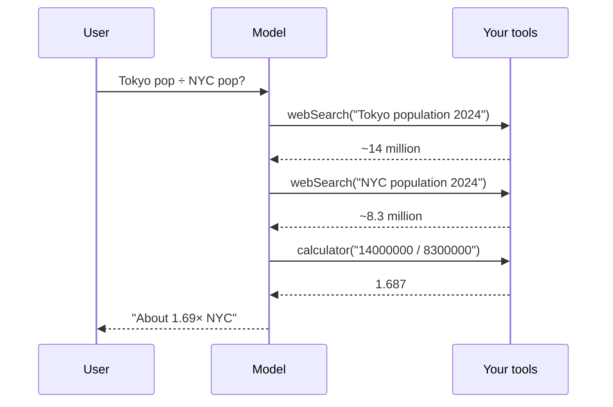

# Day 31 — Tool Calling Concepts

**Time:** ~60 min · Hands-on

> **Today:** the pattern behind every "autonomous agent" you've heard about — tool calling, where the AI decides *when* and *how* to act. You'll learn how it actually works (it's not magic), when it beats a fixed workflow (less often than you'd think), and then refactor your RAG pipeline into a tool the AI chooses to call.

Tool-calling lets an AI model decide **when** and **how** to use external capabilities. Instead of you writing code that says "search the database, then generate a response," the AI itself decides whether to search at all.

Let's understand this with a simple example that has nothing to do with RAG.

## A simple example: research assistant

Imagine building an assistant that can answer questions like:

> "What's the population of Tokyo, and what's that divided by the population of New York?"

The AI can't do this alone. It needs:

1. **Web search** — to find current population data
2. **Calculator** — to do the math

Here's how tool-calling works:

```typescript
import { streamText, tool } from 'ai';
import { openai } from '@ai-sdk/openai';
import { z } from 'zod';

const result = await streamText({
  model: openai('gpt-4o'),
  tools: {
    webSearch: tool({
      description: 'Search the web for current information',
      parameters: z.object({
        query: z.string().describe('The search query'),
      }),
      execute: async ({ query }) => {
        // Call a search API
        const results = await searchWeb(query);
        return results;
      },
    }),
    calculator: tool({
      description: 'Perform mathematical calculations',
      parameters: z.object({
        expression: z.string().describe('Math expression like "14000000 / 8300000"'),
      }),
      execute: async ({ expression }) => {
        // Safely evaluate the expression
        return eval(expression); // (use a safe math parser in production)
      },
    }),
  },
  messages: [
    { role: 'user', content: 'What is the population of Tokyo divided by the population of NYC?' }
  ],
});
```

## What happens under the hood

1. **User asks the question**
2. **AI reads the available tools** and their descriptions
3. **AI decides**: "I need to search for Tokyo's population"
4. **Tool executes**: `webSearch({ query: "Tokyo population 2024" })`
5. **AI receives result**: "Tokyo metropolitan area: ~14 million"
6. **AI decides**: "Now I need NYC's population"
7. **Tool executes**: `webSearch({ query: "New York City population 2024" })`
8. **AI receives result**: "NYC: ~8.3 million"
9. **AI decides**: "Now I need to divide"
10. **Tool executes**: `calculator({ expression: "14000000 / 8300000" })`
11. **AI receives result**: `1.687`
12. **AI responds**: "Tokyo's population is about 1.69 times that of NYC"

The AI orchestrated the entire flow. You just defined the tools.



## It's not magic: the schema tells the AI what to send

A common confusion: *how does the AI know to call `webSearch({ query: "Tokyo population 2024" })` with a `query` field that's a string?* It feels like the model is reading your mind. It isn't.

Three things you wrote get serialized and handed to the model as part of its prompt **before it ever responds**:

1. **The tool's `name`** (`webSearch`) — what to call.
2. **The `description`** (`'Search the web for current information'`) — *when* to call it.
3. **The `parameters` Zod schema** — *what arguments to pass and their exact shape*.

That Zod schema isn't just runtime validation for your code. The SDK converts it into a [JSON Schema](https://json-schema.org/) that's sent to the model. So when you write:

```typescript
parameters: z.object({
  query: z.string().describe('The search query'),
}),
```

…the model literally receives a description that says, in effect:

```json
{
  "name": "webSearch",
  "description": "Search the web for current information",
  "parameters": {
    "type": "object",
    "properties": {
      "query": { "type": "string", "description": "The search query" }
    },
    "required": ["query"]
  }
}
```

The model reads that, sees it must produce an object with a string field named `query`, and generates exactly that. The argument names, their types, and which are required all come straight from your schema.

This is why two habits matter:

- **`.describe()` on every field.** That text is the model's only hint about *what* should go in the field. `z.string().describe('Math expression like "14000000 / 8300000"')` produces far better arguments than a bare `z.string()`.
- **Schema = contract.** If you mark a field required, the model is told it's required. If you use an enum, the model is told the only valid values. You're not hoping the AI guesses right — you're telling it the shape up front, and validating that it complied.

The "decision" the AI makes is *which* tool and *what values*. The *structure* of the call is something you defined and the model was handed.

## The key insight

With tool-calling, you define **what** tools exist. The AI decides **when** to use them.

```
Traditional Code:    You → decide order → call functions → return result
Tool-Calling:        You → define tools → AI decides → AI calls → AI responds
```

This is powerful for **autonomous agents** that need to figure things out on their own.

```quiz
[
  {
    "q": "How does the model know that webSearch takes a required string field named `query`?",
    "options": ["It infers it from the tool's TypeScript source code", "The SDK converts your Zod parameters schema into JSON Schema and sends it to the model with the prompt", "It guesses based on the tool name and retries until validation passes"],
    "answer": 1,
    "explain": "The name, description, and parameter schema are serialized and handed to the model BEFORE it responds. The structure of the call is your contract; the model only chooses which tool and what values."
  },
  {
    "q": "What's the fundamental difference between tool-calling and a fixed workflow?",
    "options": ["Tool-calling is faster", "In a workflow YOU decide the sequence of steps; with tool-calling the AI decides which capabilities to invoke and when", "Workflows can't call external APIs"],
    "answer": 1,
    "explain": "Both can call the same functions. The question is who orchestrates: your code (workflow) or the model's reasoning (tool-calling)."
  },
  {
    "q": "Why does `.describe()` on every schema field matter so much?",
    "options": ["It's required or the SDK throws", "That description is the model's only hint about what value belongs in the field — it directly shapes the arguments the model generates", "It improves TypeScript autocomplete"],
    "answer": 1,
    "explain": "z.string() tells the model 'a string goes here'. z.string().describe('Math expression like \"14000000 / 8300000\"') tells it exactly what KIND of string — and the argument quality follows."
  }
]
```

## Autonomy vs. predictability

Here's the trade-off:

**Tool-calling (autonomous):**

- AI decides the workflow
- Flexible, can handle unexpected queries
- Less predictable
- More expensive (AI reasoning about what to do)
- Can make mistakes in orchestration

**Fixed workflow (deterministic):**

- You decide the workflow
- Predictable, same steps every time
- Easier to debug and test
- Cheaper (no decision overhead)
- Can waste resources on simple queries

## When workflows beat tool-calling

**Here's the thing: most of the time, a fixed workflow is better.**

Why?

1. **You usually know what needs to happen.** If you're building a RAG app, you know every query needs: embed → search → rerank → generate. Why make the AI figure that out?
2. **Workflows are testable.** You can unit test each step. With tool-calling, the AI might take different paths for similar inputs.
3. **Workflows are cheaper.** No extra LLM calls to decide what to do.
4. **Workflows are debuggable.** When something breaks, you know exactly where.

**Tool-calling shines when:**

- You genuinely don't know what sequence of actions is needed
- The agent needs to explore and react dynamically
- You're building a general-purpose assistant

**Workflows win when:**

- The task has a known pattern
- Reliability matters more than flexibility
- You're building a single-purpose tool

You'll hear this exact pitch at work — practice the reply:

```scenario
{
  "who": "A product manager",
  "setting": "Roadmap review. Your docs Q&A bot runs the fixed embed → search → rerank pipeline, and users are happy with it.",
  "ask": "I keep reading about agents. Let's give the chatbot tool calling so it can answer from our docs — that's how everyone's building these now.",
  "note": "The bot already answers from the docs. Pick the reply you'd actually give.",
  "options": [
    {
      "text": "It already answers from our docs — every question runs the same retrieve-then-answer flow, deterministically. Tool calling would add an LLM decision about WHETHER to search, which buys us latency, cost, and a new failure mode where it sometimes decides not to. Tools earn their keep when the assistant has to take actions, hit live systems, or chain steps we can't script — if we add features like that, I'll reach for them.",
      "verdict": "best",
      "feedback": "This lands because it separates the capability from the fashion: the PM asked for an outcome the system already delivers. Naming what tool calling would actually add here (a nondeterministic gate in front of retrieval) and when it WOULD be the right call keeps the door open without taking on complexity now."
    },
    {
      "text": "We could wrap our retrieval pipeline in a tool — it's maybe a day of work, and it would set us up if we add more capabilities later. For the current feature set, though, users wouldn't notice any difference.",
      "verdict": "ok",
      "feedback": "Honest and low-drama, but 'set us up for later' is how systems grow parts nobody needed. YAGNI applies to agents too: add the tool boundary when the second capability actually exists, because until then you've added a decision point that can only make the bot worse."
    },
    {
      "text": "Good idea — tool calling is the modern pattern, and it'll make the bot smarter about when to search.",
      "verdict": "weak",
      "feedback": "It won't make it smarter — the retrieval is identical; you've just put a nondeterministic gate in front of it. The first time the model searches for 'thanks for your help!' or skips a search it needed, you own that bug — and you agreed to it in a meeting without naming the trade."
    },
    {
      "text": "We don't need any of that agent hype — tool calling is overrated.",
      "verdict": "weak",
      "feedback": "Right conclusion for this feature, reasoning that won't survive the follow-up: 'so when WOULD we use it?' Dismissing the technique instead of matching it to the use case teaches the PM nothing — the suggestion comes back next quarter with a blog post attached."
    }
  ],
  "debrief": "The question is never 'is tool calling good?' — it's 'who should orchestrate?' When every request needs the same steps (embed → search → answer), your code should decide: cheaper, testable, and it can't choose wrong. Save the model's judgment for workflows you genuinely can't script in advance."
}
```

And the inverse conversation — where tools ARE the right call and someone's pushing back:

```scenario
{
  "who": "A senior engineer",
  "setting": "Design review for the support assistant. The new requirement: check a customer's live order status and issue refunds under $50.",
  "ask": "We should NOT use tool calling for this — LLMs are unreliable. Let's keep it a plain RAG chatbot and stay safe.",
  "note": "The concern is legitimate. Pick the reply you'd actually give.",
  "options": [
    {
      "text": "The reliability concern is real — models do occasionally call the wrong tool with the wrong arguments. But RAG can't do this feature: retrieval reads a static index, and order status changes by the minute. Live lookups and actions are exactly what tools are for, so let's spend the caution on mitigations: tight parameter schemas the SDK validates, retries on failure, and a human-approval step before any refund executes.",
      "verdict": "best",
      "feedback": "Starting with 'you're right about the risk' is what makes the rest land — you're not dismissing a senior engineer, you're redirecting the caution to where it works. Naming the mitigation stack (schemas, validation, retries, human-in-the-loop on writes) shows this is an engineering problem with known controls, not a leap of faith."
    },
    {
      "text": "What if we split it? Tool calling for the read-only order-status lookup, where a wrong call is recoverable — and route refunds to a human queue entirely, at least for now.",
      "verdict": "ok",
      "feedback": "A genuinely shippable compromise, and the read/write split is real risk thinking. It gives up more than it has to, though: a human-approval gate gets you automated refunds WITH a check, versus no automation at all. Fine as phase one — just don't let 'for now' quietly become the architecture."
    },
    {
      "text": "That take is outdated — modern models are really good at tool calling now. It'll be fine.",
      "verdict": "weak",
      "feedback": "You're answering a risk assessment with vibes. Models are better, and they still occasionally produce wrong arguments or skip a needed call — the senior engineer knows this, so 'it'll be fine' costs you credibility, and the first bad tool call in production reopens the whole debate with you on the losing side."
    },
    {
      "text": "Fair enough — the bot can just link users to the order-status page and tell them to check there.",
      "verdict": "weak",
      "feedback": "This avoids the argument by abandoning the requirement. The feature was 'check the order and act on it'; a bot that says 'go check yourself' is a search box with extra steps. Deferring to seniority when the design is wrong for the use case is how bad architectures get consensus."
    }
  ],
  "debrief": "'It's unreliable' is a risk statement, not a veto — and the professional response is a mitigation list, not a counter-opinion. Schemas constrain what the model can send, validation and retries catch what slips through, and human-in-the-loop gates anything irreversible. RAG reads a snapshot of the past; tools touch the live world. When the feature needs the live world, the answer is tools plus controls — not no tools."
}
```

## Your challenge: implement tool-calling RAG

Now it's your turn. Take your existing RAG workflow — the embed → search → rerank pipeline from [/learn/day-22](/learn/day-22) and [/learn/day-23](/learn/day-23) — and refactor it to use tool-calling.

**Create:** `app/api/tool-calling-agent/route.ts`

**Resources:**

- [Vercel AI SDK - Tools and Tool Calling](https://sdk.vercel.ai/docs/concepts/tools)
- [Vercel AI SDK - Multi-step Tool Calls](https://sdk.vercel.ai/docs/foundations/agents)

**Test it with:**

1. `"Thanks for your help!"` — should NOT call the tool
2. `"How do I use useEffect?"` — should call the tool
3. `"Hello, what can you do?"` — should NOT call the tool
4. `"Explain React hooks"` — should call the tool

<details>
<summary>💡 Hint 1 — where does your existing RAG logic go?</summary>

Wrap your whole retrieval pipeline (embed → search → rerank) inside a single tool's `execute` function. The tool takes a `query` string and returns the reranked context as text. Your existing [`app/agents/rag.ts`](https://github.com/projectshft/mini-rag/blob/student-todo-exercises/app/agents/rag.ts) already has all the pieces — you're just relocating them behind a tool boundary.

</details>

<details>
<summary>💡 Hint 2 — making the AI decide correctly</summary>

- Use `toolChoice: 'auto'` so the AI decides when to search.
- Write a specific `description` — it's how the AI knows *when* to use the tool ("Search the documentation for technical questions about React, hooks, components...").
- In the system prompt, also tell the AI when *not* to use tools (greetings, thanks, small talk) — otherwise it may search for "thanks for your help".
- Set `maxSteps` so the model can call the tool and then generate a final answer from the result.

</details>

You'll see a complete reference implementation tomorrow in [/learn/day-32](/learn/day-32) — genuinely try it first.

## Think about it

Before tomorrow, consider these scenarios. For each one, would you use tool-calling or a fixed workflow?

1. **A customer support bot** that answers questions about your product using a knowledge base.
2. **A code review assistant** that analyzes PRs, checks for security issues, runs linters, and suggests improvements.
3. **A travel planning agent** that needs to search flights, hotels, and activities, then combine them into an itinerary.
4. **A documentation Q&A bot** for your company's internal docs.
5. **A research assistant** that needs to search multiple sources, cross-reference information, and synthesize findings.
6. **A form-filling assistant** that extracts data from documents and populates a database.

Write down your answers. We'll go through them tomorrow in [/learn/day-32](/learn/day-32) — where we reveal our implementation and discuss when workflows beat tool-calling (spoiler: most of the time).

## ✅ Key takeaways

- Tool-calling = you define **what** tools exist, the AI decides **when** and with **what arguments** to call them
- It's not magic: the tool name, description, and Zod-schema-turned-JSON-Schema are sent to the model up front — the model fills in a shape you defined
- `.describe()` every schema field and write specific tool descriptions — they're the model's only guidance
- Fixed workflows beat tool-calling when the steps are known: cheaper, testable, debuggable, predictable
- Reach for tool-calling only when the task is genuinely open-ended and the sequence of actions can't be known in advance

## 🤖 Work with AI

```ai-prompt
title: Debug my tool-calling RAG route with me
---
I'm building app/api/tool-calling-agent/route.ts with the Vercel AI SDK: a single search tool wrapping my embed → Pinecone search → rerank pipeline, toolChoice: 'auto', and a system prompt telling the model when NOT to search. My four test cases: "Thanks for your help!" and "Hello, what can you do?" should skip the tool; "How do I use useEffect?" and "Explain React hooks" should call it.

Here's my code and what's happening: [paste code + behavior]

Help me debug. Check specifically: (1) is my tool description specific enough for the model to know when to act, (2) does every Zod parameter have .describe(), (3) is maxSteps set so the model can answer AFTER the tool returns, (4) does my system prompt explicitly cover the no-tool cases? Ask me what each test query actually did before proposing fixes.
```

```ai-prompt
title: Quiz me — workflow or tool-calling?
---
I just learned the trade-off between fixed workflows (you orchestrate: predictable, cheap, testable) and tool-calling (the AI orchestrates: flexible, expensive, unpredictable). Quiz me with 6 NEW product scenarios (not customer support bots, code reviewers, travel agents, docs Q&A, research assistants, or form-fillers — I've done those). One at a time, I answer "workflow" or "tool-calling" with a one-sentence justification. Challenge weak justifications — especially if I pick tool-calling for a task with a known, fixed pattern. Keep score and at the end tell me the single heuristic I should remember.
```
