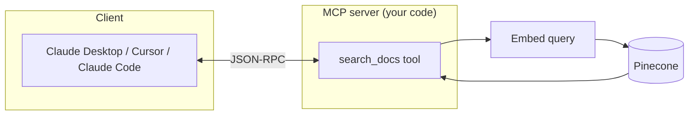

# Day 32 — The Reveal + MCP

**Time:** ~90 min · Build

> **Today:** two things. First, the reveal — our tool-calling RAG implementation and the answers to yesterday's workflow-vs-tool-calling scenarios. Then the payoff: tool-calling standardized across every AI client is called **MCP**, and you'll build a real MCP server that lets Claude search your Pinecone index straight from your editor.

If you haven't attempted yesterday's challenge from [/learn/day-31](/learn/day-31) yet, go do that first — the reveal lands much harder when you've fought with `toolChoice` and tool descriptions yourself.

## Part 1: The reveal — our implementation

Here's a complete tool-calling RAG agent:

```typescript
// app/api/tool-calling-agent/route.ts
import { streamText, tool } from 'ai';
import { openai } from '@ai-sdk/openai';
import { z } from 'zod';
import { pineconeClient } from '@/app/libs/pinecone';
import { openaiClient } from '@/app/libs/openai/openai';

const searchDocsTool = tool({
	description: `Search the documentation for technical information about React,
hooks, components, and web development. Use this when users ask programming
questions that require looking up documentation.`,

	parameters: z.object({
		query: z.string().describe('The technical query to search for'),
	}),

	execute: async ({ query }) => {
		console.log('🔧 Tool called:', query);

		// Step 1: Generate embedding
		const embeddingResponse = await openaiClient.embeddings.create({
			model: 'text-embedding-3-small',
			input: query,
			dimensions: 512,
		});
		const embedding = embeddingResponse.data[0].embedding;

		// Step 2: Search Pinecone
		const index = pineconeClient.Index(process.env.PINECONE_INDEX!);
		const results = await index.query({
			vector: embedding,
			topK: 10,
			includeMetadata: true,
		});

		// Step 3: Extract documents
		const documents = results.matches
			.map((match) => match.metadata?.text)
			.filter(Boolean) as string[];

		// Step 4: Rerank
		const reranked = await pineconeClient.inference.rerank({
			model: 'bge-reranker-v2-m3',
			query,
			documents,
			topK: 5,
			returnDocuments: true,
		});

		// Step 5: Return context
		const context = reranked.data
			.map((r) => r.document?.text)
			.filter(Boolean)
			.join('\n\n');

		console.log('📊 Retrieved', reranked.data.length, 'docs');
		return context;
	},
});

export async function POST(request: NextRequest) {
	const { messages } = await request.json();

	const result = streamText({
		model: openai('gpt-4o'),
		tools: {
			search_documentation: searchDocsTool,
		},
		toolChoice: 'auto',
		maxSteps: 3,
		system: `You are a helpful assistant that answers questions about React and web development.

For technical questions about React, hooks, components, or programming concepts, use the search_documentation tool to find accurate information.

For general conversation, greetings, or simple clarifications, respond directly without using tools.`,
		messages,
	});

	return result.toDataStreamResponse();
}
```

### Key design decisions

**1. Tool description matters.** The description tells the AI **when** to use this tool. Be specific — vague descriptions lead to unpredictable behavior.

**2. `maxSteps` prevents infinite loops.** Without it, the AI could theoretically keep calling tools forever. Set a reasonable limit.

**3. The system prompt guides behavior.** Explicitly tell the AI when NOT to use tools ("For general conversation, greetings, or simple clarifications, respond directly"). Otherwise, it might search for "thanks for your help."

## Scenario answers: workflow vs. tool-calling

Let's revisit yesterday's six scenarios.

**1. Customer support bot (knowledge base) → Workflow.** Every customer question needs the same thing: search the knowledge base, find relevant articles, generate a response. There's no decision to make — always search. Tool-calling would just add overhead for the AI to "decide" to do what it always needs to do.

```
Query → Embed → Search KB → Rerank → Generate
```

**2. Code review assistant → Workflow.** A code review has a known checklist: security check → lint → test coverage → suggestions. You want **every PR** to go through all these steps. Letting the AI skip steps would be dangerous.

**3. Travel planning agent → Tool-calling.** Genuinely open-ended: search flights (maybe multiple airlines), find hotels based on flight times, look up activities based on interests, check weather, combine into an itinerary. The sequence depends on preferences, budget, and availability. The AI needs autonomy to explore options.

**4. Documentation Q&A bot → Workflow.** Same as customer support. Every question needs docs. Just search.

**5. Research assistant → Tool-calling.** Research is exploratory: start with one source, find a lead, follow it, cross-reference, realize you need to search for something else. Exactly where tool-calling shines — the AI dynamically decides what to investigate next.

**6. Form-filling assistant → Workflow.** Extract data → validate → populate database. Known steps, every time.

### The honest truth

**Most production AI features are workflows, not agents.** Most business problems have known solutions — answer customer questions (search and respond), summarize documents (extract and condense), classify emails (analyze and categorize). You don't need the AI to "figure out" what to do. You already know.

Tool-calling is powerful, but it's often overkill. It adds latency (the AI thinks about what to do), cost (extra tokens for reasoning), unpredictability (different paths for similar inputs), and debugging complexity (which path did it take?).

**When in doubt, start with a workflow.** You can always add tool-calling later.

That's why our RAG app sticks with the workflow approach in [`app/agents/rag.ts`](https://github.com/projectshft/mini-rag/blob/student-todo-exercises/app/agents/rag.ts) — every documentation question needs context, so there's no decision to make:

```typescript
// Our actual implementation
export async function ragAgent(request: AgentRequest) {
	// Always: embed → search → rerank → generate
	const embedding = await generateEmbedding(request.query);
	const results = await searchPinecone(embedding);
	const reranked = await rerank(results);

	return streamText({
		model: openai('gpt-4o'),
		system: `Context: ${reranked}`,
		messages: request.messages,
	});
}
```

**"But won't the workflow waste resources when someone says 'Thanks!'?"** Yes. But how often does that happen — maybe 5% of queries? At a few cents per unnecessary search? The alternative is an extra LLM call on *every* query just to decide. The math usually favors the simpler approach. If "thanks" queries ever become a real cost problem, add a simple classifier **before** the workflow — not tools inside it.

```quiz
[
  {
    "q": "Why does the reference implementation set maxSteps: 3?",
    "options": ["To limit Pinecone results to 3 documents", "Without a cap, the model could keep calling tools indefinitely — the limit bounds the tool-call loop", "It makes streaming 3x faster"],
    "answer": 1,
    "explain": "Each 'step' is a model turn that may call a tool. 3 steps is enough for search → (maybe refine) → final answer, and guarantees termination."
  },
  {
    "q": "A code review assistant that must check security, lint, and coverage on EVERY PR — workflow or tool-calling, and why?",
    "options": ["Tool-calling, because reviews require intelligence", "Workflow, because every input needs the same known steps and letting the AI skip a security check would be dangerous", "Tool-calling, because PRs vary in content"],
    "answer": 1,
    "explain": "Varying content doesn't mean varying PROCESS. When the checklist is fixed and skipping steps is costly, you orchestrate — not the model."
  },
  {
    "q": "What problem does MCP solve that plain tool-calling doesn't?",
    "options": ["It makes tools run faster", "It standardizes how tools are exposed, so one server works with ANY MCP client (Claude Code, Cursor, Claude Desktop) instead of a custom integration per app", "It removes the need for tool descriptions"],
    "answer": 1,
    "explain": "Tool-calling inside your app is bespoke — your route, your SDK. MCP is the same idea as an open protocol: define tools once, every compatible AI client can discover and call them."
  },
  {
    "q": "Why must an MCP stdio server log with console.error instead of console.log?",
    "options": ["console.log is deprecated in Node", "stdout carries the JSON-RPC protocol messages — writing logs there corrupts the protocol; stderr is the safe channel", "Errors are more important than logs"],
    "answer": 1,
    "explain": "With stdio transport, the client and server literally talk over stdout/stdin. Anything else you print to stdout gets parsed as (broken) protocol traffic."
  }
]
```

## Part 2: What is MCP?

Yesterday and today you've seen tool-calling *inside your own app*: you define a tool (name + description + schema), and your model decides when to call it. Now the natural next question — what if you want **other** AI apps to call your tools? Claude Desktop, Cursor, Claude Code?

**Model Context Protocol (MCP)** is an open standard that lets AI assistants connect to external tools and data sources. It's tool-calling, standardized.

### The problem MCP solves

Without MCP, every AI integration is custom:

```
Your App ──(custom API)──> Claude
Your App ──(different API)──> GPT
Your App ──(another API)──> Gemini
```

With MCP, you build once:

```
Your App ──(MCP)──> Any AI Assistant
```

### How it works

MCP has three parts:

1. **Server** — your code that exposes tools
2. **Client** — the AI assistant (Claude Desktop, Cursor, Claude Code, etc.)
3. **Protocol** — JSON-RPC messages between them



MCP servers can expose:

- **Tools** — functions the AI can call (search, create, update)
- **Resources** — data the AI can read (files, database records)
- **Prompts** — pre-built prompt templates

For RAG, you typically expose **tools**: `search_documents`, `get_document`, `list_sources`.

### Why this matters for RAG

Instead of building a chat UI, you can expose your RAG system as an MCP server, and users query it directly from Claude Desktop or Cursor — the AI calls your tools automatically:

```
User: "What's the refund policy?"
  → Claude Desktop calls your MCP tool
  → Your server queries Pinecone
  → Claude gets context and responds
```

### MCP vs REST API

| Aspect      | REST API      | MCP          |
| ----------- | ------------- | ------------ |
| Client      | Your app      | AI assistant |
| Integration | Custom per AI | Universal    |
| Discovery   | Docs/OpenAPI  | Built-in     |
| Context     | Manual        | AI manages   |

Notice what carries over from tool-calling: an MCP tool is still a **name + description + parameter schema**. Everything you learned yesterday about writing specific descriptions and `.describe()`-ing schema fields applies directly.

## Part 3: Build it — "Ask My Docs" MCP server

You've seen what MCP is. Now build a small, real one — a single-tool server that lets **any** MCP client (Claude Code, Cursor, the Inspector) search the knowledge base you already loaded into Pinecone, straight from your editor.

Timebox: ~1 hour. One file, one tool.

**Goal:** Expose your Pinecone index as one MCP tool, `search_docs`, and query it from a real client.

```
You (in Claude Code): "search my docs for chunking strategies"
        │
        ▼
  search_docs tool  ──►  embed query  ──►  Pinecone  ──►  top matches back to the chat
```

That's the whole project. No UI, no API route, no auth. One tool that does retrieval.

### Step 1 — Install

```bash
yarn add @modelcontextprotocol/sdk zod
```

### Step 2 — Write the server

Create `mcp/rag-server.ts`. It's self-contained on purpose — it talks to Pinecone and OpenAI directly so you don't have to refactor your app to export anything.

Before you look at the code below, try sketching it yourself: you already know how to embed a query and search Pinecone (you've done it since [/learn/day-11](/learn/day-11)), and you just saw that a tool is a name + description + Zod schema + execute function. The only new pieces are `McpServer` and the stdio transport.

<details>
<summary>💡 Hint — the skeleton</summary>

```typescript
const server = new McpServer({ name: 'rag-server', version: '1.0.0' });

server.tool(
	'search_docs',
	'<description the client model will read>',
	{ /* Zod fields (not wrapped in z.object) */ },
	async (args) => {
		// embed → index.query → map matches
		return { content: [{ type: 'text', text: '...' }] };
	},
);

const transport = new StdioServerTransport();
await server.connect(transport);
```

</details>

<details>
<summary>✅ Solution — the full server</summary>

```typescript
import { McpServer } from '@modelcontextprotocol/sdk/server/mcp.js';
import { StdioServerTransport } from '@modelcontextprotocol/sdk/server/stdio.js';
import { Pinecone } from '@pinecone-database/pinecone';
import OpenAI from 'openai';
import { z } from 'zod';

const pinecone = new Pinecone({ apiKey: process.env.PINECONE_API_KEY! });
const openai = new OpenAI({ apiKey: process.env.OPENAI_API_KEY! });
const index = pinecone.index(process.env.PINECONE_INDEX!);

const server = new McpServer({ name: 'rag-server', version: '1.0.0' });

server.tool(
	'search_docs',
	'Search the knowledge base for relevant document chunks',
	{
		query: z.string().min(1).max(1000).describe('What to search for'),
		topK: z
			.number()
			.int()
			.min(1)
			.max(20)
			.default(5)
			.describe('Number of results'),
	},
	async ({ query, topK }) => {
		const embed = await openai.embeddings.create({
			model: 'text-embedding-3-small',
			input: query,
		});

		const { matches } = await index.query({
			vector: embed.data[0].embedding,
			topK,
			includeMetadata: true,
		});

		const results = matches.map((m) => ({
			score: m.score,
			text: m.metadata?.text,
			source: m.metadata?.source,
		}));

		return {
			content: [{ type: 'text', text: JSON.stringify(results, null, 2) }],
		};
	},
);

const transport = new StdioServerTransport();
await server.connect(transport);
console.error('rag-server running on stdio');
```

</details>

> Note: `console.log` would corrupt the protocol — MCP uses stdout for JSON-RPC. Log to `stderr` (`console.error`) only.

### Step 3 — Test it before touching any client

The Inspector is the fastest feedback loop:

```bash
npx @modelcontextprotocol/inspector npx tsx mcp/rag-server.ts
```

Open the web UI it prints, pick `search_docs`, and run a query you know is in your index. You should get matches back with scores. If you don't, fix it here — not inside Claude.

### Step 4 — Connect a real client

**Claude Code** — add to `~/.claude.json` (or run `claude mcp add`):

```json
{
	"mcpServers": {
		"rag": {
			"command": "npx",
			"args": ["tsx", "/absolute/path/to/mcp/rag-server.ts"],
			"env": {
				"OPENAI_API_KEY": "sk-...",
				"PINECONE_API_KEY": "...",
				"PINECONE_INDEX": "rag-tutorial"
			}
		}
	}
}
```

Restart, then ask: _"Use search_docs to find what my notes say about reranking."_

Cursor and Claude Desktop accept the same config block — check each client's docs for where its config file lives.

### Done when

- [ ] The Inspector lists `search_docs` and returns real matches from your index.
- [ ] One MCP client (Claude Code / Cursor / Desktop) calls the tool and answers from your docs.

## ✅ Key takeaways

- Most production AI features are **workflows**, not agents — tool-calling earns its cost only when the sequence of actions is genuinely unknowable in advance
- In tool-calling implementations, three things do the steering: a specific tool description, an explicit "when NOT to use tools" system prompt, and a `maxSteps` cap
- MCP is tool-calling as an open standard: build one server, and any MCP client (Claude Code, Cursor, Claude Desktop) can discover and call your tools over JSON-RPC
- An MCP tool is still name + description + schema — the same contract you learned yesterday, just exposed to clients you don't control
- With stdio transport, stdout belongs to the protocol — log to stderr only, and test with the Inspector before wiring up a real client

## 🤖 Work with AI

```ai-prompt
title: Extend my MCP server with a second tool
---
I built an MCP server (mcp/rag-server.ts) with one tool, search_docs, that embeds a query with text-embedding-3-small and searches my Pinecone index. It uses McpServer + StdioServerTransport from @modelcontextprotocol/sdk.

Help me design and implement a second tool, but make me do the thinking: first ask me what my index's metadata looks like (source, url, date?), then propose 3 candidate tools (e.g., list_sources, get_document_by_source, search_docs_filtered) with the exact tool name, description, and Zod parameter schema for each — the description and .describe() text matter because the client model reads them. Let me pick one, then guide me through implementing it step by step, asking me to write each piece before you show yours. Finish by giving me 3 Inspector test queries to verify it.
```

```ai-prompt
title: Defend my workflow-vs-tool-calling answers
---
Yesterday I classified 6 scenarios as workflow or tool-calling; today I saw the official answers: customer support bot (workflow), code review assistant (workflow), travel planner (tool-calling), docs Q&A (workflow), research assistant (tool-calling), form-filler (workflow).

Play devil's advocate against the official answers, one scenario at a time. Argue the OPPOSITE choice as convincingly as you can (e.g., "a travel planner is really just search-flights → search-hotels → combine — that's a workflow!"), and make me defend the official answer using the real criteria: known vs unknown step sequence, cost of the model skipping steps, testability, and latency/cost overhead. If I can't defend one, explain what nuance I'm missing in two sentences.
```
