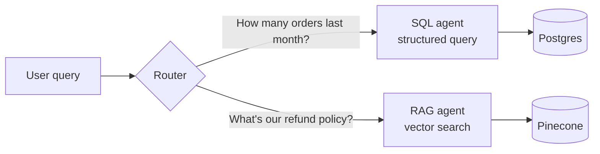

# Day 33 — RAG Without Vectors: The SQL Agent


> **Today:** a reality check on vector search. Not all "retrieval" needs embeddings — for structured data with known schemas, plain database queries are more precise, faster, and cheaper. You'll learn when SQL beats vectors, how an LLM translates natural language into safe database queries, and start the SQL agent you'll submit as Assignment 4.

Not all retrieval requires vector search. For structured data with known schemas, traditional database queries are often more precise, faster, and cheaper. "RAG" just means *grounding the model in retrieved data* — nothing says that data has to come from a vector index.

## When to use SQL vs vector search

### SQL strengths

SQL queries excel when you need:

- **Exact matches**: "Show me orders from customer ID 12345"
- **Aggregations**: "What's the total revenue last month?"
- **Filtering on known fields**: "Find users in California with premium accounts"
- **Sorting and pagination**: "Top 10 products by sales"
- **Joins across tables**: "Orders with their customer details"

```sql
-- Precise, fast, deterministic
SELECT * FROM influencers
WHERE genre = 'fitness' AND location = 'Los Angeles'
ORDER BY follower_count DESC
LIMIT 10;
```

### Vector search strengths

Vector search excels when you need:

- **Semantic similarity**: "Find documents about customer complaints" (even if they don't use the word "complaint")
- **Fuzzy matching**: "What's our policy on returns?" (matches refund policy docs)
- **Unstructured content**: searching through PDFs, articles, support tickets
- **When you don't know the exact terms**: natural language queries

```typescript
// Semantic, flexible, approximate
const results = await index.query({
  vector: await embed("frustrated customer experience"),
  topK: 10
});
```

### The decision framework

| Question | SQL | Vector |
|----------|-----|--------|
| Do I know the exact field names? | | |
| Is the data structured with a schema? | | |
| Do I need aggregations (COUNT, SUM, AVG)? | | |
| Is the query about meaning/similarity? | | |
| Is the content unstructured text? | | |
| Do users ask in natural language? | Depends | |

## Hybrid approach: best of both

Many production systems use both — and the router you built in [/learn/day-17](/learn/day-17) is exactly the piece that decides which retrieval method fits the query:



## Building a SQL agent

A SQL agent translates natural language into database queries. The flow:

```
"Show me fitness influencers in LA under $500"
                    │
                    ▼
         Extract params using LLM
                    │
                    ▼
        genre: "fitness"
        location: "Los Angeles"
        maxPrice: 500
                    │
                    ▼
          Build Prisma query
                    │
                    ▼
        prisma.influencer.findMany({
          where: {
            genre: "fitness",
            location: "Los Angeles",
            price: { lte: 500 }
          }
        })
```

### Why structured outputs matter here

This is the same technique from [/learn/day-18](/learn/day-18) doing a new job: instead of the LLM writing SQL strings (fragile, dangerous), it extracts **typed parameters** and your code builds the query:

```typescript
const QueryParamsSchema = z.object({
  genre: z.string().optional(),
  location: z.string().optional(),
  tier: z.enum(['micro', 'mid', 'macro', 'mega']).optional(),
  minPrice: z.number().optional(),
  maxPrice: z.number().optional(),
});

// LLM extracts structured params from natural language
const params = await extractParams(userQuery);

// Build type-safe Prisma query
const results = await prisma.influencer.findMany({
  where: constructWhereClause(params)
});
```

Every field is `optional()` because users rarely specify everything — "I need gaming influencers" only fills in `genre`. The enum constrains `tier` to the only valid values, so the model can't invent `"medium"`.

## SQL injection: why Prisma is safe

### The dangerous way (raw SQL)

```typescript
// NEVER DO THIS - SQL injection vulnerability
const query = `SELECT * FROM users WHERE name = '${userInput}'`;

// User inputs: "'; DROP TABLE users; --"
// Resulting query: SELECT * FROM users WHERE name = ''; DROP TABLE users; --'
```

### The safe way (Prisma)

```typescript
// Prisma uses parameterized queries
const users = await prisma.user.findMany({
  where: { name: userInput }
});

// User input is treated as DATA, not SQL code
// Even malicious input just searches for that literal string
```

Prisma's query builder:

1. Separates SQL structure from data values
2. Escapes all user input automatically
3. Never interpolates user strings into SQL

**Key insight**: with Prisma, you're building queries with a type-safe API, not concatenating strings. The database receives the query structure and values separately. This matters double in an LLM app — the "user input" flowing into your query might have been generated by a model processing untrusted text. (Tomorrow's security lesson, [/learn/day-34](/learn/day-34), goes deep on this class of problem.)

```quiz
[
  {
    "q": "\"What was our total revenue per region last quarter?\" — SQL or vector search?",
    "options": ["Vector search — it's a natural language question", "SQL — it's an aggregation over structured fields with a known schema", "Neither, you need fine-tuning"],
    "answer": 1,
    "explain": "Natural language INPUT doesn't imply vector RETRIEVAL. Aggregations (SUM, GROUP BY) over known fields are exactly what SQL does deterministically and vectors can't do at all."
  },
  {
    "q": "In our SQL agent, why does the LLM extract typed parameters instead of writing the SQL query itself?",
    "options": ["LLMs can't produce valid SQL syntax", "Typed params (validated by a Zod schema) let YOUR code build a parameterized query — the model never controls query structure, only data values", "It's cheaper per token"],
    "answer": 1,
    "explain": "The model's job is understanding intent; your code's job is safe query construction. Structured outputs draw that boundary precisely."
  },
  {
    "q": "Why is prisma.user.findMany({ where: { name: userInput } }) safe even if userInput is \"'; DROP TABLE users; --\"?",
    "options": ["Prisma blocks the word DROP", "Prisma sends query structure and values to the database separately (parameterized queries), so input is always treated as data, never executable SQL", "Postgres ignores semicolons"],
    "answer": 1,
    "explain": "Parameterization means the malicious string is just searched for literally. No string concatenation, no injection."
  }
]
```

## Exercise: build the `databaseSearchAgent`

This is the code portion of **Assignment 4 (SQL Agent)** — start it today; the full assignment (including your video) is due on [/learn/day-38](/learn/day-38).

### Repository

Clone the **sql-agent** branch:

```bash
git clone -b sql-agent https://github.com/projectshft/killer_agents.git
cd killer_agents
yarn install
```

This repo has Prisma configured with a shared Postgres database containing 1000 influencers.

### The TODOs

Complete the `databaseSearchAgent` in `app/agents/databaseSearchAgent.ts`:

1. Define the Zod schema for extracted parameters
2. Build a Prisma WHERE clause from those parameters
3. Implement the full agent flow (prompt -> LLM -> query -> format)

**Test these queries work:**

- "Find fitness influencers in LA"
- "Show me micro tier creators under $500"
- "I need gaming influencers"

<details>
<summary>Hint 1 — the schema</summary>

Look at the Prisma schema in the repo first — your Zod schema should mirror the queryable columns (genre, location, tier, price range). Make every field `.optional()`: "I need gaming influencers" specifies only genre, and the extraction must not fail because location is missing. Use `z.enum()` for tier so the model can only return valid values, and `.describe()` each field so the model knows what maps where ("maxPrice: the maximum budget in dollars, e.g. 500 for 'under $500'").

</details>

<details>
<summary>Hint 2 — the WHERE clause</summary>

Build the object conditionally — only include keys the LLM actually extracted:

```typescript
const where: Prisma.InfluencerWhereInput = {};
if (params.genre) where.genre = { equals: params.genre, mode: 'insensitive' };
if (params.location) where.location = { contains: params.location, mode: 'insensitive' };
if (params.tier) where.tier = params.tier;
if (params.minPrice || params.maxPrice) {
	where.price = {
		...(params.minPrice && { gte: params.minPrice }),
		...(params.maxPrice && { lte: params.maxPrice }),
	};
}
```

Case-insensitive matching matters — users type "la", "LA", and "Los Angeles".

</details>

<details>
<summary>Hint 3 — the agent flow</summary>

Three steps, all patterns you've built before: (1) call the LLM with a system prompt describing the extraction task + `zodResponseFormat(QueryParamsSchema, ...)` to get params (day 18's structured outputs), (2) `prisma.influencer.findMany({ where })` with your constructed clause, (3) format the rows into a readable response — either template the results directly or hand them to the LLM as context for a natural-language summary.

</details>

Post your progress in Slack — WHERE-clause edge cases ("under $500" vs "between $200 and $500") make good discussion.

## Key takeaways

- "Retrieval" in RAG doesn't have to mean vectors — structured data with a known schema is SQL territory: exact matches, aggregations, joins, sorting
- Vector search earns its keep on unstructured text and meaning-based queries; production systems often route between both (your day-17 router pattern)
- The safe SQL agent pattern: LLM extracts **typed parameters** via structured outputs -> your code builds a **parameterized** Prisma query — the model never writes SQL
- Optional Zod fields + enums make extraction robust to partial queries and impossible values
- Parameterized queries treat user input as data, never code — that's why Prisma is injection-safe by construction

## Work with AI

```ai-prompt
title: Generate test queries for my databaseSearchAgent
---
I'm building databaseSearchAgent.ts (killer_agents repo, sql-agent branch): an LLM extracts { genre?, location?, tier? (micro|mid|macro|mega), minPrice?, maxPrice? } from natural language via a Zod schema + structured outputs, then my code builds a Prisma WHERE clause over an influencers table.

Generate 12 test queries in 4 groups: (1) clean single-filter queries, (2) multi-filter queries with price ranges phrased indirectly ("won't break the bank", "mid four figures"), (3) queries with values that need normalization ("LA", "l.a.", "los angeles"), (4) adversarial ones — a tier that doesn't exist, a price of "free", an injection attempt in the genre. For each, state the exact params my schema SHOULD extract (or reject) and what my WHERE clause should look like. I'll run them and report back; help me debug any mismatches.
```

```ai-prompt
title: Feynman practice — SQL vs vector retrieval
---
I'm going to explain to you, as if you're a smart PM with no ML background, why our app answers "what's the refund policy?" with vector search but would answer "how many refunds did we approve in March?" with SQL. Play the PM: after my explanation, ask the naive-but-sharp follow-ups ("why can't the vector thing count?", "if SQL is cheaper why not use it for everything?", "what happens if the question is kind of both?"). Flag any jargon I didn't define (embedding, schema, aggregation). Then rate my explanation 1-10 on simplicity and accuracy, and tell me the one gap to study before my Assignment 4 video.
```
