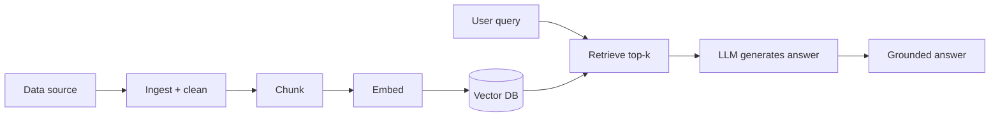

# Day 36 — Capstone Kickoff: Your Final Project

**Time:** ~90 min · Plan + Submit

> **Today:** you pick your capstone — a complete RAG application for a domain you actually care about — scope it, and submit your proposal. Everything you've built over five weeks was practice for this.

## The capstone

Build a complete RAG application for a domain of your choice. You have two paths:

- **Option A:** Extend the existing RAG project by adding a new data source and agent
- **Option B:** Build your own RAG system from scratch

Both options are equally valid. Choose what excites you most.

## Finding your use case

**This is the highest ROI part of the capstone.** Building a RAG system for a real problem you care about — or one your company faces — can be career-changing.

### Where to look for ideas

**At work:**

- Documentation that's hard to search ("Where's the policy on X?")
- Onboarding knowledge that lives in senior engineers' heads
- Support tickets that keep asking the same questions
- Internal wikis that nobody can navigate
- Slack history that contains answers but is impossible to find

**Personal projects:**

- Your notes, journals, or research
- A hobby with lots of documentation (music, games, sports rules)
- Learning a new skill with scattered resources
- Organizing recipes, articles, or bookmarks you've saved

**Open data:**

- Legal documents (case law, contracts, regulations)
- Academic papers in a field you're interested in
- Public company filings (SEC, earnings calls)
- Government data (city council minutes, legislation)
- Product reviews or forum discussions

### The "10x Question"

Ask yourself: **"What takes me 10 minutes to find that should take 10 seconds?"**

That's your RAG use case.

### Real student examples

- **Internal docs search** — "Our engineering wiki has 500 pages and no one can find anything"
- **Recipe assistant** — "I have 200 saved recipes and can never remember which one has that technique"
- **Legal research** — "Finding relevant case law takes hours of reading"
- **Course notes** — "I took 3 years of notes but can't search them semantically"
- **API documentation** — "Our API docs are split across 5 repos"

**Don't overthink it.** Pick something you'll actually use after the course ends.

## Flexibility & experimentation

You are not limited to the tools we used in class:

- **Any programming language** — Python, Go, Rust, Java, whatever you prefer
- **Any vector database** — Pinecone, Qdrant, Weaviate, Chroma, pgvector, etc.
- **Any LLM provider** — OpenAI, Anthropic, Cohere, local models, etc.
- **Any framework** — LangChain, LlamaIndex, Haystack, or build from scratch

**The only requirement:** document your choices and explain why you made them.

## What "done" looks like

Know the bar before you scope. Your final submission (due [Day 42](/learn/day-42)) must hit these:

**Core requirements (all projects):**

- Working RAG system that retrieves relevant context and generates responses
- Proper chunking strategy for your data
- Vector embeddings stored in a vector database
- Working demo with example queries
- One unique feature not covered in the curriculum

**If extending the class project:**

- Add one new data source
- Create a new vector index for this data
- Add one new agent responsible for the new data source
- Update routing so the correct agent is selected

**If building from scratch:**

- Document your architecture decisions
- Explain why you chose your tech stack
- Show how your system handles retrieval and generation

Your `README.md` must explain what your project does, your tech stack and why, how to run it, your chunking strategy, and example queries with expected behavior.

**Evaluation criteria:** correct use of embeddings and chunking · working retrieval and generation pipeline · clean, readable code · clear explanation of design decisions · working demo with example queries · thoughtful documentation of technical choices · one unique feature that shows creativity.

```quiz
[
  {
    "q": "You have 6 build days. Which capstone scope is most likely to succeed?",
    "options": ["A focused Q&A system over one data source you already have access to, plus one unique feature", "A multi-agent platform with five data sources, auth, and a mobile app", "Whatever you can dream up — scope doesn't matter if the idea is good"],
    "answer": 0,
    "explain": "The evaluation rewards a *working* pipeline and clear reasoning, not breadth. One data source, solid retrieval, one creative feature — that ships in a week."
  },
  {
    "q": "If you extend the class project (Option A), what's the minimum set of additions?",
    "options": ["A new UI theme and a new system prompt", "A new data source, a new vector index for it, a new agent, and updated routing", "A second LLM provider and a caching layer"],
    "answer": 1,
    "explain": "Option A is about running the full playbook once more on your own data: ingest it, index it, give it an agent, and teach the selector to route to it."
  },
  {
    "q": "Your capstone must use TypeScript, Pinecone, and OpenAI like the class project.",
    "options": ["True — grading depends on the class stack", "False — any language, vector DB, or LLM provider is fine, as long as you document and justify your choices"],
    "answer": 1,
    "explain": "The stack is your call. The non-negotiable is explaining *why*: that reasoning is what gets evaluated."
  }
]
```

## Sketch your architecture

Before you write the proposal, sketch the pipeline end-to-end. Every RAG capstone reduces to some version of this:



If you're adding agents, add a selector in front of retrieval (you built exactly this in [Day 17](/learn/day-17) and [Day 18](/learn/day-18)). If your data is structured, remember RAG doesn't require vectors at all — revisit the SQL agent from [Day 33](/learn/day-33).

## Part 1: Submit your proposal (due today)

Before building, submit a proposal outlining your plan.

### Video assignment (2–3 minutes)

Record a video explaining your project plan:

1. **Project scope:**
   - Are you extending the class project or building from scratch?
   - What problem are you solving?

2. **Data source:**
   - What data will you use? (articles, docs, posts, etc.)
   - Where will you get it? (public API, scraping, dataset)
   - Why did you choose this data?

3. **Technical choices:**
   - What language/framework are you using?
   - What vector database did you choose and why?
   - What LLM provider are you using?

4. **Chunking strategy:**
   - How will you chunk this content?
   - What chunk size and overlap make sense? (Revisit [Day 8](/learn/day-08) if you're unsure.)
   - Any special considerations for this data type?

5. **Architecture:**
   - How will your system work at a high level?
   - If using agents, how will routing work?

### Submit proposal

- [Proposal Video Submission](https://form.typeform.com/to/Z9JApCkF)
- [Proposal Notes](https://form.typeform.com/to/DXPyafyJ)

Post your idea in Slack too — a quick sanity check from mentors or classmates today can save you two days of building the wrong thing.

> **Build something that works. Explain your choices. Show us what you learned.**

## ✅ Key takeaways

- The best capstone answers the 10x question: what takes you 10 minutes to find that should take 10 seconds?
- Any stack is fine — the graded skill is *justifying* your choices, not matching the class tooling
- Know the finish line before you start: working pipeline, real chunking strategy, demo queries, one unique feature, and a README that explains it all
- Scope small and real: pick something you'll still use after the course ends, then submit the proposal today

## 🤖 Work with AI

```ai-prompt
title: Pressure-test my capstone idea
---
I'm proposing a capstone RAG project. Here's my idea: [describe your problem, data source, and whether you're extending the class project or building from scratch].

Act as a skeptical senior engineer reviewing my proposal. Ask me, one at a time: (1) how I'll actually get the data and roughly how many documents/tokens it is, (2) what a hard example query looks like and what chunk would need to come back for it, (3) what my chunk size/overlap should be for this data type and why, (4) what my "one unique feature not covered in the curriculum" is, and (5) what I'll cut if I fall two days behind. Then tell me if this fits in 6 build days — and if not, propose the smaller version that does.
```

```ai-prompt
title: Rehearse my proposal video
---
I'm about to record a 2–3 minute capstone proposal video covering: project scope, data source, technical choices (language, vector DB, LLM provider), chunking strategy, and high-level architecture.

Here's my draft script: [paste your bullet points]. Play the reviewer: flag anything where I stated a choice without a *why*, any jargon I didn't earn, and any section that would run long. Then give me a tightened 5-bullet outline I can record from, with a one-sentence "why" for each technical choice.
```
