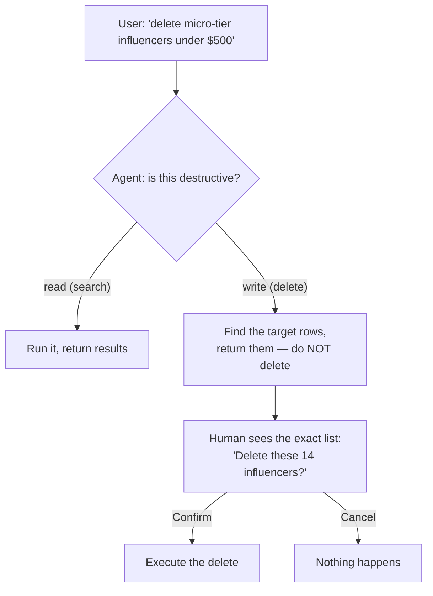

# Human in the Loop: Gating an Agent's Destructive Actions

**Time:** ~60 min · Build

> **Today:** an agent that can *read* is safe to run on its own. An agent that can *delete, refund, or email* is a liability until a human signs off. You'll learn the human-in-the-loop pattern — the agent proposes, a human approves, then it executes — and wire it into the influencer agent from the SQL-agent lab.

## Video walkthrough

<iframe src="https://share.descript.com/embed/bLyg4DvdgXW" width="640" height="360" frameborder="0" allowfullscreen></iframe>

## Why gate an agent at all

On the SQL Agent you built an agent that turns "find gaming influencers under $500" into a SQL query. That agent only **reads** — worst case, it returns the wrong rows and the user shrugs.

Now the client asks for one more feature: *"let me clean up dead accounts — 'delete all micro-tier influencers we haven't booked in a year.'"* Suddenly the same agent can **write**. And here's the uncomfortable truth: an LLM occasionally extracts the wrong parameters. "Delete influencers under $500" with a mis-parsed threshold, or a `WHERE` clause that's emptier than you meant, and you've just wiped your database. There's no undo on `deleteMany`.

The fix is **not** "prompt it more carefully" or "use a better model." Those reduce the odds; they don't change the blast radius. The fix is **structural**: never let the model execute an irreversible action directly. It **proposes**, a human **approves**, and only then does it **execute**.

## The pattern: propose → confirm → execute



The load-bearing idea: **the model never holds the delete capability.** It can misclassify, it can hallucinate a `WHERE` clause — but the worst it can do is show the human the wrong list, and the human catches it before anything runs.

## What the starter already gives you

Clone the starter — the search agent works, but the deletion gate is missing (that's your build):

```bash
git clone -b human-in-loop-needs-fixing https://github.com/projectshft/killer_agents.git
```

> Ignore that branch's `TODOS.md` — it describes a different, unrelated exercise. Your spec is right here in this lesson.

Three pieces of the pattern are already in place. Read them so you understand the contract you'll wire into:

**1. The agent classifies intent.** The extraction schema carries an `isDestructive` flag the model sets from the query itself:

```typescript
const sqlSchema = z.object({
	// ...tier, genre, location, price...
	isDestructive: z
		.boolean()
		.optional()
		.describe(
			'if the query is about deleting, removing, or cleaning up influencers, set to true',
		),
});
```

The `.describe()` is doing real work here — it's the only instruction the model gets about what "destructive" means. Vague description, unreliable gate.

**2. The agent identifies the targets — and does NOT delete them.** `databaseSearchAgent` builds the same `WHERE` clause it always does, finds the matching rows, and returns them with the flag:

```typescript
// returns { message, isDestructive, influencers }
// — the exact rows that WOULD be deleted. It never calls delete itself.
```

**3. A separate action does the deed — only ever from the UI, after confirmation:**

```typescript
// app/actions/deleteInfluencersAction.ts
export async function deleteInfluencersAction(influencers: Influencer[]) {
	const { count } = await prisma.influencer.deleteMany({
		where: { id: { in: influencers.map((i) => i.id) } },
	});
	return count;
}
```

The delete capability lives in its own function that the *agent* never calls. The **UI** calls it, and only after the human clicks Confirm on a list of the specific rows.

## Confirmation only counts if it's specific

```quiz
[
  {
    "q": "Why return the exact rows and make the human confirm, instead of just tightening the prompt so the model deletes correctly?",
    "options": [
      "A tighter prompt is cheaper",
      "A better prompt lowers the odds of a mistake but not the blast radius — one bad WHERE clause still wipes the table. Gating removes the capability from the model entirely, so a mistake becomes a visible wrong list, not a deletion",
      "Prompts can't express deletion intent"
    ],
    "answer": 1,
    "explain": "Reliability and safety are different axes. Prompting improves reliability; the gate changes what failure even looks like — from 'data gone' to 'human sees a wrong list and clicks Cancel.'"
  },
  {
    "q": "A confirmation dialog that says 'Delete some influencers?' with no list — what's wrong with it?",
    "options": [
      "Nothing, a confirm is a confirm",
      "It's theater — the human can't catch the model's mistake without seeing exactly what will be deleted, so they'll click yes and the gate does nothing",
      "It should auto-delete after 5 seconds"
    ],
    "answer": 1,
    "explain": "The gate only works if the human can see the model's proposed action concretely. Show the 14 names, or the confirmation adds friction without adding safety."
  }
]
```

```scenario
{
  "who": "Your PM",
  "setting": "Sprint planning. You've flagged that the delete feature needs a human-confirm step.",
  "ask": "Can't we just let the agent delete directly? If it's wrong, users can undo it — move fast.",
  "note": "Pick the reply YOU'D actually give.",
  "options": [
    {
      "text": "There's no undo — deleteMany is permanent, and the model occasionally mis-parses a query. One bad WHERE clause wipes real data. A confirm step that shows the exact rows costs one click and removes that whole failure mode.",
      "verdict": "best",
      "feedback": "Names the specific irreversibility and the specific failure, and quantifies the cost (one click). This is the version that changes the PM's mind."
    },
    {
      "text": "Best practice is to always have a human in the loop for agent actions.",
      "verdict": "weak",
      "feedback": "'Best practice' is an appeal to authority, not a reason. And it's not even true — read-only actions don't need a gate. Argue from the actual risk, not a rule."
    },
    {
      "text": "We could add an undo by soft-deleting instead of hard-deleting.",
      "verdict": "ok",
      "feedback": "A legitimate mitigation, and worth doing anyway — but it doesn't replace the gate. Soft-delete still means the agent acted on the wrong rows; the human never got to catch it."
    }
  ],
  "debrief": "The gate is about WHERE the capability lives, not about adding an undo. Both are good; only the gate stops the wrong action from happening at all."
}
```

## Which actions need a gate?

```match
{
  "title": "Gate it, or let the agent run it?",
  "note": "Tap a row, then tap its match.",
  "pairs": [
    { "left": "Search influencers by tier and price", "right": "No gate — read-only, reversible" },
    { "left": "Delete influencers matching a query", "right": "Gate — irreversible" },
    { "left": "Issue a refund to a customer", "right": "Gate — moves money" },
    { "left": "Draft (not send) an outreach email", "right": "No gate — a draft is reversible; sending is not" }
  ]
}
```

## The problem (what's broken)

The starter can search, and the agent can even *tell* that a query is destructive — but **nothing gates the deletion.** Right now:

- `executeAgent` runs the search and returns `{ message, isDestructive, influencers }`, but nothing downstream reads `isDestructive`.
- The UI (`app/page.tsx`) only renders `agentResult.message`. It never shows the influencer list, never asks for confirmation, and never calls `deleteInfluencersAction`.

So a "delete the micro-tier influencers under $500" query just prints a message and deletes nothing. The tempting "fix" a beginner reaches for is to wire the agent straight to `deleteInfluencersAction` — and now the model deletes rows with **zero human review**. That is exactly the failure mode you're here to design *around*.

## How it should work (the spec)

Build the propose → confirm → execute gate. The exact behavior:

1. **User submits a query.** The agent extracts params, runs the search, returns the matching influencers + `isDestructive`.
2. **`isDestructive` is false** (a normal search) → show results as today. No gate.
3. **`isDestructive` is true** (a delete) → **do not delete.** Render a **confirmation panel** showing:
   - the exact count — "You're about to delete **14** influencers"
   - the specific rows (name + tier, at minimum — enough to catch a mistake)
   - a **Confirm** and a **Cancel** button
4. **Cancel** → clear the panel. Nothing deleted, nothing changed.
5. **Confirm** → call `deleteInfluencersAction(influencers)`, report how many were deleted, clear the panel.

The one contract that keeps it safe: **`deleteInfluencersAction` is only ever called from the Confirm handler** — never from the agent, never automatically. The model's only power is to *propose a list*; a human click is the only thing that deletes.

## Build it

You have everything you need — write the code yourself:

- Sharpen the schema's `isDestructive` `.describe()` so "delete / remove / clean up" flags true and plain searches flag false. Test both.
- Thread `isDestructive` + `influencers` from the agent to the UI (they're already on the return type — `page.tsx` just ignores them today).
- Add the confirmation panel and the Confirm / Cancel handlers.
- Wire **Confirm → `deleteInfluencersAction`**, and nothing else.

**Done when:**

- [ ] A delete query shows a confirmation with the **exact rows** and count — and deletes nothing yet.
- [ ] Confirm deletes exactly those rows; Cancel leaves everything intact.
- [ ] A plain search never triggers the gate.
- [ ] There is **no** code path where the agent calls `deleteInfluencersAction` directly.

## The pattern generalizes

This isn't about influencers. The same propose → confirm → execute gate covers every irreversible action an agent might take:

- **Refunds** — the agent computes the amount; a human approves the charge.
- **Sending email / DMs** — draft freely; a human sends.
- **Booking appointments** — the medical-rag agent proposes a slot; a human confirms before it's on the calendar.
- **Publishing / deploying** — the agent prepares; a human ships.

The question to ask of any tool you give an agent: *if the model gets this wrong, can I take it back?* If no, gate it.

## Key takeaways

- **Read-only agents** can run autonomously; **write agents** that take irreversible actions need a human gate.
- The model **proposes**, a human **approves**, then it **executes** — the destructive capability lives in a function the model never calls.
- Confirmation is only real if it's **specific** — show the exact rows/amount/recipient, or it's just friction.
- The test for any agent action: **can I undo it?** If not, gate it.

## Work with AI

```ai-prompt
title: Threat-model my agent's actions
---
I'm building an agent with these capabilities (list yours — e.g. search DB, delete rows, send email, issue refund, book appointment). For EACH one, act as a staff engineer and interview me, one at a time: is this action reversible? What's the worst case if the model mis-parses the request? Does it need a human-confirm gate, a soft-delete/undo, a dry-run, or nothing? Push back if I hand-wave "it's probably fine." At the end, give me a table: capability → risk → the specific guardrail you'd ship.
```

```ai-prompt
title: Design the confirmation UX
---
I have an agent that, on a destructive query, returns the exact rows it wants to delete (id + name + tier) plus an isDestructive flag. I need a confirmation step before anything is deleted.

Help me design it, making me decide each choice: what exactly do I show the user (how much of each row?), how do I make the count unmissable, how do I prevent an accidental confirm (button placement, wording), and what happens on Cancel. Then have me write the handler that calls deleteInfluencersAction ONLY after confirm, and give me 3 test cases — including a query that matches 0 rows and one that matches 500.
```
