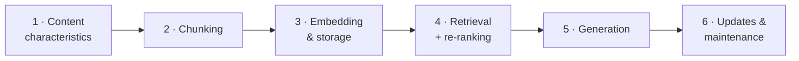

# RAG System Design Interviews

**Time:** ~90 min · Write + Record

> **This session:** "Design a RAG system for X" is the most common technical question in AI engineering interviews. You'll learn a six-part framework that works for any scenario, then apply it to three worked designs — legal documents, customer support, and code documentation.

## What you'll build

By the end of this session, you'll have:

- Three complete system designs for different scenarios
- A framework for designing any RAG system
- A video walkthrough of one design

## Why system design matters

**Common interview question:**

"Design a RAG system for [legal documents / customer support / code documentation]."

**What they're testing:**

- Can you think through architecture end-to-end?
- Do you consider different content types?
- Can you explain chunking strategies?
- Do you think about tradeoffs?

This isn't about perfect answers — it's about demonstrating structured thinking.

## The design framework

For any RAG system, address these six areas:

### 1. Content type & characteristics

- What kind of data? (structured, unstructured, semi-structured)
- How large? (pages, tokens, documents)
- How often updated? (static, daily, real-time)
- What structure exists? (headings, sections, metadata)

### 2. Chunking strategy

- Chunk by what? (size, semantic boundaries, structure)
- Overlap? (yes/no, how much)
- Metadata? (what to preserve)

### 3. Embedding & storage

- Which embedding model?
- Index structure (single, multiple, namespaces)
- Metadata filtering strategy

### 4. Retrieval strategy

- Search type (vector, hybrid, with metadata)
- How many results (topK)?
- Re-ranking? (yes/no, which model)

### 5. Generation

- Which LLM?
- Prompt structure
- Context handling

### 6. Updates & maintenance

- How to handle new content?
- Deduplication strategy
- Timestamp tracking

Notice the order — it mirrors the data's journey through the system:



Walk the interviewer through it left to right and you can't forget a section.

## Scenario 1: legal document RAG

### The prompt

"Design a RAG system for a law firm to query contracts, case law, and legal memos."

### Your design

#### 1. Content characteristics

Legal documents are:

- **Highly structured** (sections, clauses, numbered paragraphs)
- **Precise** (exact wording matters)
- **Long** (contracts can be 50+ pages)
- **Metadata-rich** (dates, parties, document type, jurisdiction)

#### 2. Chunking strategy

**Approach: chunk by semantic boundaries**

```typescript
// ✅ Good chunking for legal docs
Chunk by:
- Sections (numbered headings like "3.2 Indemnification")
- Clauses (complete legal statements)
- Paragraphs (within sections)

Preserve:
- Section numbers
- Heading text
- Document metadata (date, parties, type)
```

**Why not fixed-size chunks?**

❌ Fixed chunks split clauses mid-sentence
❌ Loses structural context
❌ Makes citations unclear ("found in chunk 47" is useless)

**Example:**

```
Document: employment-agreement-acme-2024.pdf
Section: 5.2 Non-Compete Clause

Chunk:
"5.2 Non-Compete Clause: Employee agrees not to engage in
competing business activities within 50 miles of Employer's
offices for a period of 12 months following termination..."

Metadata:
- document_id: "ea-acme-2024"
- section: "5.2"
- section_title: "Non-Compete Clause"
- doc_type: "employment_agreement"
- date: "2024-01-15"
- parties: ["Acme Corp", "John Doe"]
```

#### 3. Embedding & storage

**Single index with metadata filtering:**

- One Pinecone index for all legal docs
- Filter by: `doc_type`, `date`, `parties`, `jurisdiction`
- Use namespaces for different clients (client isolation)

**Why?**

✅ Scales to thousands of documents
✅ Can query across document types
✅ Easy to filter to specific cases
✅ Client data isolation

#### 4. Retrieval strategy

**Hybrid search with re-ranking:**

```typescript
// Step 1: Initial retrieval
const results = await index.query({
  vector: embedding,
  topK: 20,  // Cast wide net
  filter: {
    doc_type: { $in: ["contract", "memo"] },
    date: { $gte: "2020-01-01" }  // Recent docs only
  }
});

// Step 2: Re-rank with cross-encoder
const reranked = await cohere.rerank({
  query: userQuery,
  documents: results,
  topN: 5
});
```

**Why re-ranking?**

Legal queries are precise — "indemnification clauses in employment contracts" needs exact matches, not just "employment" OR "indemnification".

#### 5. Generation

**GPT-4 or Claude Opus:**

- Complex reasoning required
- Accuracy matters more than cost
- Need to quote exact text

**Prompt structure:**

```typescript
const systemPrompt = `You are a legal research assistant.
Answer based ONLY on the provided context.
Quote relevant sections verbatim with citations.
If the context doesn't contain the answer, say so clearly.

Context:
${retrievedChunks}

User query: ${query}

Respond with:
1. Direct answer
2. Relevant quotes (with section numbers)
3. Source documents`;
```

#### 6. Updates & maintenance

**Challenges:** new contracts added daily, amendments modify existing docs, old contracts still relevant.

**Strategy:**

- Track `document_id` + `version`
- Store `last_updated` timestamp
- Don't delete old versions (legal needs history)
- Use metadata to mark latest version

### Your turn: scenario 1

Design a RAG system for legal documents using the framework.

```markdown
## Legal Document RAG: My Design

### 1. Content Characteristics
[Describe the content]

### 2. Chunking Strategy
[How you'll chunk and why]

### 3. Embedding & Storage
[Index structure and metadata]

### 4. Retrieval Strategy
[Search approach and re-ranking]

### 5. Generation
[Model choice and prompt structure]

### 6. Updates & Maintenance
[How you'll handle changes]
```

```quiz
[
  {
    "q": "Why are fixed-size chunks a bad fit for legal documents?",
    "options": ["They split clauses mid-sentence, lose structural context, and make citations useless ('found in chunk 47')", "Fixed-size chunks exceed Pinecone's vector limits on 50-page contracts", "Legal text can't be embedded without special legal embedding models"],
    "answer": 0,
    "explain": "Legal docs have explicit structure — numbered sections and clauses. Chunking on those semantic boundaries preserves meaning and lets the system cite '5.2 Non-Compete Clause' instead of an arbitrary chunk number."
  },
  {
    "q": "The legal design retrieves topK: 20 and then re-ranks down to topN: 5. Why the two stages?",
    "options": ["Pinecone bills per query, so fewer follow-up queries saves money", "Initial vector search optimizes recall (wide net); the cross-encoder re-ranker reorders for precision — legal queries need exact matches, not just related ones", "GPT-4's context window can only fit 5 chunks"],
    "answer": 1,
    "explain": "Vector search casts a recall-focused wide net; the re-ranker reads each query-document pair and reorders for precision. Two stages get you both."
  },
  {
    "q": "Why does the customer support design bias retrieval toward recent content?",
    "options": ["Recent embeddings are higher quality because embedding models improve monthly", "Older chunks cost more to retrieve", "The product changes weekly, so an outdated answer is worse than no answer"],
    "answer": 2,
    "explain": "Support docs churn constantly. The design filters by last_updated, boosts recency in scoring, and marks stale chunks deprecated — all because serving obsolete instructions actively harms users."
  },
  {
    "q": "Why does the code documentation design use separate namespaces per framework (react-18, vue-3, ...) instead of one shared pool?",
    "options": ["It prevents mixing React and Vue results and lets each framework update independently", "Pinecone requires one namespace per programming language", "Namespaces make embeddings cheaper to generate"],
    "answer": 0,
    "explain": "A question about React hooks should never surface Vue composition-API chunks. Namespace isolation keeps relevance high, and each framework/version can be re-scraped independently."
  },
  {
    "q": "The three scenarios picked three different models: GPT-4/Opus (legal), GPT-4o-mini (support), GPT-4o (code docs). What drove the choice?",
    "options": ["Matching each task's quality/cost/latency profile: legal needs accuracy over cost, support is high-volume and straightforward, code docs need a balance", "Vendor lock-in avoidance — one model per provider", "Larger models are always used for larger documents"],
    "answer": 0,
    "explain": "Model selection follows the workload: complex reasoning where accuracy beats cost (legal), cheap and fast at high volume (support), balanced quality/cost/speed for chat over code (docs). One size does not fit all — and neither does one design."
  }
]
```

## Scenario 2: customer support knowledge base

### The prompt

"Design a RAG system for customer support agents to query internal documentation, FAQs, and troubleshooting guides."

### Your design

#### 1. Content characteristics

Support docs are:

- **Semi-structured** (mix of FAQs, guides, screenshots)
- **Updated frequently** (product changes weekly)
- **Varied length** (FAQs are short, guides are long)
- **Action-oriented** ("How to reset password", not theory)

#### 2. Chunking strategy

**Approach: chunk by question-answer pairs for FAQs, by steps for guides**

```typescript
// For FAQs:
Chunk = one Q&A pair

// For guides:
Chunk = one complete step (with substeps)

Preserve:
- Source type (FAQ vs guide)
- Category (billing, technical, account)
- Last updated date
```

**Example:**

```
FAQ Chunk:
Q: How do I reset my password?
A: Click "Forgot Password" on the login page, enter your email,
and follow the link sent to your inbox. Links expire in 24 hours.

Metadata:
- doc_type: "faq"
- category: "account_management"
- last_updated: "2024-03-01"
- page_url: "/help/account/password-reset"
```

#### 3. Embedding & storage

**Single index with aggressive metadata:**

- One index for all support content
- Metadata: `category`, `product_version`, `last_updated`
- Boost recent content (weight by recency)

#### 4. Retrieval strategy

**Hybrid search with recency bias:**

```typescript
// Retrieve
const results = await index.query({
  vector: embedding,
  topK: 10,
  filter: {
    last_updated: { $gte: cutoffDate },  // Prefer recent
    category: inferredCategory  // From query
  }
});

// Re-rank with recency weight
const scored = results.map(r => ({
  ...r,
  adjustedScore: r.score * (1 + recencyBoost(r.last_updated))
}));
```

**Why?**

Support docs change frequently — outdated answers are worse than no answer.

#### 5. Generation

**GPT-4o-mini:**

- Support queries are straightforward
- High volume (cost matters)
- Speed matters (agents waiting)

**Prompt structure:**

```typescript
const systemPrompt = `You are a helpful support assistant.
Provide clear, step-by-step instructions based on the context.
Include relevant links when available.
If information is outdated, mention the date.

Context:
${retrievedChunks}

User query: ${query}

Respond with:
1. Direct answer (2-3 sentences)
2. Step-by-step instructions (if applicable)
3. Links to full documentation`;
```

#### 6. Updates & maintenance

**Challenges:** docs updated daily, old content becomes obsolete, need to expire outdated info.

**Strategy:**

- Re-scrape and re-embed weekly
- Mark old chunks with `deprecated: true`
- Filter out deprecated unless explicitly requested
- Track `product_version` to handle multiple versions

### Your turn: scenario 2

Design a RAG system for customer support using the framework.

```markdown
## Customer Support RAG: My Design

### 1. Content Characteristics
[Describe the content]

### 2. Chunking Strategy
[How you'll chunk and why]

### 3. Embedding & Storage
[Index structure and metadata]

### 4. Retrieval Strategy
[Search approach and filters]

### 5. Generation
[Model choice and prompt structure]

### 6. Updates & Maintenance
[How you'll handle frequent changes]
```

## Scenario 3: code documentation

### The prompt

"Design a RAG system for querying documentation for React, Vue, and Angular."

### Your design

#### 1. Content characteristics

Code docs are:

- **Highly structured** (API refs, guides, examples)
- **Framework-specific** (mixing frameworks reduces relevance)
- **Code-heavy** (examples are critical)
- **Versioned** (React 18 vs 19 are different)

#### 2. Chunking strategy

**Approach: chunk by API reference entries and guide sections**

```typescript
// For API references:
Chunk = one function/hook/component
Include: signature, parameters, return type, examples

// For guides:
Chunk = one complete concept
Include: explanation + code examples

Preserve:
- Framework (react, vue, angular)
- Version (18, 19, etc)
- Doc type (api, guide, tutorial)
```

**Example:**

````
API Chunk: useState Hook

## useState

`const [state, setState] = useState(initialState)`

Parameters:
- initialState: The initial state value

Returns:
- Array with current state and setter function

Example:
```javascript
const [count, setCount] = useState(0);
```

Metadata:
- framework: "react"
- version: "18.0.0"
- doc_type: "api"
- api_name: "useState"
- category: "hooks"
````

#### 3. Embedding & storage

**Separate namespaces per framework:**

```typescript
// In Pinecone:
namespaces: {
  "react-18": [...],
  "react-19": [...],
  "vue-3": [...],
  "angular-17": [...]
}

// Query specific namespace
const results = await index.namespace("react-18").query({...});
```

**Why namespaces instead of one index?**

✅ Prevents mixing React and Vue results
✅ Easy to update one framework independently
✅ Can query across frameworks when needed

#### 4. Retrieval strategy

**Namespace-filtered search:**

```typescript
// Step 1: Detect framework from query
const framework = detectFramework(query);  // "react", "vue", etc.

// Step 2: Query that namespace
const results = await index
  .namespace(`${framework}-${version}`)
  .query({
    vector: embedding,
    topK: 5,
    filter: {
      doc_type: { $in: ["api", "guide"] }  // Prefer official docs
    }
  });
```

**Why not re-rank?**

Code docs are already well-structured — initial retrieval is usually good enough.

#### 5. Generation

**GPT-4o:**

- Balance of quality and cost
- Good at code examples
- Fast enough for chat

**Prompt structure:**

```typescript
const systemPrompt = `You are a technical documentation assistant.
Provide accurate answers with code examples.
Always specify which framework and version you're referencing.

Context from ${framework} ${version} docs:
${retrievedChunks}

User query: ${query}

Respond with:
1. Direct answer (2-3 sentences)
2. Code example
3. Link to full documentation`;
```

#### 6. Updates & maintenance

**Challenges:** frameworks release new versions, need to maintain multiple versions, deprecated APIs still queried.

**Strategy:**

- Scrape docs per version
- Keep last 2–3 versions active
- Mark older versions as `archived: true`
- Default to latest, allow version selection

### Your turn: scenario 3

Design a RAG system for code documentation using the framework.

```markdown
## Code Documentation RAG: My Design

### 1. Content Characteristics
[Describe the content]

### 2. Chunking Strategy
[How you'll chunk and why]

### 3. Embedding & Storage
[Index structure and namespaces]

### 4. Retrieval Strategy
[Framework detection and search]

### 5. Generation
[Model choice and prompt structure]

### 6. Updates & Maintenance
[How you'll handle version updates]
```

## Written assignment

Complete all three system designs using the framework:

1. Legal Document RAG
2. Customer Support RAG
3. Code Documentation RAG

**Instructions:**

- Address all six areas in the framework
- Explain your reasoning (don't just list choices)
- Mention tradeoffs
- Be specific (not "I'd use chunking" but "I'd chunk by semantic boundaries because...")

**Submission format:** three separate system designs in one markdown document.

## Video assignment

Record yourself walking through ONE of your system designs and submit for feedback.

**Instructions:**

1. Choose your strongest design
2. Walk through all six areas (aim for 1–5 minutes total)
3. Use the "interviewer asks, you answer" format:

**Example script:**

"The question is: Design a RAG system for legal documents.

First, let me think about the content characteristics...
[Explain content characteristics]

For chunking, I would...
[Explain chunking strategy]

For embedding and storage...
[Explain embedding approach]

[Continue through all six areas]

So to summarize, the key decisions are...
[Summarize key choices]"

**Don't:** read from notes, rush through (take your time), or skip the reasoning ("I'd use X because Y").

**What you'll receive feedback on:** completeness of system design, quality of reasoning for each decision, tradeoff discussion, clarity of architecture explanation, interview readiness.

## Practice tips

### Tip 1: draw the architecture

While explaining, draw boxes and arrows — data flow, components, decision points. Helps you think clearly and shows structured thinking.

### Tip 2: explain the "why"

For every choice, say why:

❌ "I'd use GPT-4"
✅ "I'd use GPT-4 because legal queries need complex reasoning and accuracy matters more than cost"

### Tip 3: mention what you're NOT doing

Shows you considered alternatives:

"I'm not using fixed-size chunks because legal clauses would split mid-sentence."

### Tip 4: stay focused

Keep your explanation tight: too brief = missing critical details; too long = losing focus on key decisions.

## Common mistakes

### Mistake 1: too generic

❌ "I'd use RAG with chunking and retrieval"
✅ "I'd chunk by semantic boundaries - specifically by numbered sections - because legal docs have explicit structure"

### Mistake 2: no reasoning

❌ "I'd use re-ranking"
✅ "I'd use re-ranking because legal queries are precise and initial retrieval often returns related but not exact matches"

### Mistake 3: forgetting updates

Many designs forget ongoing maintenance. Always address: how do you handle new content? How do you update existing content? How do you prevent stale data?

### Mistake 4: one-size-fits-all

Don't use the same design for every scenario.

Legal docs ≠ Support docs ≠ Code docs

Each has different chunking needs, update frequency, accuracy requirements, and cost constraints.

## ✅ Key takeaways

- Every RAG design question yields to the same six-part framework: content characteristics → chunking → embedding & storage → retrieval → generation → updates & maintenance
- Start from the content, not the tech: its structure dictates chunking, its precision requirements dictate re-ranking, its churn rate dictates the maintenance story
- The three worked designs diverge on purpose — semantic-boundary chunks + re-ranking for legal precision, recency bias for fast-churning support docs, per-framework namespaces for versioned code docs
- Model choice follows the workload: accuracy-first (GPT-4/Opus) for legal reasoning, cheap-and-fast (4o-mini) for high-volume support, balanced (4o) for code chat
- Updates & maintenance is the section candidates forget — always answer how new, changed, and stale content is handled

## 🤖 Work with AI

```ai-prompt
title: Mock-interview me on RAG system design
---
Run a RAG system design mock interview. I've practiced a six-part framework: (1) content characteristics, (2) chunking strategy, (3) embedding & storage, (4) retrieval strategy, (5) generation, (6) updates & maintenance.

Give me ONE scenario I haven't practiced — pick something like a medical knowledge base for doctors, e-commerce product search, an HR policy assistant for a multinational, or invent your own. I'll answer section by section; after each of my six answers, respond like a real interviewer: probe one weak spot ("why namespaces over metadata filters here?", "what happens when a policy is amended mid-quarter?", "topK of what, and why?") before letting me continue. At the end, score me on the four things interviewers test — end-to-end thinking, content-type awareness, chunking reasoning, and tradeoff discussion — and name the section I should drill again.
```

```ai-prompt
title: Stress-test my three written designs
---
Here are my three written RAG system designs for interview prep — legal documents, customer support, and code documentation — each covering content characteristics, chunking, embedding & storage, retrieval, generation, and updates & maintenance:

[paste your three designs]

Review them like a staff engineer grading a design doc. For each design: (1) find any choice with no stated reasoning — every "I'd use X" needs a "because Y"; (2) check the design actually fits the scenario — flag anything copy-pasted between the three (legal ≠ support ≠ code docs: different precision needs, churn rates, and cost constraints); (3) verify updates & maintenance handles new content, amendments, AND stale data; (4) throw one curveball requirement at each (e.g. "legal now needs multi-jurisdiction support", "support docs must serve three product versions at once") and ask how my design absorbs it. Wait for my answer to each curveball before revealing your own.
```
