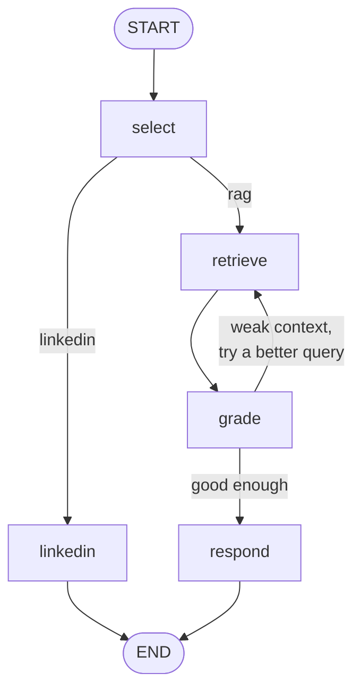

# LangGraph: When a Straight Line Isn't Enough (Beta)

> **Today:** your agent runs the same four steps in the same order every time, and mostly that's a feature. Today you'll see the one thing that shape genuinely can't do — go back and try again — and meet the framework built around it.

> **🚧 Beta lesson.** No video on this one yet. It's here so you can get exposure to the framework before you meet it in a job posting. If something's confusing or flat-out wrong, say so in Slack — that feedback is what gets folded into the recorded version.

## Your pipeline is an assembly line

Picture the RAG agent you built. Embed the question, search Pinecone, rerank, write the answer. Four stations, one conveyor belt, parts move left to right.

Assembly lines are wonderful. They're fast, cheap, and when something breaks you know exactly which station did it. This is why most of your agents should stay assembly lines, and why the tool-calling lesson kept insisting that a fixed workflow usually beats letting the model improvise.

But assembly lines have one hard limit, and you've already felt it.

Someone asks your agent a question. The retrieval comes back with five chunks that are *sort of* about the topic. Not wrong, just not useful. Your pipeline doesn't care. Station three hands the junk to station four, station four dutifully writes an answer on top of it, and the user gets a confident paragraph built on nothing.

The pipeline can't say *"hang on, that's garbage, let me search again with better words."* There's no belt running backwards. To add one you'd write a while loop, a retry counter, some flags to track whether you've already tried, and a way to stop before you bankrupt yourself on API calls. Do that twice and you've written a small, buggy, personal version of LangGraph.

## The same shop, rearranged

LangGraph stops pretending your agent is a line and calls it what it is: a **graph**. Stations become **nodes**. Belts become **edges**. And some belts have an inspector standing at the end deciding where the part goes next.

Three pieces, that's the whole mental model:

**State is the clipboard.** One object that rides along with the work. Every node reads it, and every node can write on it. The question, the chosen agent, the retrieved context, how many times you've retried, the final answer — all on the clipboard.

**Nodes are the stations.** A node is just an async function. It takes the clipboard, does one job, and returns the fields it wants changed. Not the whole clipboard — only what it touched.

```typescript
async function retrieveNode(state) {
  const vector = await embeddings.embedQuery(state.refinedQuery);
  const hits = await pineconeIndex().query({ vector, topK: 10, includeMetadata: true });
  return { context: hits.matches.map(...).join('\n\n') };  // only the field it changed
}
```

**Edges are the belts.** Most are boring: after `retrieve`, always go to `grade`. The interesting ones are **conditional edges**, where a function looks at the clipboard and picks the next stop.

```typescript
function routeAfterGrade(state) {
  if (state.sufficient) return 'respond';   // ship it
  return 'retrieve';                        // back to station three
}
```

That second line is the whole reason this lesson exists. **A conditional edge can point backwards.** Your assembly line physically cannot.

## What that looks like



Look at the edge from `grade` back up to `retrieve`. That's a cycle, and it's the thing you cannot draw in a function that runs top to bottom. Everything else in that diagram, you could write by hand in an afternoon.

```quiz
[
  {
    "q": "What does a node actually return?",
    "options": ["The full state object, with every field re-specified", "Only the state fields it changed — LangGraph merges them in", "Nothing; it mutates the state object in place"],
    "answer": 1,
    "explain": "Nodes return a partial update. LangGraph merges it into the state using each field's reducer, which is why two nodes writing different fields don't clobber each other."
  },
  {
    "q": "What can a graph do that your existing RAG pipeline genuinely cannot?",
    "options": ["Call Pinecone and OpenAI in the same request", "Stream tokens to the browser", "Send work backwards — retrieve again after judging the first attempt was weak"],
    "answer": 2,
    "explain": "Both shapes call the same APIs and both can stream. The cycle is the difference: a conditional edge can route back to a node you already ran."
  },
  {
    "q": "A conditional edge function's job is to:",
    "options": ["Do the work for the next step", "Read the state and return the NAME of the next node", "Decide whether the graph should stop"],
    "answer": 1,
    "explain": "It's a router, not a worker. It looks at the clipboard and returns a string naming where the work goes next. Keep the actual work in nodes."
  }
]
```

```order
title: What happens when you invoke a graph
---
State is created from your input plus each field's default
The node wired to START runs
That node returns a partial update, which gets merged into state
The edge leaving that node decides where to go next
Nodes keep running until an edge points at END
The final state object is returned to your code
```

## The honest part: you probably don't need it

Here's where most framework lessons lie to you, so let's not.

Go back and reread the diagram. Strip out the grading loop, and what's left is a selector that picks one of two branches. **You already built that. It's a switch statement.** Wrapping a switch statement in a graph framework buys you nothing but three new dependencies and a novel way to be confused at 2am.

Skip LangGraph when:

- **Your flow is a straight line.** Embed, search, answer. Ship the function.
- **You're routing, not looping.** One decision, then one path to the exit. That's an `if`.
- **You're streaming to a React UI.** The AI SDK you've been using is built for that and LangGraph isn't. Fighting it costs you more than the graph gains.

Reach for it when:

- **The work needs to judge itself and retry.** Retrieve, grade, re-query. Generate, critique, revise.
- **A human has to approve something mid-run.** The graph pauses, waits, and picks up where it stopped.
- **The job outlives the request.** Checkpointing writes state to a database at every node, so a workflow can span hours, survive a crash, and resume.
- **Several specialists hand work to each other**, and who goes next depends on what the last one found.

Notice the pattern: every single one is about a run that isn't a straight shot from input to output. If yours is, you already have the right tool.

```scenario
{
  "who": "A senior engineer on your team",
  "setting": "Architecture review. Your RAG service is in production and behaving.",
  "ask": "I've been reading about LangGraph — we should rewrite the agent layer on it. Everyone's moving to graph-based orchestration.",
  "note": "More than one answer is defensible. Pick the one you'd actually say out loud.",
  "options": [
    { "text": "What would it let us do that we can't do now? Our flow is embed, search, answer — no branching, no loops. If we hit something that needs a retry loop or human approval, I'd reach for it then, on that piece.", "verdict": "best", "feedback": "Ties the tool to a capability gap and leaves the door open. It also scopes any future adoption to one component instead of the whole layer, which is how these migrations should happen." },
    { "text": "Good idea — it's what production agent systems use, and it'll make us more extensible later.", "verdict": "weak", "feedback": "'Extensible later' is how a working system becomes a rewrite with no user-visible benefit. And 'what production systems use' isn't an argument; plenty of production systems are three functions and a queue." },
    { "text": "We don't have time. The current code works.", "verdict": "ok", "feedback": "The conclusion is probably right but you've made it a scheduling problem, so it comes back every sprint. Argue from the architecture instead and it stays settled." },
    { "text": "Let's prototype it on the retrieval path and measure answer quality against what we have.", "verdict": "ok", "feedback": "Defensible, and the measurement instinct is good. But you're spending real time before anyone has named the problem being solved. Ask what's broken first, then prototype." }
  ],
  "debrief": "The useful question is never 'is this framework good?' It's 'what does my run look like?' Straight line, keep your function. Cycles, pauses, or a job that outlives the request — then a graph earns its keep."
}
```

## Key takeaways

- A graph is **state** (a clipboard that rides along), **nodes** (functions that read it and return partial updates), and **edges** (what runs next).
- Nodes return **only the fields they changed**; LangGraph merges the update into state.
- **Conditional edges can point backwards.** That cycle is the capability a top-to-bottom function does not have.
- Every good reason to reach for LangGraph is a run that isn't a straight line: retry loops, human approval, crash-resumable work, specialists handing off.
- A selector with two branches is a switch statement. Don't buy a framework to hold it.

## Work with AI

```ai-prompt
title: Quiz me on graph thinking
---
I just finished a lesson on LangGraph: state, nodes, edges, conditional edges, and when a graph beats a straight-line function. Quiz me with 5 questions, ONE AT A TIME, waiting for my answer before you continue. Start easy and get harder. At least two questions should be "here's a system — graph or plain function?" with a realistic description, where the honest answer is sometimes "plain function." If I'm wrong, don't hand me the answer — give a hint and let me try again. At the end, list what I was shaky on and explain each in two sentences.
```

```ai-prompt
title: Find the cycle in my own project
---
I'm going to describe a feature I'm building or want to build. Act as a staff engineer and interview me about its control flow, one question at a time: does any step judge the output of an earlier step? Does anything need to retry with different inputs? Does a human ever need to approve something mid-run? Could the job outlive a single HTTP request?

Then tell me straight whether this needs a graph or whether a plain async function with an if statement does the job. If it's a plain function, say so plainly and don't soften it — I'd rather not add three dependencies for nothing. If it IS a graph, sketch the nodes and name the edge that points backwards.
```
