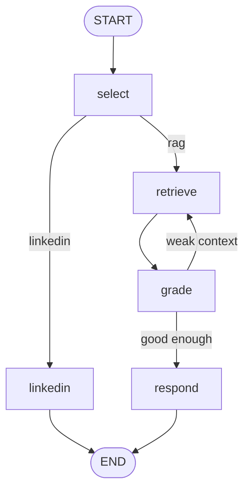

# Rebuilding Your Agent as a Graph (Beta)

> **Today:** you'll port the selector and the RAG agent you already built onto LangGraph, one file at a time, and then add the thing the old shape couldn't do — a retrieval loop that grades its own context and goes back for better.

> **🚧 Beta lesson.** No video on this one yet, and the code here is newer than the rest of the course. If a snippet doesn't run, that's worth a Slack message — you'd be the first to find it, not the person who broke it.

## What you're building

Same two agents. Same Pinecone index. Same routing decision. The difference is at the end, where retrieval learns to give itself a second chance.



Work in a scratch folder or a branch you don't care about. Nothing here replaces your working agent, and you want the old one around to compare against.

## Install it

```bash
yarn add @langchain/langgraph @langchain/core @langchain/openai
```

Three packages. `langgraph` is the graph machinery, `core` holds the message types everything shares, and `openai` is LangChain's client for the models.

## The client, wired for your key

Before any graph code, deal with the thing that will otherwise eat an hour of your evening.

LangChain has its own OpenAI client. It does **not** know about the other two clients in your project, and it does **not** read `OPENAI_BASE_URL` on its own. If we minted you a class key, that key only works through the class proxy. Hand it to a LangChain client that's still pointed at `api.openai.com` and you get a 401 that looks exactly like a bad key.

Make one file that gets this right, and import from it everywhere:

```typescript
// app/libs/langgraph/client.ts
import { ChatOpenAI, OpenAIEmbeddings } from '@langchain/openai';

// Same rule as the rest of the app: if we minted you a class key,
// OPENAI_BASE_URL points at the class proxy. LangChain will NOT read that
// variable on its own, so pass it explicitly or your key gets sent to
// api.openai.com and 401s.
const configuration = { baseURL: process.env.OPENAI_BASE_URL };

export function chatModel(model = 'gpt-4o') {
	return new ChatOpenAI({
		model,
		temperature: 0.2,
		apiKey: process.env.OPENAI_API_KEY,
		configuration,
	});
}

export const embeddings = new OpenAIEmbeddings({
	model: 'text-embedding-3-small',
	dimensions: 512,
	apiKey: process.env.OPENAI_API_KEY,
	configuration,
});
```

Using your own OpenAI account instead? Leave `OPENAI_BASE_URL` unset and this all talks to OpenAI directly. Same file either way.

Those 512 dimensions aren't decoration — they have to match the index you created, or Pinecone rejects the query.

## The clipboard

Everything the run needs to remember, in one place:

```typescript
// app/libs/langgraph/state.ts
import { Annotation } from '@langchain/langgraph';

export const GraphState = Annotation.Root({
	// What the user typed. Set once, never changes.
	query: Annotation<string>,

	// Filled in by the selector.
	agent: Annotation<'linkedin' | 'rag'>,
	refinedQuery: Annotation<string>,

	// Filled in by retrieve.
	context: Annotation<string>,

	// Filled in by grade. Starts false so the first grade always runs.
	sufficient: Annotation<boolean>({
		reducer: (_current, incoming) => incoming,
		default: () => false,
	}),

	// How many times we've gone back for better context.
	retries: Annotation<number>({
		reducer: (_current, incoming) => incoming,
		default: () => 0,
	}),

	// The final answer.
	answer: Annotation<string>,
});

export type GraphStateType = typeof GraphState.State;
```

Two of those fields spell out a **reducer** and a **default**. The reducer answers "when a node writes this field, what happens to what was already there?" Here, last write wins. The default is what the field holds before anyone writes it, which matters enormously for `retries` — without it you'd be doing arithmetic on `undefined` and everything downstream would quietly become `NaN`.

The bare ones like `query` get last-write-wins for free.

<details>
<summary>When would a reducer be anything other than last-write-wins?</summary>

Chat history. If `messages` replaced itself on every write, each node would wipe the conversation. So it appends instead:

```typescript
messages: Annotation<BaseMessage[]>({
  reducer: (current, incoming) => current.concat(incoming),
  default: () => [],
}),
```

Now a node returning `{ messages: [newMessage] }` adds to the transcript rather than becoming it. Same idea for accumulating sources, logs, or anything where every node contributes a piece.

</details>

## The nodes

Each one is an async function: clipboard in, changed fields out.

**Select** does the job your selector route does today.

```typescript
export async function selectNode(state: GraphStateType) {
	const result = await chatModel('gpt-4o-mini')
		.withStructuredOutput(
			z.object({
				agent: z.enum(['linkedin', 'rag']),
				refinedQuery: z.string(),
			})
		)
		.invoke([
			{
				role: 'system',
				content:
					'Route the user. "linkedin" writes posts in a voice. "rag" answers technical questions from the knowledge base. Also rewrite the question so it stands on its own.',
			},
			{ role: 'user', content: state.query },
		]);

	return { agent: result.agent, refinedQuery: result.refinedQuery };
}
```

`withStructuredOutput` is LangChain's version of the structured-output trick you already know. Hand it a Zod schema, get back an object that matches it. Same guarantee, different spelling.

**Retrieve** is your RAG search with the clipboard swapped in for function arguments.

```typescript
// Built on first use, not at import time — otherwise this module can't be
// imported (or tested) without a Pinecone key in the environment.
let pinecone: Pinecone | undefined;
const pineconeIndex = () => {
	pinecone ??= new Pinecone({ apiKey: process.env.PINECONE_API_KEY! });
	return pinecone.Index(process.env.PINECONE_INDEX!);
};

export async function retrieveNode(state: GraphStateType) {
	const vector = await embeddings.embedQuery(state.refinedQuery);

	const hits = await pineconeIndex().query({
		vector,
		topK: 10,
		includeMetadata: true,
	});

	const context = hits.matches
		.map((m) => (m.metadata?.text ?? m.metadata?.content) as string)
		.filter(Boolean)
		.join('\n\n');

	return { context };
}
```

Note that it embeds `state.refinedQuery`, not `state.query`. That's deliberate, and it's what makes the loop possible — the grader rewrites `refinedQuery`, so the second trip through this node searches for something different than the first.

**Grade** is the new one. It reads what came back and decides whether it's good enough.

```typescript
export async function gradeNode(state: GraphStateType) {
	if (!state.context) {
		return { sufficient: false, retries: state.retries + 1 };
	}

	const verdict = await chatModel('gpt-4o-mini')
		.withStructuredOutput(
			z.object({
				sufficient: z.boolean(),
				betterQuery: z.string(),
			})
		)
		.invoke([
			{
				role: 'system',
				content:
					'Does this context answer the question? If not, write a better search query. Be strict: vaguely related is not sufficient.',
			},
			{
				role: 'user',
				content: `Question: ${state.refinedQuery}\n\nContext:\n${state.context}`,
			},
		]);

	if (verdict.sufficient) return { sufficient: true };

	return {
		sufficient: false,
		retries: state.retries + 1,
		refinedQuery: verdict.betterQuery,
	};
}
```

"Be strict: vaguely related is not sufficient" is doing real work in that prompt. Ask a model whether some text is relevant and it will charitably say yes to almost anything. You have to tell it to be a hard grader or it'll wave everything through and your loop will never fire.

**Linkedin** and **respond** just write the final text. Nothing new.

```typescript
export async function respondNode(state: GraphStateType) {
	const reply = await chatModel('gpt-4o').invoke([
		{
			role: 'system',
			content: `Answer using this context. If it doesn't cover the question, say so plainly.\n\n${state.context}`,
		},
		{ role: 'user', content: state.refinedQuery },
	]);

	return { answer: reply.text };
}
```

## The routers

Two small functions. They do no work — they read the clipboard and name the next stop.

```typescript
/** Edge function: which agent did the selector pick? */
export function routeToAgent(state: GraphStateType): 'linkedin' | 'retrieve' {
	return state.agent === 'linkedin' ? 'linkedin' : 'retrieve';
}

/**
 * Edge function: good enough, or go around again?
 *
 * Two ways out, and you need both. The grader saying "yes" is the happy exit.
 * The retry ceiling is the one that saves you when the grader is never happy —
 * without it the graph circles until LangGraph's recursion limit kills it.
 */
export function routeAfterGrade(state: GraphStateType): 'retrieve' | 'respond' {
	if (state.sufficient) return 'respond';
	if (state.retries > MAX_RETRIES) return 'respond';
	return 'retrieve';
}
```

Read `routeAfterGrade` twice, because the bug lives in it.

Try writing it as a single condition — "loop while retries are under the ceiling" — and trace what happens when the grader is satisfied on the second pass. `retries` is 1, still under a ceiling of 1, so back to retrieve it goes. Forever. The satisfied verdict never gets a chance to end the run.

That's why `sufficient` is a real field on the clipboard instead of something you infer from the retry count. **A loop needs an exit for success and a separate exit for giving up.** Miss either one and you've built either an infinite loop or a graph that never retries.

```blanks
{
  "title": "Complete the retry ceiling",
  "note": "Every blank is a real decision — one of these choices loops forever.",
  "code": "export function routeAfterGrade(state) {\n  if (state.___1___) return 'respond';\n  if (state.retries ___2___ MAX_RETRIES) return 'respond';\n  return '___3___';\n}",
  "blanks": [
    { "options": ["sufficient", "context", "answer"], "answer": "sufficient", "explain": "The grader's verdict is the success exit. Checking context only tells you something came back, not that it was any good." },
    { "options": [">", "<", "==="], "answer": ">", "explain": "Give up once retries has passed the ceiling. Using < inverts it: you'd bail immediately and never retry at all." },
    { "options": ["retrieve", "grade", "respond"], "answer": "retrieve", "explain": "Back to retrieval — with the rewritten query the grader just put on the clipboard. Routing to grade again would re-judge the same context forever." }
  ]
}
```

## Wiring it up

```typescript
// app/libs/langgraph/graph.ts
import { StateGraph, START, END } from '@langchain/langgraph';

// Node names share a namespace with state channels, so the node that writes
// `answer` is called `respond`. Naming it `answer` throws at compile() time.
const workflow = new StateGraph(GraphState)
	.addNode('select', selectNode)
	.addNode('retrieve', retrieveNode)
	.addNode('grade', gradeNode)
	.addNode('linkedin', linkedinNode)
	.addNode('respond', respondNode)

	// Every run starts at the selector.
	.addEdge(START, 'select')

	// The selector's choice picks the next node.
	.addConditionalEdges('select', routeToAgent, ['linkedin', 'retrieve'])

	// LinkedIn doesn't retrieve anything, so it's one hop to the exit.
	.addEdge('linkedin', END)

	// RAG retrieves, then grades what it got.
	.addEdge('retrieve', 'grade')

	// And here's the edge a straight-line pipeline can't have: grade can
	// send the work back to retrieve.
	.addConditionalEdges('grade', routeAfterGrade, ['retrieve', 'respond'])

	.addEdge('respond', END);

export const graph = workflow.compile();

export async function runGraph(query: string) {
	const result = await graph.invoke({ query });
	return {
		agent: result.agent,
		answer: result.answer,
		retries: result.retries,
	};
}
```

That comment above `new StateGraph` is there because it cost real time to discover. **Node names and state field names live in the same namespace.** A node called `answer` alongside a state field called `answer` throws the moment you compile the graph, and TypeScript will not warn you — it's a runtime check inside LangGraph. If you get `already being used as a state attribute`, that's this.

The third argument to `addConditionalEdges` — the array of possible destinations — is optional at runtime but worth writing every time. It's how you and your editor can see where an edge can actually go without reading the router.

## Run it

```typescript
const result = await runGraph('how does reranking work in Pinecone?');
console.log(result.agent, result.retries);
console.log(result.answer);
```

Watch `retries`. Ask something your knowledge base covers well and it stays 0. Ask something adjacent to your documents but not really in them and you'll see it tick to 1, which means the grader rejected the first pull and the rewritten query went back around.

<details>
<summary>Nothing ever retries — is it broken?</summary>

Probably not broken, just a lenient grader. Two things to try:

Sharpen the prompt. "Be strict" is a start; "reject context that is topically related but does not contain the specific facts needed to answer" is better.

Then check you're actually giving it a chance to fail. If your index is small and every question you ask is dead center in your documents, retrieval is genuinely doing fine and the loop is correctly staying out of the way. Ask about something on the edge of your corpus and watch it fire.

</details>

<details>
<summary>It retried, and the second answer was worse</summary>

That happens, and it's the honest downside. The grader rewrote your query and the rewrite drifted from what the user meant. You paid for two retrievals and an extra model call to get a worse result.

This is the trade the loop makes. Log both queries and compare them on real questions before you decide the loop earns its cost. Sometimes the right answer is to delete the grader and spend the money on better chunking instead.

</details>

```quiz
[
  {
    "q": "Why does retrieveNode embed state.refinedQuery instead of state.query?",
    "options": ["refinedQuery is shorter, so embedding is cheaper", "The grader rewrites refinedQuery, so the second pass searches for something different", "query holds the raw user text, which can't be embedded"],
    "answer": 1,
    "explain": "It's what makes the loop worth running. If the retry embedded the original query it would fetch the identical chunks and the grader would reject them again."
  },
  {
    "q": "Your graph runs forever and eventually dies on a recursion limit. Most likely cause?",
    "options": ["A node throws an error that isn't caught", "A conditional edge has no path that reaches END for some state", "Pinecone is returning zero matches"],
    "answer": 1,
    "explain": "A cycle needs an escape hatch that the state can actually reach. Both the success exit and the give-up ceiling have to be reachable, or the graph circles until LangGraph stops it."
  },
  {
    "q": "You name a node 'answer' and also have a state field called 'answer'. What happens?",
    "options": ["The node silently overwrites the field on every run", "TypeScript catches it at build time", "LangGraph throws when you compile the graph — they share a namespace"],
    "answer": 2,
    "explain": "Runtime check inside LangGraph, invisible to tsc. It's why the node that writes the answer field is called respond."
  }
]
```

## Key takeaways

- A node is an async function that takes state and returns **only the fields it changed**. The framework merges the rest.
- **Reducers and defaults matter most on counters and accumulators.** A missing default on `retries` turns your arithmetic into `NaN`.
- Retry loops need **two exits**: one for success, one for giving up. Inferring success from the retry count is how you write an infinite loop.
- **Node names collide with state field names.** LangGraph throws at compile time and TypeScript won't save you.
- LangChain's client ignores `OPENAI_BASE_URL`. Pass `configuration: { baseURL }` or a class key dies with a 401 that looks like a bad key.
- A grading loop costs an extra model call and a second retrieval every time it fires. Measure whether it's buying you better answers before you keep it.

## Work with AI

```ai-prompt
title: Break my loop on purpose
---
Here's a LangGraph routing function I wrote:

[paste your routeAfterGrade]

Act as a reviewer hunting for non-termination. Walk me through the state values step by step for these cases, one at a time, and make me predict the outcome before you tell me: (1) the grader is satisfied on the first pass, (2) satisfied on the second pass, (3) never satisfied, (4) retrieval returns nothing at all. For each, tell me which exit fires and how many model calls I paid for. If any case loops forever, don't fix it for me — show me the trace and let me spot it.
```

```ai-prompt
title: Is the grading loop worth it?
---
I added a self-grading retrieval loop to my RAG agent: retrieve, ask a cheap model whether the context is sufficient, and if not, rewrite the query and retrieve once more. Help me design an experiment to find out whether it's actually worth the extra calls.

Interview me one question at a time: what questions would I test it on, what counts as a better answer, how would I tell a real improvement from noise on a small sample, and what's the per-query cost of the extra grade plus retrieval. Then tell me honestly what you'd expect the result to be, and what I should try instead if the loop turns out not to pay for itself.
```
